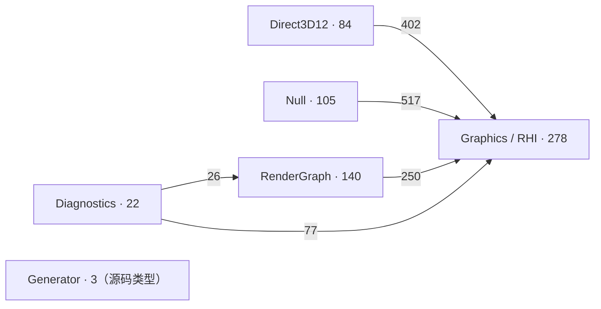
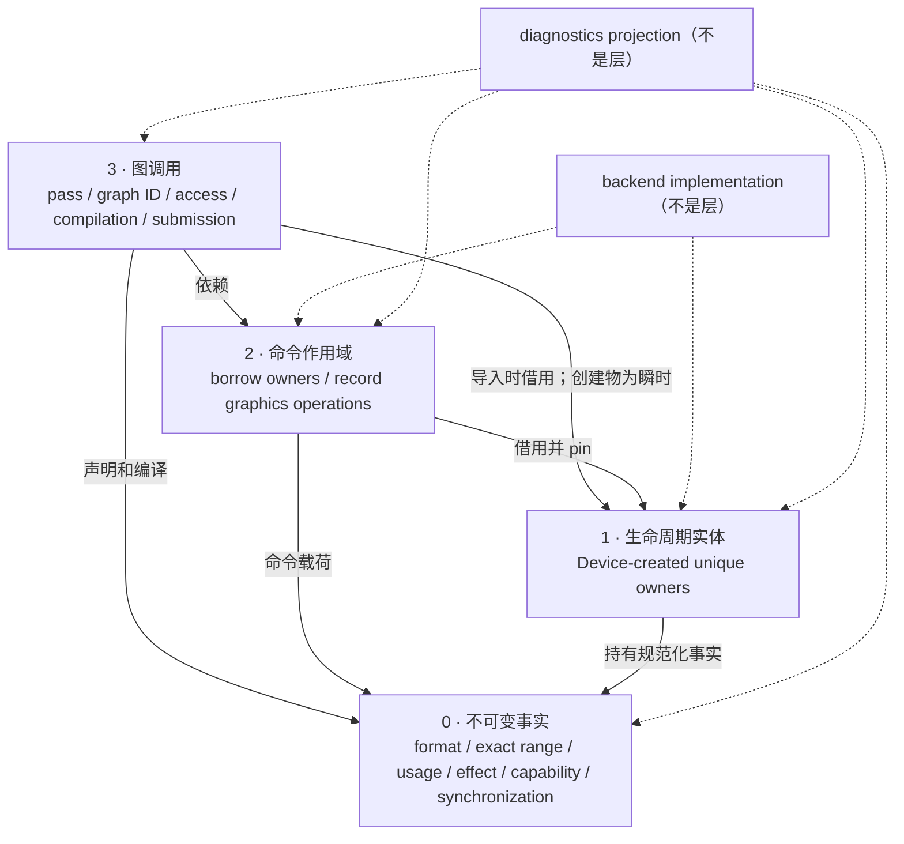
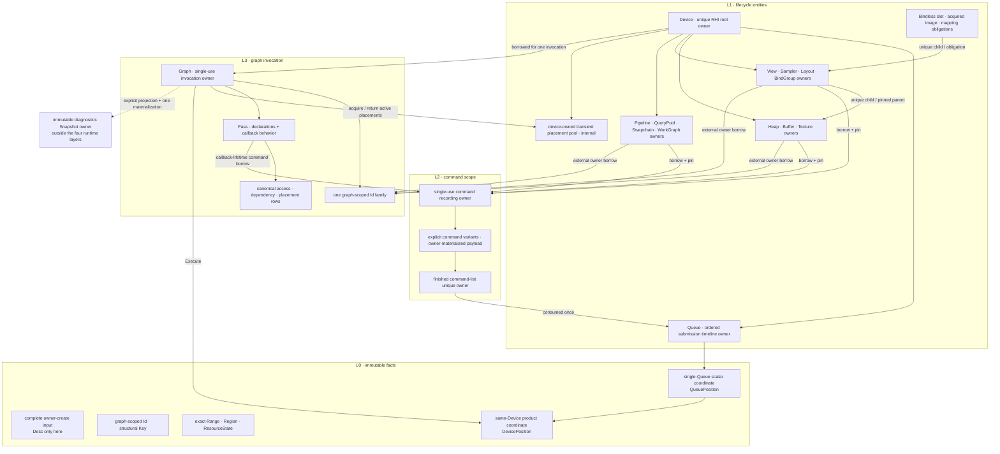

# RHI / Render Graph 概念依赖审计

状态：固定实施审计与闭包交付记录（Section 6 为终态心智模型）  
审计输入基线：2026-07-23 工作树；终态验证：2026-07-27 工作树  
范围：`SomeEngine.Graphics`、`SomeEngine.Graphics.Direct3D12`、`SomeEngine.Graphics.Null`、`SomeEngine.RenderGraph`、`SomeEngine.RenderGraph.Diagnostics`，以及直接生成 Render Graph 类型的生成器代码。

本文只记录已经从类型依赖图和源码结构中得到的判断。当前名字只用于定位现有节点，不自动成为替代名字。任何尚未完成全图归并的概念，先用语义描述占位，不发明新类型名。

## 0. 上一轮与完整审计的连续性

上一轮结论不是并列规范，也不是需要原文归档的聊天记录；它是本次完整审计的输入状态。本节逐项记录它在后续证据下是延续、细化、待定已解决、真实冲突还是新增约束。后续章节若与本节的当前状态不一致，以本节为准，且必须修正文内旧说法，不能静默覆盖。

| 主题 | 上一轮状态 | 完整审计状态 | 关系与当前权威判断 |
| --- | --- | --- | --- |
| 图节点 | 629 product + 3 generator = 632 | 同为632 | **延续**。类型全集未变 |
| 图边统计 | 5,030条带类别边，折叠为2,728对；来自编译后签名与IL | v2源码显式名称扫描为2,720对；恢复原生成器后确认两图共有2,561对、编译图独有167对、语法图独有159对 | **真实口径冲突，已解决**。历史净差8不是8条孤立漏边，而是167减159；两种方法各自漏掉另一方可见的真实依赖。当前权威图取语义源码与编译签名/IL的并集，共2,887对、5,352条规范类别边；逐对差异保存在机器图中 |
| 程序集方向 | backend/RG/diagnostics单向依赖RHI，无倒置 | 方向相同 | **延续**。当前没有重新拆程序集的证据 |
| rank 0–11 | 是审计顺序，不是十二层架构 | 同一判断 | **延续** |
| 17套generation Handle | 重复identity表示，应合并；当时不创造替代名 | 最终判为public handle survivor 0，幸存entity直接承担owner | **细化**。重复identity判断未变；“删除public表示、直接owner”是后续消费者审计得到的新裁决，不冒充上一轮原结论 |
| `ResourceHandle` | 明确暂不删除，等待资源多态消费者审计 | public handle sum删除；真正共同操作使用borrowed resource surface或明确overload | **待定已解决**，不是第一轮已有结论 |
| `AccelerationStructureHandle` | 从identity家族移出，视为typed buffer range | 归入typed buffer interval/view | **延续并细化** |
| 五种RG Id与`GraphToken` | 五套表示重复；Token词义不成立，最终命名后置 | 归并为一个graph-invocation-scoped Id family，Token退出 | **延续并细化** |
| extraction/result | 整条链删除；持久资源必须是external RHI owner，RG只borrow | 相同 | **延续并锁定** |
| `Desc`数据流 | scoped create input；input collection只borrow；owner在边界materialize必要状态；不得保存whole Desc | 相同，并逐25个节点分流 | **延续并细化** |
| Null command继承树 | 删除abstract root + 47 record subclasses，收敛到一个owned command storage boundary | 相同，并继续锁定recorder → payload → finished-list ownership | **延续并细化** |
| `DeviceCompilationSnapshot` | 删除live-device伪snapshot | 相同 | **延续并锁定** |
| feature Device/Command interfaces | 不表达optionality，应并回唯一surface，capability负责支持性 | 相同 | **延续并锁定** |
| compiler影子rows | 只锁定“每个事实一个canonical representation”，具体逐边待审 | 后续逐节点给出归并、局部化或保留算法row的去向 | **待定已解决/细化** |
| 同步结构 | 只锁定Execute不得携owner/result；明确要求先移除extraction/result并查看幸存依赖，再决定值形状与名字 | 后续审计得到单Queue坐标和同Device逐Queue最大坐标两个结构，并提前写入`QueuePosition`/`DevicePosition`名字 | **结构与命名顺序均已闭合**。实现删除extraction/result后重新生成幸存图，两个结构仍分别承担唯一的单Queue与同Deviceproduct-coordinate职责，最终验收为`QueuePosition`/`DevicePosition` |
| 四层模型与横向扩展 | 上一轮尚未提出 | 后续由用户明确要求锁定层级、只横向扩展 | **新增约束**，不与上一轮冲突 |

当前可以作为实施约束的，是已经延续或经完整消费者审计细化的**结构判断**：唯一owner、borrow不复制、owner边界一次materialize、无意义wrapper删除、extraction/result删除、command持久化横向化、feature接口归并、四层只横向扩展。

原先后置的两项现在均已决议：同步事实在删除旧消费者并重建图后验收为`QueuePosition`/`DevicePosition`；Device/entity/pass command scope的C#表示已按真实backend polymorphism、unique disposal与zero-allocation约束落地，详见Section 8。

## 1. 图基线

实施前v4权威审计图包含：

- 632 个类型节点：629 个产品源码类型，3 个生成器类型。
- 2,887 对去重后的“源类型 → 目标类型”依赖关系。
- 5,352 条去重后的“源类型 → 目标类型 → 关系类别”边；同一类型对可以同时承担多个类别。
- 561 个强连通分量，其中 9 个包含多个节点。
- 最长凝聚图依赖路径为 11 条边，即 12 个审计 rank。

v4统计口径已经锁定：同时读取当前工作树的 Roslyn semantic source 与内存编译结果，权威边集取两者并集。源码语义保留 enum constant 等会在编译时擦除的依赖；编译签名与IL补足源码没有显式写出的推断/隐式依赖。每个类型对只出现一次，并保存全部适用关系；关系词只有五个：`signature`、`inheritance`、`creation`、`body-use`、`containment`。它们分别只表示声明签名、基类/接口、构造、可执行体使用和词法嵌套，不再混用 `implementation`、`uses`、`inherits`、`implements` 等不同层级词。

历史口径已完整对账：

| 边集 | 类型对 |
| --- | ---: |
| 2,728-pair编译图与2,720-pair语法图共有 | 2,561 |
| 仅编译图可见 | 167 |
| 仅语法图可见 | 159 |
| 当前并集 | 2,887 |

完整的167对与159对清单位于机器图的 `edgeMethodReconciliation`；因此此处不再保留“待统一”的悬空判断。第一轮结构结论继续有效，但其degree和跨程序集数字统一由v4重算。

规范关系类别固定为：

| 类别 | 唯一含义 | 类别边 |
| --- | --- | ---: |
| `signature` | 字段、属性、事件、参数、返回值、泛型约束或声明注解引用目标类型 | 2,096 |
| `inheritance` | 基类或实现接口引用目标类型 | 124 |
| `creation` | 方法体或初始化器构造目标类型/相关数组类型 | 655 |
| `body-use` | 除构造外的可执行体语义或IL引用；包含编译擦除常量和推断/隐式类型依赖 | 2,371 |
| `containment` | 源类型在词法上包含目标嵌套类型 | 106 |

这五个词是图关系层的完整词表，不是产品API后缀；同一类型对可以因承担不同关系而拥有多个类别，但同一类别不重复计数。

机器图还记录每个节点显式声明的 instance data member、普通方法和 constructor 数量，仅用于定位 wrapper 候选，不自动作删除判断。当前定位到 28 个“一个 data member、没有普通 instance method”的 class/struct（7 public、21 internal/private）；它们仍须逐个检查是否有独立身份、生命周期、不变量或协议角色。

- [完整节点索引](rhi-render-graph-type-dependencies.md)
- [可直接打开的完整 SVG 图](rhi-render-graph-type-dependencies.svg)
- [机器可读图](rhi-render-graph-type-dependencies.json)
- [Graphviz 图](rhi-render-graph-type-dependencies.dot)
- 生成器：`tools/RhiTypeGraph`；运行 `dotnet run --project tools/RhiTypeGraph/RhiTypeGraph.csproj -- <repository-root>` 可重建 JSON、DOT、SVG 和索引。

这 12 个 rank 只表示“先审计依赖叶子，再审计上层消费者”的工作顺序，不是 12 层架构，也不允许被解释成新的心智模型层级。

程序集节点数：

| 程序集 | 类型节点 |
| --- | ---: |
| `SomeEngine.Graphics` | 278 |
| `SomeEngine.Graphics.Direct3D12` | 84 |
| `SomeEngine.Graphics.Null` | 105 |
| `SomeEngine.RenderGraph` | 140 |
| `SomeEngine.RenderGraph.Diagnostics` | 22 |
| Render Graph 生成器 | 3 |

跨程序集依赖是单向的：

当前没有证据要求重新切分程序集。问题集中在程序集内部：同义节点重复、输入和所有权混淆、阶段性行结构被升格成概念、以及包装类型纵向堆叠。

审计 rank 的节点数从 0 到 11 依次为：`178, 131, 85, 80, 44, 18, 7, 14, 47, 25, 2, 1`。

当前最高出度节点包括：

| 节点 | 出度 |
| --- | ---: |
| Direct3D12 `Device` | 251 |
| Null `Device` | 234 |
| `RenderGraph` | 175 |
| Direct3D12 `CommandContext` | 151 |
| Null `SubmissionState` | 114 |
| Null `CommandContext` | 113 |
| `RenderGraphCompiler` | 94 |
| `IDevice` | 70 |

当前最高入度叶节点包括：

| 节点 | 入度 |
| --- | ---: |
| `BufferHandle` | 53 |
| Null `RecordedCommand` | 51 |
| `QueueType` | 47 |
| `TextureHandle` | 41 |
| `Format` | 37 |
| `ResourceState` | 35 |
| `DeviceDomain` | 31 |
| `TextureDesc` | 31 |
| `TextureSubresourceRange` | 31 |
| `GpuCompletionSet` | 22 |

### 1.1 强连通分量暴露出的结构问题

561 个 SCC 中只有 9 个包含多个类型。它们不能一概当作错误：iterator 与 collection 互相引用是实现闭环；owner 与 lease 互相协作也可以有合法生命周期。真正要清理的是把完整 Device/RenderGraph owner 反向带进所有子节点的闭环。

| SCC | 节点数 | 形成原因 | 判断 |
| --- | ---: | --- | --- |
| D3D12 Device cluster | 42 | `Device` 创建/持有所有 native entity、command scope 和 retirement 数据；`NativeLifetime.HasCompletedLastUse/CanChangeResidency` 与 `RetirementPoint.IsComplete` 又反向依赖完整 `Device`，使几乎所有 native owner 回到 root | 是实际过耦合。completion comparison 回到 Device；native owner 只暴露自身 last-use/retirement facts，不接受完整 Device。Command scope 对 Device 的借用可以保留，但不能让所有 entity 因通用 lifetime base 进入同一环 |
| Render Graph cluster | 22 | `RenderGraph` 调用 compiler/validation/observer；这些类型再读写整个 graph。`PassValidationTable`、descriptor/push-constant table、observer command decorator 等 wrapper 也在环内 | 删除已判定的 table/decorator wrapper；Graph 是唯一 invocation owner。算法 helper 只能是同层实现函数/模块，不能拥有第二份 graph lifecycle/rows。diagnostics 读取 detached projection，不借 observer 再包装 command surface |
| Null Device cluster | 4 | Device 持有 command context、submission transaction 和 transient allocator；后三者借用 Device | 可作为 backend-private root/child 实现闭环暂留；transient allocator 降为 RG friend/internal，submission 明确为一次事务，任何节点都不进入 public 层 |
| `DeviceCompilationSnapshot` ↔ `IDevice` | 2 | snapshot 保存 live device 并把 requirement 查询转发回 device | 伪 snapshot 闭环，删除 snapshot；已锁定 |
| `GpuCompletionSet` ↔ Enumerator | 2 | aggregate 实现 `IReadOnlyList` 并嵌套 enumerator，enumerator 又持 aggregate | 删除 list 身份和无意义 `Completions` 后不再把 iterator 当领域节点；可保留 allocation-free iteration implementation |
| `CpuDescriptorPool` ↔ `NativeCpuDescriptor` | 2 | pool 创建唯一 descriptor allocation，allocation dispose 后归还 pool | 合法 owner/lease 生命周期；`NativeCpuDescriptor` 是 allocation owner，不是 handle/range wrapper |
| `TextureLayout` ↔ subresource enumerator | 2 | layout operation 返回专用 iterator，iterator 调回 layout normalization | backend-private 算法闭环，无额外领域层；保留或内联由代码简化决定 |
| `ArenaSlice<T>` ↔ Enumerator | 2 | value collection 与 nested iterator | 合法 collection implementation，不是领域闭环 |
| `ArenaColumn<T>` ↔ Enumerator | 2 | owner collection 与 nested iterator | 合法 collection implementation，不是领域闭环 |

## 2. 已冻结的心智模型

最终公共心智模型固定为四层。后续功能只能在这四层内部增加同级概念或字段，不得在层与层之间增加新的纵向包装层。

箭头仍表示依赖/借用/投影，不表示状态迁移。任何新 feature 只能在某个现有框内添加同级 entity、operation、fact 或 graph row/column；不得在箭头之间插入新的 manager/provider/context/result/metadata 层。

| 层 | 唯一职责 | 可以横向扩展的内容 | 禁止出现的纵向扩展 |
| --- | --- | --- | --- |
| 0. 不可变事实 | 表达格式、范围、用途、能力、访问效果、同步位置等无生命周期值 | 新的值、枚举成员、正交字段、算法所需的明确关系 | 只转发另一事实的 `Info` / `Metadata` / `Properties` / `Options` 包装；携带生命周期实体的 `Result` |
| 1. 生命周期实体 | 唯一拥有 Device 及其创建实体的生命周期和规范化事实 | 新的同级实体种类；实体自身的新能力和规范化字段 | `Handle + Destroy` 伪所有权；实体外的 metadata 镜像；两层 owner 相互包装 |
| 2. 命令作用域 | 在有限作用域内借用实体并记录图形操作 | 新命令、新队列能力、新的明确命令载荷 | 可继承的一命令一类型树；泛化 `Context` 装饰层；把已完成命令列表叫作单个 command |
| 3. 图调用 | 一次性声明 pass、逻辑资源和访问，编译并提交瞬时资源 | 同级 pass/resource/access 列；编译算法；调度关系 | extraction/export/result owner；把编译阶段的中间行升成新的领域层；持久资源所有权 |

补充边界：

- 后端是这四层的实现，不是第五层心智模型。
- diagnostics 是现有事实的只读投影，不是第五层心智模型。
- 创建输入、借用引用、图内 ID 都是跨层边界角色，不是独立层。
- 扩展空间来自每层内部的同级节点和正交字段，不来自新增 `Manager`、`Provider`、`Context`、`Session`、`Result`、`Snapshot` 或类似转发层。

## 3. 全局不变量

以下约束已经锁定，后续节点审计只能落实它们，不能重新引入相反模型。

1. 引擎自有命名禁止 `Gpu` 前缀。第三方 API 的原生命名不属于引擎词汇，但不得被复制成引擎自有包装名。
2. 一个单词在同一命名层级只有一个语义；一个复合词只表示一个结构角色；一条后缀规则只对应一种依赖形状。不能靠添加旧概念前缀来掩盖同义节点。
3. 有生命周期的实体只有一个 owner。owner 不可复制；`Handle` 若保留，只能是非拥有借用身份，不能承担销毁权。
4. 借用输入不得被保存。若接收方需要跨调用保存数据，必须在明确的所有权边界进行 materialize，并把复制后的数据放入接收方 owner；不得把 `ReadOnlyMemory<T>` 当成“既可借用又可长期保存”的模糊契约。
5. `Desc` 只允许表示“单次、完整、作用域内、构造一个 owner 的输入”。依赖形状必须是 `Desc → Create → Owner`。owner 和后端不得保存整个 `Desc`，只保存已经验证和规范化的语义字段。
6. 任何 public 或 internal 类型若没有独立的不变量、身份、生命周期、索引职责或算法职责，只是包装另一个值或转发调用，必须删除或内联。
7. Render Graph 创建的物理资源都是瞬时资源。持久资源由外部 RHI owner 持有，Render Graph 只在一次图调用内借用导入。
8. Render Graph 不提供 extraction/export/result owner，不把图内瞬时资源转移为持久资源。
9. `Execute` 只返回纯同步事实`DevicePosition`；它不携带资源 owner、extraction、diagnostics 或执行结果包装。
10. 心智模型层级固定为上一节四层，只允许横向扩展。
11. collection 边界必须明确区分 borrow、snapshot 和 transfer：borrow 不分配也不复制；snapshot 可以复制但名字必须明确；transfer/drain 返回由调用方接管的独立数据。创建、注册和 retained-command 边界可以 materialize scoped input，因为接收方在该点成为 owner。

## 4. 判断状态

| 状态 | 含义 |
| --- | --- |
| 锁定 | 结构语义已经确定，后续不能通过改名恢复旧结构 |
| 有证据，待命名 | 去留和唯一语义已经确定，但必须等依赖消费者清理后再选择最终代码名 |
| 待归并 | 已发现重复或边界错误，具体幸存结构仍需继续沿图审计 |
| 保留 | 当前结构有独立语义和依赖形状，尚未发现纵向包装问题 |
| 删除 | 节点没有独立语义，或属于已经被否决的模型 |
| 内联 | 数据仍需要，但不应继续成为独立类型节点 |

### 4.1 当前审计覆盖快照

这里的“完成”表示该组现有节点已经逐个查过依赖和源码并有去向，不表示同一节点不会因下游 owner/API 重构再次被复核。不同组会重叠，因此这些数量不能相加成完成率。

| 已完成的全图枚举 | 当前覆盖与结果 |
| --- | --- |
| 强连通分量 | 9 个 multi-node SCC 全部判定：2 个实际 root 过耦合、2 个伪 wrapper 闭环、5 个合法/private implementation 闭环 |
| wrapper shape 候选 | 28 个：7 public、21 internal/private，全部已有独立去向；shape 只负责定位，判断来自协议/owner/算法证据 |
| `*Info` | 13 个全部分流，后缀 survivor 0 |
| `*State` | 9 个全部分流；只有 `ResourceState` 保留 State 词义，其余退出后缀或删除 |
| 项目自有 `Gpu*` | 195 次词面匹配已归并到 5 个项目标识和 4 个第三方 native 类型；项目标识全部退出前缀 |
| `*Handle` | 19 个全部有结构去向；17 个 public generation handle survivor 0，另外两个分别归并 common resource owner/typed interval |
| `*Desc` | 25 个全部分类：16 个 complete owner-create input、1 个 pipeline shader input、7 个 nested fact、1 个重复 pipeline input |
| `Record` / `Context` | 27 个 Record 名与 15 个 Context 名全部检查；Record 只保留 shader-table ABI 词义，Context survivor 0 |
| `Table` / `Range` | table 的真实 lookup 结构与三类包装已分开；range 的 finite-coordinate 规则、whole/default sentinel、重复 validation range 已锁定 |
| `Id` / `Identity` / `Key` / `Token` | 6 个 Id、4 个 Identity、10 个 Key、1 个 Token 全部检查；Id/Key 分义，Identity/Token 当前 survivor 0 |
| rank 0 selector/set 基础词 | Effect、Usage、Use、Mode、Kind、Type、State、Flags、Mask、Support、Action、Operation、Tier、Limits、Requirements 已给出唯一标准；`ShaderStage`、`TextureAspect` 的 single/set 双义和 AS build flags 的三义混装已锁定拆分 |
| rank 0 全节点 | 178 / 178 个叶节点都已在台账点名并给出保留、删除、归并或待表示去向；其中 124 public、54 internal/private。后续上层审计可以推翻其可见性或承载位置，但不能无记录地恢复已删除词义 |
| rank 1 全节点 | 131 / 131 个节点都已沿源码消费者复核并写入 5.15；其中 76 public、40 internal、15 private。新增锁定 `SparseTileRegion` 的显式 variant、`BufferBoundarySet` 的 ordered-index 语义，以及 backend/RG 重复 range、sync、stage row 的归并方向 |
| rank 2 全节点 | 85 / 85 个节点都已沿源码消费者复核并写入 5.16；其中 40 public、37 internal、8 private。宽 tagged packet 改为显式 variant，shader argument/descriptor write 阶段行归并，copyable transient heap lease删除 |
| rank 3 全节点 | 80 / 80 个节点都已沿源码消费者复核并写入 5.17；其中 33 public、34 internal、13 private。8个feature interface归并到唯一Device/command surface，transient leases与retirement marker interfaces删除，Snapshot锁定为只读storage owner |
| rank 4 全节点 | 44 / 44 个节点都已沿源码消费者复核并写入 5.18；其中 16 public、18 internal、10 private。AS inputs与descriptor writes改为显式variants，allocator entries锁定单一identity，diagnostics codec/export/query边界分流 |
| rank 5 全节点 | 18 / 18 个节点都已沿源码消费者复核并写入 5.19；其中 4 public、9 internal、5 private。唯一command recording scope与finished-list owner边界锁定，两个backend rendering-continuation副本归并为一个internal structural key，Null retained-command子类继续删除 |
| rank 6 全节点 | 7 / 7 个节点都已沿源码消费者复核并写入 5.20；其中 3 public、3 internal、1 private。Device锁定为唯一RHI root owner，伪`DeviceCompilationSnapshot`拆回Device事实与operation，Null finished-list root成为真实unique owner |
| rank 7 全节点 | 14 / 14 个节点都已沿源码消费者复核并写入 5.21；其中 8 public、5 internal、1 private。Device/recorder/submission transaction保留真实职责，recovery与transfer utility移出RHI core，extraction和diagnostics command decorator删除 |
| rank 8 全节点 | 47 / 47 个节点都已沿源码消费者复核并写入 5.22；其中 6 public、34 internal、7 private。D3D12 entity implementations归入唯一owner体系，finished command list边界锁定，descriptor/lifetime/retirement/work-graph重复关系归并 |
| rank 9 全节点 | 25 / 25 个节点都已沿源码消费者复核并写入 5.23；其中 5 public、13 internal、7 private。RenderGraph锁定为单次invocation owner，pass只保留一个callback command scope，compiler/tables降为实现算法，recovery wrapper三层归并并移出RHI |
| rank 10 全节点 | 2 / 2 个节点都已沿源码消费者复核并写入 5.24；其中 1 public、1 internal。recovery coordinator移出RHI，snapshot observer改为diagnostics operation私有materializer并删除command decoration |
| rank 11 全节点 | 1 / 1 个节点已沿源码消费者复核并写入 5.25；public diagnostics root只保留横向snapshot capture operation，不建立第二套Execute/result语义 |
| survivor 心智模型 | 四层、唯一owner、四种collection边界、横向扩展轴均已锁定；`QueuePosition` / `DevicePosition` 已在删除旧消费者并重建图后验收为最终代码名 |

**v4权威图节点审计完成：632 / 632，逐rank机械核对遗漏为0。** 这表示每个现有类型节点都有结构去向，且历史2,728/2,720边口径已经逐对对账并收敛为2,887对并集；同步最终identifier已在实施后幸存图中验收，已删除节点仍不得换名复活。

## 5. 节点判断台账

### 5.1 身份、引用和所有权

| 当前节点或节点族 | 图和源码证据 | 判断 | 状态 |
| --- | --- | --- | --- |
| 17 个 `(DeviceDomain, Slot, Generation)` `*Handle` | BindGroup、layout、table、view、command list、heap、pipeline、query pool、sampler、shader、swapchain、work graph、buffer、texture 等逐个复制同一表示；`IDevice` 再为它们公开约 15 个 `Destroy` | 最终 public RHI 中这 17 个 handle 全部不保留。16 个幸存生命周期实体直接是唯一 owner 对象（`ShaderHandle` 所属独立 shader lifecycle 已另行删除）；RHI 方法参数借用 owner 引用，不增加 `Borrow` wrapper。retained command-list owner 在内部 pin 被借实体直到 submit/dispose | 结构锁定 |
| backend generation key | D3D12/Null 仍需要 slot/generation 检测 stale reference，但当前为每个 public entity 复制类型 | backend 可以保留一种 internal table key/entry，并由 typed table 决定 entity kind；该 implementation key 不泄漏为 public handle，也不成为第五层概念 | 锁定 internal |
| `ResourceHandle` | 是 Buffer/Texture 的公开和类型，当前又被 barrier、memory query、work-graph access 使用 | 删除 public handle sum。跨 buffer/texture 的 RHI 操作直接借用共同 resource owner abstraction 或使用明确 overload；RG/internal row 使用 unified graph ID + `ResourceKind` 判别，不借 public handle 建第二套身份 | 删除当前节点 |
| `AccelerationStructureHandle` | 实际保存 `BufferHandle + offset + size + type` | 语义是有类型的 buffer 区间/视图，不是普通 handle；从 handle 家族移出 | 有证据，待命名 |
| 5 个 Render Graph 资源 ID | 都重复 `(GraphToken, Ordinal)`；generator 为保持 pass parameters unmanaged，又直接特许 `SamplerHandle` 并把 `QueryPoolHandle` / `BindlessTableHandle` 嵌入 access wrapper | 使用一个图调用作用域`GraphId`表示所有 graph-local resource/view 以及登记后的 external owner borrow，种类由使用位置或唯一 tag 判别。pass parameters 只保存该 graph ID，不继续泄漏 RHI handle；增加新可借实体是同层 kind 的横向扩展 | 结构与名字锁定 |
| `BufferExtraction`、`TextureExtraction` | 再次复制 `(GraphToken, Ordinal)`，只服务 extraction 链 | 随 extraction 模型整体删除 | 删除 |
| `GraphToken` | 语义是图调用的作用域 ID，不是可消费凭据 | 与图内 ID 表示一起归并；`Token` 后缀删除 | 结构锁定 |
| `DeviceDomain` | 当前公开存在主要是给 17 套 handle、同步值和 allocation ID 做跨 device 校验；backend table 也依赖它 | owner 引用建立归属；该值降为 internal validation marker。同步值和物理 placement 内部仍可携带它拒绝跨 device 混用，但 public API 不暴露第二个 device ID 概念 | 锁定 internal |
| `PhysicalAllocationId` | 为 alias/overlap 判断提供同一物理分配的稳定 ID，和资源生命周期 owner 不等价；RG import 需要读取但普通调用方不消费 | 保留为 RHI↔RG friend 边界的 immutable backing-allocation ID，不进入 public 心智模型；外部资源 owner 是唯一事实源，RG 借读 placement | 锁定 internal/friend |
| `CommandListHandle` + `Submit` / `DiscardCommandList` | finish 后产生“只能提交或丢弃一次”的生命周期义务，但返回值是可复制 struct；backend 只能运行时阻止重复消费 | finished command list 必须是唯一 owner；Submit 消费该 owner，Dispose 表达未提交释放；删除 public discard protocol 和 copyable handle ownership | 锁定，待命名 |
| `SwapchainImage` + `Present` / `AbandonSwapchainImage` | acquire 后必须且只能 present 或 abandon 一次；当前 copyable struct 与单独的 swapchain handle/index 参数允许复制和错配 | acquired image 是唯一 owner；它借用 swapchain-owned texture，并由自身执行 Present 或 Dispose/Abandon。删除分离的 index consume protocol | 锁定，待命名 |
| `BindlessSlot` + `AllocateBindlessSlot` / `FreeBindlessSlot` | generation-checked allocation，有明确 free/retirement 义务，却是可复制 struct；command 只应借用并 pin | slot allocation 改为唯一 owner，table owner 创建，command scope 借用，Dispose 进入 retirement；删除 public free protocol | 锁定，待命名 |
| `BufferMapping` → `IBufferMappingOwner` → backend mapping owner | public owner 再包装 internal owner，销毁职责跨两层 | 后端具体 mapping 实例直接成为唯一 public owner；删除中间 owner 包装层 | 锁定，待命名 |
| `NativeCommandDependency` + `NativeCommandDependencyKind` | escape hatch 把 12 类 public generation handle 再复制成 `(DeviceDomain, Kind, Slot, Generation)`，要求调用方手工生成 copyable lifetime value 后交回 command scope pin；`GetNativeResource` 又依赖已删除的 `ResourceHandle` | 两个节点随 handle 模型删除。native command scope 直接借用实际 RHI owner（common owner surface 或明确 overload）并在内部 pin；实体种类由 owner/table 决定，不再公开第二套 dependency sum ID | 删除 |
| `Id` 词义；当前 `PhysicalAllocationId` + 5 个 graph resource/view ID | 这 6 个值都不拥有生命周期，只在一个明确作用域内以相等性定位一个对象；调用方不能从中读取描述性状态 | `Id` 只表示 **owner/invocation scoped、opaque、non-owning locator**。它只提供有效性与相等性，不承担创建、销毁、借用、同步或结构比较；物理分配 ID 降为 friend/internal，5 个 graph ID 归并成一个 graph-scoped ID | 词义锁定 |
| `Identity` 后缀；当前 4 个节点 | `PipelineDescriptorIdentity` 是规范化结构相等值；`PipelineShaderIdentity` 是已决定删除的 detached pipeline metadata 中的 `(artifact key, stage)`；Null 的两个 identity 分别重复 acceleration-structure interval 和 work-graph backing start | `Identity` 没有独立词义，最终 survivor 数为 0。结构相等值归入 `Key`；实体定位归入 `Id`；typed interval/range 回到它自己的领域事实；不能用 `Identity` 绕过这两个定义 | 删除词汇 |
| `PipelineDescriptorIdentity` | cache 以 `(PipelineCacheKey, PipelineType)` 索引，而该值由完整 layout/pipeline create input 规范化成字符串，只用于验证同一 caller key 是否仍代表相同结构；构造过程中会排序/遍历 collection，但不会保存原 descriptor 或其数组 | 语义归入 internal structural `Key`：在 pipeline-cache owner 边界 materialize，独立于 create input 生命周期。最终实现不得保存 whole descriptor；是否继续用 canonical string 属于后续表示/成本审计，不改变概念层级 | 结构锁定，表示待审 |
| `PipelineShaderIdentity` | 只被 `PipelineMetadata` 的私有数组和只读视图持有；该 metadata 已因制造第二 pipeline 事实源而判定删除 | wrapper 随 detached metadata 删除；pipeline owner 直接持有 canonical shader-artifact key 与 stage facts，不再生成一层重复对象 | 删除 |
| Null `AccelerationStructureIdentity` | `(BufferHandle, Offset, Type)` 与公开 `AccelerationStructureHandle` 的 typed buffer interval 重复，只是把 `Size` 拆到 dictionary value `BuiltAccelerationStructure.AllocationSize`；失效判断又必须把两边拼回完整 interval | 删除当前节点；Null validation/storage 与其他 backend 一样使用唯一 acceleration-structure typed buffer interval/view 事实，不能再拆出第二套定位概念 | 删除/归并 |
| Null `WorkGraphBackingIdentity` + `WorkGraphBackingInitialization` | dictionary key 只含 physical allocation + absolute start，value 才含 graph + size；overlap invalidation 必须将 key/value 重新拼成 finite interval，且 size 会被 `Max` 扩大 | 删除当前 domain 节点。初始化事实必须以唯一 finite backing range 表达；若 dictionary 需要按 allocation/start 索引，该 tuple 只是 private lookup `Key`，不能提升成另一种领域定位词 | 删除/归并 |
| `Key` 词义；当前 10 个 `*Key` | 这些值都参与 dictionary/cache/group equality，但现状有完整 key、caller key、generation-table key，也有只包装 descriptor 的伪 key | `Key` 只表示 **由 owning structure 规范化并持有、用于 index/cache/group/equivalence 的 immutable structural-equality value**。Key 不拥有被索引实体，不替代 `Id`，也不得通过保存 whole `Desc` 偷渡创建输入 | 词义锁定 |
| `IndirectSignatureKey`、`HandleKey`、`PipelineCacheKey`、`ShaderArtifactKey`、`PipelineCacheEntryKey`、placement `ProfileKey` | 分别完整覆盖 command-signature cache、internal generation table、caller pipeline cache namespace、shader artifact content、pipeline cache row 和 placement compatibility group 的比较字段 | 6 个现有节点符合 `Key` 词义；可随 owning structure 的最终 survivor graph 调整可见性或合并，但不能改叫 Id/Identity/Token | 条件保留 |
| transient `BufferKey`、`TextureKey` | 当前以 `(HeapHandle, Offset, whole Desc)` 比较 transient allocation；语义确实是 cache key，但表示泄漏 public handle 并长期保存 create input | Key 语义保留，当前形状删除；allocator owner 在创建边界 materialize 规范化 allocation-location 与 resource-shape fields，不保存 owner descriptor | 结构锁定，表示待审 |
| transient `BufferViewKey(Desc)`、`TextureViewKey(Desc)` | 都是一字段 descriptor wrapper，除去 `Name` 后把整个 view create input长期留在 cache | 当前两个节点删除；若最终 cache 仍需要 view lookup key，必须由 cache owner 直接 materialize 完整规范字段，而不是给 descriptor 换一个壳 | 删除当前节点 |
| `Token` 词义；当前仅 `GraphToken` | 唯一实例既不授权也不被消费，只是每次 graph invocation 的数值身份，并被 5 个 ID 与 extraction 重复携带 | 最终 `Token` survivor 数为 0；图调用归属直接成为 unified graph ID 的作用域部分。以后只有确实表示一次性授权/可消费凭据的概念才允许引入 Token | 删除词汇 |

这一组词的边界因此固定为：`Id` 回答“在谁的作用域里是哪一个”，`Key` 回答“在某个 owning structure 里哪些结构字段相等”。owner 回答“谁负责生命周期”。三者不可互相改名复活，`Identity` 和当前 `Token` 不再提供第四、第五种模糊说法。

### 5.2 创建输入、借用和 materialization

| 当前节点或节点族 | 图和源码证据 | 判断 | 状态 |
| --- | --- | --- | --- |
| 16 个 survivor owner 创建 `*Desc` | 当前 17 个 complete create inputs 中，除 `ShaderDesc` 外，分别作为 Swapchain、QueryPool、Buffer、Texture、Heap、View、Sampler、Pipeline、PipelineLayout、BindlessTable、WorkGraph owner 的输入 | 可继续作为 scoped create input；创建边界验证并 materialize，任何 owner/backend/RG 行不得保存整个 descriptor | 锁定 |
| `ShaderDesc` | 当前只用于先创建 `ShaderHandle`，产品源码中 `CreateShader/DestroyShader` 的唯一调用者是 `ShaderPipeline`；shader handle 没有独立 product consumer | 从 owner descriptor 家族移出，作为 pipeline 创建时借用的 immutable shader-artifact input；collection 仍按 scoped borrow 处理 | 锁定，待命名 |
| `RasterizerDesc`、`StencilFaceDesc`、`DepthStencilDesc`、`BlendAttachmentDesc`、`VertexAttributeDesc`、`VertexBufferLayoutDesc`、`BindingDesc` | 它们是其他创建输入中的组成事实，不是“构造一个 owner”的完整输入 | 数据可以保留，但不能继续使用 `Desc` 规则；按各自唯一领域语义归并或待命名 | 有证据，待命名 |
| `RasterPipelineStateDesc` | 与 `RasterPipelineDesc` 大量重复，只服务 `ShaderPipeline` helper | 删除该重复输入；helper 直接使用唯一 pipeline 创建输入或 owner 的规范事实 | 删除 |
| `RayTracingShaderTableBuilder` | public static 类型只承载一个 `Build` 入口和 private validate/stride/write helpers；结果 `RayTracingShaderTable` 已有完整 immutable table invariant | 删除纵向 Builder 类型；materialization factory 与结果 table 属于同一概念，输入 records 在调用内借用，结果 owner 持有唯一 byte storage | 删除/并入结果类型 |
| `TextureDesc` 的 `IEnumerable<Format>` | 构造时复制为 `ImmutableArray`，之后 descriptor 被 backend 和 RG 保存 | collection 输入必须是 scoped borrow；创建方在 owner 边界 materialize；禁止保存 `TextureDesc` 本身 | 锁定 |
| pipeline / ray / work graph 输入中的 `ReadOnlyMemory<T>` | 同一类型既像借用又被长期保存；ray 类型还嵌套 collection | 逐条改成明确 scoped borrow 或明确 transfer。不能机械地全部替换为 `Span`，嵌套 ray 数据需要独立的数据流设计 | 待归并 |
| `UploadBufferData` | `Transfer(byte[])` 明确转移，`Copy(ReadOnlySpan<byte>)` 明确复制，内部只保存 `byte[]` | 这是符合约束的 owner 边界，可作为传输输入的语义先例 | 保留 |
| `ParameterSlice<T>` | `CreateParameterSlice(ReadOnlySpan<T>)` 明确复制到 graph-owned arena，返回值只引用图内 offset/count | materialization 边界清晰；在图作用域身份归并后可保留图内 slice 语义 | 保留，待身份归并 |
| `DeviceRecoveryManager.Components` | 属性类型是 `IReadOnlyList`，但 getter 每次用 LINQ `ToArray()` 创建新数组 | 当前 API 既不是 borrow 也没有声明 snapshot；改成 owner-backed 稳定只读视图，或改成明确 snapshot operation，不能暗拷贝 | 锁定 |
| `HandleTable.Snapshot()`、diagnostics `RenderGraphSnapshot` materialization | 名字和生命周期明确表明 detached point-in-time copy | 复制合法；snapshot 数据不反向成为 live owner | 保留 |
| `DrainDiagnostics()`、handle-table `Drain()` | operation 同时清空 source 并返回独立数组 | 是明确 transfer/drain，不属于 borrow | 保留 |
| Null retained-command 对 `ReadOnlySpan` 的 `ToArray()` | command 必须在调用返回后继续持有 payload | command recorder 在该边界成为 payload owner，复制合法；最终统一 payload storage 后仍需保留这种明确接管 | 保留此边界判断 |
| `AccelerationStructureAccess(AccelerationStructureId)`、`QueryAccess(QueryPoolHandle)` | 两个 public record 各只包装一个已有 ID/borrow；generator 仅靠 wrapper 类型把它们识别成固定语义的 pass access，没有额外 effect、range 或 invariant | 删除 wrapper。Acceleration Structure 的固定 read access 和 Query Pool 的 pass borrow 由已有 ID/borrow 在声明位置直接表达；generator 不应要求用户增加一层空 relation object | 删除 |
| transient allocator 的 `HeapEntry.Desc`、`BufferKey.Desc`、`TextureKey.Desc`、`BufferViewKey(Desc)`、`TextureViewKey(Desc)` | allocator 为 cache equality 长期保存完整 create descriptors；两个 view key 还是一字段 wrapper，缓存前只做 `with { Name = null }` | 删除 descriptor storage 和一字段 key wrapper。cache owner 在创建边界 materialize 一份只含规范化 structural fields 的同层 key；key 可以有比较职责，但不能靠包装 Desc 获得比较 | 锁定 |
| `RenderGraphExecutionException` | 一字段候选，但其异常类型表示“至少一次 submission 已发布后执行失败”，并保留已经发布的纯同步事实和原始 inner exception | 不是 wrapper；删除 extraction/result 后仍需保留 partial-submission failure 协议。属性改用 `DevicePosition` | 保留 |
| `PushConstantAttribute.Offset` | 一字段候选，但 attribute 把普通 unmanaged parameter member 标记为 push-constant ABI 并给出明确 byte offset；没有转发另一个领域对象 | 是 source-generation protocol annotation，不是 value wrapper；保留。至此 7 个 public 一字段/零普通方法候选均已有明确去向 | 保留 |
| 21 个 internal/private 一字段/零普通方法候选 | 精确分为 15 个 Null command subclass、4 个 Null handle-table entity record、2 个 transient view-key descriptor wrapper | 15 个随 command 继承树删除并进入统一 payload；4 个随 backend owner storage 重构且不存 Desc；2 个 view key 已判定删除。该机械候选集没有遗留未判定节点 | 分流完成 |

### 5.3 `Info`、`Metadata`、`Properties`、`Options` 和 `Snapshot`

| 当前节点或节点族 | 图和源码证据 | 判断 | 状态 |
| --- | --- | --- | --- |
| 13 个 `*Info` | rank 0–4 中同一后缀分别表示 4 个叶子事实、device 汇总、DXIL 解析值、静态函数集合、3 个 owner 镜像、物理区间、混合查询结果和命令输入 | `Info` 没有唯一依赖形状，后缀整体退出词汇；13 个节点的结构去向已逐项确定，幸存语义的最终名字只能在 survivor graph 上统一确定 | 锁定，分流完成 |
| `DeviceInfo` | `IDevice.Info` 是唯一入口；字段混合 adapter 标识、backend/API/driver version、hardware/debug configuration。除已决定移出的 recovery coordinator 外，没有需要独立值身份的结构消费者 | 删除独立汇总节点。Device owner 是唯一事实源；诊断读取 owner 的明确字段/投影，不能再复制一份笼统 device info | 删除 |
| `FormatInfo` | rank 1 静态类，只有格式判断、兼容性、block geometry 和 byte-size 运算；它不是一个数据值 | 保留格式运算，删除 `Info` 概念身份；这些函数与 canonical `Format` 事实属于同一语义面，不形成纵向对象 | 删除当前类型身份，运算保留 |
| `FormatBlockInfo` | rank 0 叶子值，三个字段共同表达一个 format plane 的 block 宽、高和字节数，六个消费者用于 copy/size/tiling 计算 | 这是有独立不变量的存储布局事实，不是 wrapper；保留三个字段的值结构，但 `Info` 后缀退出，最终词名待 survivor graph | 保留语义，待命名 |
| `RenderingInfo` | rank 4 命令输入，含 attachment collection、extent 和 flags；D3D12 在调用内消费，Null retained-command 在记录边界复制 collection | 归入命令作用域的单次 rendering 输入。调用方借入，只有 retained-command owner 可以在明确边界 materialize；不作为可查询或长期保存的 Info | 锁定，待命名 |
| `WorkGraphInfo` | rank 1 只组合 `Memory` 与 `Entrypoints`；D3D12/Null backend owner 保存它，`GetWorkGraphInfo` 再原样返回；没有第三个不变量 | 删除 wrapper 和 `Get*Info` 镜像。唯一 Work Graph owner 直接持有规范化的 memory requirement 与 entrypoint facts | 删除 |
| `WorkGraphMemoryInfo` | rank 0 叶子值，minimum/maximum/granularity 共同参与 backing-memory 验证 | 三字段构成一个真实 requirement，结构可以保留；它属于 Work Graph owner 的不可变事实，不是独立 metadata owner，`Info` 后缀退出 | 保留语义，待命名 |
| `WorkGraphEntrypointInfo` | rank 0 叶子值，index/record size/alignment 共同参与 dispatch record 验证 | 每项是一个真实 entrypoint record-layout 事实，结构可以保留；collection 由 Work Graph owner 持有并以明确 borrow 或 snapshot 边界观察，`Info` 后缀退出 | 保留语义，待命名 |
| `SparseTextureInfo` | rank 1 聚合 tile count、shape、packed-mip facts 和 subresource tiling collection；D3D12 的 getter 每次 native query 并创建数组，Null 的 getter每次重建数组 | 删除 detached getter/mirror。Texture owner 在创建时 materialize 一份 canonical tiling facts；后续只做 no-copy borrow 或显式 snapshot，不在无语义的 `Get*Info` 中暗建数组 | 删除当前镜像，事实归 owner |
| `SparsePackedMipInfo` | rank 0 叶子值，standard/packed mip count、tile count 和 start tile 共同定义 packed-mip 区间并有交叉校验 | 是 sparse tiling 的真实组成事实，可在 Texture owner 内保留值结构；`Info` 后缀退出 | 保留语义，待命名 |
| `SamplerFeedbackMapInfo` | rank 3；backend texture record 保存它，getter 原样返回；内部还长期保存两个完整 `TextureDesc`，违反 descriptor 只存在于 create scope 的约束 | 删除镜像和 getter。反馈图 owner 只保存验证后的 mode、region 与 paired texture shape 等规范字段，禁止保存 `TextureDesc`；命令直接借用 owner 的 canonical facts | 删除 |
| `ResourceMemoryInfo` | rank 2 查询结果同时重复输入 `ResourceHandle`，混合 immutable memory type/placement 与 mutable priority/resident；一个值承担三种语义 | 删除。资源 owner 直接持有 immutable allocation facts；residency/priority 是同一 owner 的可变运行事实或明确操作结果，不得继续与 resource echo 打包 | 删除/拆归 owner |
| `PhysicalAllocationInfo` | rank 2 值拥有有效 allocation ID、有限 offset/size 和 checked end，不是单值包装 | allocation ID 加有限区间形成一个真实物理 placement 事实，结构保留；`Info` 后缀退出，最终词名与 range/placement 词汇一起确定 | 保留语义，待命名 |
| `DxilProgramInfo` | D3D12 rank 1 内部值，是验证 DXIL container 后得到的 stage 与 shader-model version，并由 native shader owner 保存 | 这是解析后 shader program header 的真实事实，不是通用 Info；值结构保留在 backend owner 内，后缀退出 | 保留语义，待命名 |
| `BindlessTableMetadata` | 只包装一个 `BindlessTableDesc` | 无独立不变量，删除 | 删除 |
| `QueryPoolMetadata`、`BufferMetadata`、`TextureMetadata`、`PipelineMetadata` | 都是活实体规范事实的 detached mirror；pipeline metadata 还会被重复重建 | 事实归入唯一实体 owner；删除 detached metadata 节点及 `Get*Metadata` 镜像 API | 锁定 |
| 三个 feature `*Properties` | 与 `DeviceCapabilities` 的支持位和 tier 重复 | 所有设备支持事实归入唯一不可变 `DeviceCapabilities`；`Properties` 后缀退出该边界 | 锁定 |
| `DeviceCompilationSnapshot` | 内部保存 live `IDevice` 并把 requirement 查询转发给 device；不是 point-in-time snapshot | 删除。编译直接使用 device 的唯一不可变 capabilities 和明确 requirement 操作 | 删除 |
| `RenderGraphSnapshot` | 是 detached、持久、只读的某一时刻诊断投影 | `Snapshot` 在此具有真实语义，可以保留；不得据此允许 live-object wrapper 也叫 Snapshot | 保留 |
| `RenderGraphOptions` | 当前只有 `RecordingPriority` 一个字段 | 单字段预留包装没有独立语义；字段进入实际 owner/call boundary。不能靠空 options 预留扩展 | 删除/内联 |
| `PresentOptions` | `default` 被解释为继承 swapchain 设置，但显式 `(false, false)` 与 default 相同，无法表达明确 false/false | 当前节点把“继承”与“显式值”压成同一 bit pattern，语义无效；重做为可区分的输入，不保留当前结构 | 锁定，待设计 |
| D3D12 `Options`、Null `Options` | 都是 backend Device 的完整配置输入，包含创建选择、持续策略、budget/capability profile；Device 当前长期保存整个 packet。Null 还把 feature bool、tier 和测试结果混在同一值中 | 不是空 wrapper，但裸 `Options` 没有唯一 subject。作为 scoped Device 配置输入使用：构造时验证并把 capability、policy、budget 等正交字段 materialize 到 Device，不长期保存整个 packet；internal test seam 不进入 public 配置词汇 | 保留输入语义，待命名/拆字段 |
| 2 个 `*Validator`、8 个 `*Validation`、3 个 `*Contract` | 13 个节点全是 stateless static function hosts；`Contract` 中两类只 validate，Sampler Feedback 还混入 create-fact materialization；`Validator` 两类也不持有 validator object state | `Validation` 唯一表示 backend-independent pure validation implementation module；两个 `Validator` 退出异形后缀，三个 `Contract` 消失：validation 归统一规则，materialization 归创建 owner 的 factory。static module 只是代码组织，不进入四层心智模型 | 锁定，待代码归位 |
| public `RenderGraphSnapshotValidation` | public static 类型只提供一个 `Validate(snapshot)`，返回新建 error list | 删除单函数纵向 utility；validation 是 snapshot 自身的明确 operation，返回值必须是明确 detached errors snapshot，不以 `IReadOnlyList` 掩盖 allocation | 删除/并入 snapshot |

### 5.4 能力和 feature 接口

| 当前节点或节点族 | 图和源码证据 | 判断 | 状态 |
| --- | --- | --- | --- |
| `DeviceCapabilities`、feature properties、`DeviceCompilationSnapshot` | 三套设备能力真相；D3D12 getter 会重复重建并触发 tier 查询 | Device 拥有一份不可变 capabilities；support/tier 只从这里读取；资源 requirement 是 device 操作，不伪装成 snapshot | 锁定 |
| tiered feature 的 `SupportsX` bool + `XTier` | Mesh、RayTracing、VariableRateShading、Sparse、SamplerFeedback、WorkGraph 同时有 bool 和带 `NotSupported` 的 tier；同一支持事实被编码两次 | tier 是唯一支持事实，`tier != NotSupported` 即支持；删除重复 bool。feature 还有正交限制时直接成为同一 capabilities 值的字段 | 锁定 |
| queue list + `SupportsAsyncCompute` + `SupportsCopyQueue` | `DeviceCompilationSnapshot` 同时保存 queue collection 和两个重复 bool | 只保留一份不可变 queue availability；不能 list 和 bool 双写 | 锁定 |
| D3D12 `Capabilities` getter | 每次构造新值，并再次执行 mesh/ray/VRS/sparse/sampler-feedback/work-graph native feature query | Device 构造时发现一次并持有；读取 capabilities 不执行 native 查询、不产生新 truth snapshot | 锁定 |
| `ResourceHeapTier`、enhanced-barrier support、bindless support | 只因 RG compilation 另立 snapshot 才与 `DeviceCapabilities` 分开 | 并入唯一 device capability value；RG 借读，不复制 | 锁定 |
| `I*Device` feature islands | D3D12 和 Null 实际实现全部接口；接口是否存在不表达运行时支持 | feature 操作横向并入唯一 device surface；支持性由 capabilities 值表达 | 锁定，待 API 形状 |
| `I*CommandContext` feature islands | 与 device feature islands 同样把“是否有方法”误作“是否支持” | feature 命令横向并入唯一 command surface；queue/device capabilities 负责拒绝不支持功能 | 锁定，待 API 形状 |

### 5.5 Pipeline 唯一事实源

| 当前节点或节点族 | 图和源码证据 | 判断 | 状态 |
| --- | --- | --- | --- |
| `ShaderPipeline._descriptions` | pipeline helper 保存 shader descriptions | pipeline owner 在创建边界 materialize shader-artifact key/interface facts；不得保存输入 descriptor | 锁定 |
| Render Graph `_shaders: ReferenceColumn<ShaderDesc>` | 图同时借用 pipeline 又复制 shader descriptor | 删除 shader descriptor row；RG 只借用 pipeline owner 并读取其不可变规范事实 | 锁定 |
| `IDevice.GetPipelineMetadata()` | 每次从 backend record 重建 detached metadata | 删除；pipeline owner 是唯一事实源 | 锁定 |
| `PipelineKind` 与 `PipelineType` | Null backend 复制 Raster/Compute/Mesh 三值枚举，然后在 API 边界反复转换 | backend 不应复制同一 pipeline 分类；使用唯一分类事实 | 有证据，待归并 |
| `ShaderHandle` + `CreateShader/DestroyShader` | 产品源码唯一调用者是 `ShaderPipeline`; raw shader owner 只作为创建 pipeline 的中间步骤公开 | 删除 public shader lifecycle。pipeline owner 直接借用 shader-artifact input 并 materialize native shader facts；backend 可内部缓存但不新增 public owner 层 | 锁定删除 |
| `PipelineHandle` 与 `ShaderPipeline` | 前者是 copyable destroy protocol，后者再持有前者、shader handles、layout owner 和 input descriptions | 合成一个 public pipeline unique owner；当前 `ShaderPipeline` 的 aggregate ownership 是目标方向，但必须删除 wrapper-over-handle、descriptor storage 和重复 metadata | 锁定，待命名 |
| `PipelineLayoutHandle` 与 `ShaderPipelineLayout` | raw handle owner 与 reflection-linked owner 叠加；ray/work graph 又需要可借用 layout | 合成一个 pipeline-layout unique owner；pipeline、ray/work inputs只借用它。是否由 pipeline 独占或可独立复用属于同层 ownership 关系，不再产生第二 wrapper | 锁定，待 API 形状 |

### 5.6 Render Graph 导入、瞬时资源和执行结果

| 当前节点或节点族 | 图和源码证据 | 判断 | 状态 |
| --- | --- | --- | --- |
| 当前 import 路径 | `handle → GetBuffer/TextureMetadata → BufferRow/TextureDesc copy + Import row + readiness.ToArray()` | import 直接借用外部 RHI owner；从 owner 读取不可变规范事实；不复制 descriptor、metadata 或 readiness array | 锁定 |
| graph-created logical resource | graph 需要保存足够信息以在本次调用中实现物理资源 | graph 可 materialize 自己拥有的逻辑定义；实现出的物理资源只在本次图调用中存在 | 锁定 |
| `BufferExtraction`、`TextureExtraction`、`ExtractionRow`、`ExtractedBuffer`、`ExtractedTexture`、`RenderGraphResult`、`Take` | 完整形成“图创建 → 提取 → 结果 owner → 调用方销毁”的第二套持久资源所有权 | 整条链删除。持久资源必须先由 RHI owner 创建，再借入图 | 删除 |
| `RenderGraph.Execute` 结果 | 当前结果混合 extraction owner 和同步集合 | 删除 owner/result 层，只返回同Device逐Queue最大坐标这一纯同步事实；后文暂以`DevicePosition`定位 | 结构锁定，名字后置 |

### 5.7 同步节点

| 当前节点或节点族 | 图和源码证据 | 判断 | 状态 |
| --- | --- | --- | --- |
| 完整 `Gpu*` 词面 | 五个产品程序集共有 195 次匹配；不同标识只有 `GpuCompletion`、`GpuCompletionSet`、`GpuTimestamp`、`Gpu`、`GpuAt`，以及四个由 Vortice/D3D12 定义的 native 类型名 | 引擎自有的两个类型名和三个成员名全部退出 `Gpu` 前缀；四个 native 类型名只在 backend 实现中按第三方原名使用，不复制到引擎词汇 | 锁定，枚举完成 |
| `GpuCompletion` | 值可以处于 pending；结构是 device validation marker + queue + monotonic value；`Completion` 错误暗示已经完成，`Gpu` 违反前缀禁令 | 保留“某一Queue单调时间线上的exact scalar coordinate”结构；domain只作设备归属校验。实施后验收为`QueuePosition` | 结构与名字锁定 |
| `GpuCompletionSet` | 固定最多三项，构造时按 queue 取 max 且拒绝跨 device；清除 extraction/result 后，幸存消费者仍是 multi-queue RG Execute、import readiness、resource retirement 与 diagnostics projection | 保留“同一Device各Queue坐标的canonical product coordinate，每Queue只留最大值”结构；不是set/list/result/owner。实施后验收为`DevicePosition` | 结构与名字锁定 |
| `QueuePointSet`、`QueueFrontier` 等候选名 | 不是现有图形领域词，且在幸存结构未定前提前承诺抽象 | 明确拒绝，不进入词汇表 | 删除候选 |
| `TimestampCalibration.GpuTimestamp` | D3D12 `GetClockCalibration` 返回的是 queue clock tick，并与 host clock tick 配对；当前字段用执行硬件位置代替时钟语义 | 保留校准对中的 queue-clock tick 事实，退出 `Gpu`；与 host-clock tick、frequency 一起按时钟域命名，不能机械删前缀 | 保留语义，待命名 |
| D3D12 `DescriptorBlock.Gpu` / `GpuAt` 与 `ShaderVisibleDescriptorRange.Gpu` / `GpuAt` | 项目成员返回第三方 `GpuDescriptorHandle`；真实区别是 shader-visible descriptor address，相邻 `Cpu` 成员则是 host-visible descriptor address | 第三方类型名可以保留，项目成员必须按 descriptor visibility/role 表达并退出 `Gpu`。先与 descriptor allocation owner 归并，再定最终成员名 | 锁定，待命名 |
| Vortice `GpuDescriptorHandle`、`GpuVirtualAddressAndStride`、`GpuVirtualAddressRange`、`GpuVirtualAddressRangeAndStride` | 源码内无项目定义，均是 D3D12 interop API 的原生类型 | 仅作为 backend-native vocabulary 保留；不得向 public RHI/RG surface 泄漏，也不得成为引擎类型命名先例 | 外部名，允许 |

### 5.8 Effect、Usage、Use、Mode、Kind、Type 和 State

这些词处在“单词规则”层，不是具体复合类型的替代名：

- `Effect`：一次访问对内容造成的读/写效果集合。
- `Usage`：创建 owner 时声明的、整个生命周期允许使用的能力集合。
- `Use`：一次 Render Graph access 实际选择的操作角色。
- `Mode`：对一个操作或固定功能单元选择一个互斥行为；不能表示 capability、entity category 或 read/write effect。
- `Kind`：一个 sum/row/record 的判别值，决定后续按哪个变体解释或走哪个分支。
- `Type`：实体或操作自身稳定的领域分类，不依附某一种内部 payload 表示。
- `State`：资源在同步/barrier 协议中的当前条件。

规则只从全图现有节点的依赖角色归纳；下面同时列出不符合规则而必须删除或退出后缀的节点，不能只靠规则掩盖旧概念。

| 当前节点或节点族 | 图和源码证据 | 判断 | 状态 |
| --- | --- | --- | --- |
| `ShaderEffect`、`ResourceEffect`、`WorkGraphResourceAccessMode`、internal `ShaderEffectBits` | 四个节点表达相同的 Read/Write/ReadWrite；RG 为它们维护显式转换；bits 版本只为集合包含判断增加 `None` | 归并为一个共享的读写效果值。它应能表达 `None/Read/Write/ReadWrite` 的集合语义；三个公开重复和一个内部桥接不能同时存在 | 锁定，待命名 |
| `BufferUsage`、`TextureUsage` | 创建时声明资源整个生命周期允许承担的用途集合，都是 flags | `Usage` 固定表示创建期允许能力集合 | 保留 |
| `TextureViewUsage` | view 创建时声明允许 materialize 的角色集合，也是 flags | 与 resource Usage 同属“创建期允许能力集合”，保留 | 保留 |
| D3D12 `BindlessSlotUsage` | 不是允许能力集合，而是 `ShaderIndex + Lifetime + Dependency` 的 recording-time resolved tuple | 退出 Usage 家族；按其绑定解析关系归并/命名 | 有证据，待命名 |
| `BufferUse`、`TextureUse` | Render Graph 每次 access 选择一个具体操作角色，并映射到 Usage 和 ResourceState | `Use` 固定表示一次 access 的操作角色；与 creation-time Usage 不合并 | 保留，成员待核对 |
| 9 个有效 `*Mode` | `AccelerationStructureCopyMode`、`AddressMode`、`BufferMapMode`、`CullMode`、`FillMode`、`FilterMode`、`ResolveMode`、`SamplerFeedbackMode`、`SwapchainPresentMode` 都是非 flags 的互斥行为选择 | 符合统一 `Mode` 规则，保留；`WorkGraphResourceAccessMode` 是唯一反例，已归并到 Effect | 保留 |
| 10 个 survivor 候选 `*Kind` | generator field、barrier、binding value、device error、command mutation、resource、shader slot、record unit、trace、shader argument 都作为具体 sum/row/record 的 branch discriminant 使用 | 符合统一 `Kind` 规则；对应 sum 若在 owner/row 清理中消失，判别值一起消失，不能单独保留分类包装 | 条件保留 |
| `BackendKind`、`DeviceRecoveryComponentKind`、`NativeCommandDependencyKind`、Null `PipelineKind` | 前两者分别只服务已删除的 `DeviceInfo` 汇总与待移出的 recovery subsystem；native dependency 随第二套 handle token 删除；`PipelineKind` 与 `PipelineType` 三值重复 | 四者删除，不为它们重新找 `Kind` 名字 | 删除 |
| 7 个 `*Type` | `AccelerationStructureType`、`MemoryType`、`PipelineType`、`QueryType`、`QueueType`、`RayTracingHitGroupType`、`TextureSampleType` 都是 owner/operation 自身的稳定领域分类 | 符合统一 `Type` 规则，保留；backend 不得再复制平行分类枚举 | 保留 |
| `PriorContents` | 说明一次写是否依赖写入前的内容；liveness 和 transient placement 直接消费该事实 | 与 effect、coverage 正交，保留为 access 事实；它不是 attachment load action 的别名 | 保留 |
| `WriteCoverage` | 说明写入覆盖完整范围还是部分范围；liveness 和 alias placement 直接消费该事实 | 与 effect、prior contents 正交，保留为 access 事实 | 保留 |
| `LoadAction`、`StoreAction` | RHI rendering command 的 attachment 边界动作；RG 将 `Load/Clear/Discard` 分别映射成不同的 prior/coverage 组合 | 保留 command 层动作语义，不与 graph access 事实合并 | 保留 |
| RG `DepthAttachmentOps` / `StencilAttachmentOps` 与 RHI `DepthAttachmentOperations` / `StencilAttachmentOperations` | RG 输入故意不含 compiler-owned Store；RHI command payload 必须显式含 Store。两边形状不同，但 `Ops` 与 `Operations` 是同一个词的缩写和全写 | 两个边界可以保留不同数据形状，但当前两套近同名不能同时进入最终词汇；按“图声明事实”和“命令载荷”分别命名 | 有证据，待命名 |
| `ResourceState` | rank 0、入度 34；值是 barrier `Before/After`，RG 将 `BufferUse`/`TextureUse` 映射到它，两个 backend 都以它验证/发出同步转换 | 保留。RHI/RG 自有类型的 `State` 后缀只允许表示这一种“资源同步条件”；其余八个算法/事务节点全部退出 `State` 后缀 | 锁定保留 |
| `ProducerState` | rank 1；实质是 resource cell → latest producer pass ordinal，单 cell 内联、多 cell 使用 arena slice | 保留 liveness 所需映射语义，退出 `State`。它是 producer index map，不是资源同步条件；inline/slice 是存储优化，不得升成公共抽象层 | 保留语义，待命名 |
| `ContentState` | rank 1；实质是每个 resource cell 是否已初始化的 bit mask，用于拒绝读取未产生内容；extraction 删除后仍服务普通 read validation | 保留 initialization mask 语义，退出 `State`。它与 producer map 正交，不能合成笼统 resource state | 保留语义，待命名 |
| `ResourceQueueState` | rank 1；只为 buffer 记录 Graphics/Compute/Copy 各自最后访问的 pass ordinal，以补充跨 queue 的 whole-buffer ordering | 保留三槽 pass-history 语义，退出 `State`。它记录 compiler pass ordinal，不是 GPU 同步位置，也不能与同步聚合值共名 | 保留语义，待命名 |
| `HazardState` | rank 1；每个 resource cell 记录 last writer、每 queue last reader 和 last access，用于生成依赖 | 保留 per-cell access history，退出 `State`。字段应继续只有一个 canonical history，不再包一层 resource-state 名称 | 保留语义，待命名 |
| `HazardResourceState` | rank 2；唯一职责是在单 cell 时内联一个 `HazardState`，多 cell 时保存 slice；调用方每次手工判断 `Many.IsEmpty` | 没有独立不变量或算法职责，只是 storage wrapper；删除并把 inline/slice 选择内联到唯一 access-history storage | 删除/内联 |
| `TextureBarrierState` | rank 9；为同一 texture cell index 并排保存 canonical `ResourceState`、last pass 和 last effect，专供 barrier compiler | 三列共同构成一个真实 per-cell barrier tracker，可保留内部结构；它不是另一种 domain state，退出 `State` 后缀且不得暴露为新层 | 保留语义，待命名 |
| D3D12 `WorkGraphInitializationState` | dictionary value 是“一个 backing range 最近由哪个 Work Graph 初始化，以及该初始化所在 queue/value”；跨 queue 时据此检查 completion/wait | 保留 backing-range → graph + `QueuePosition` 关系；退出 `State`，不复制第二套同步表示 | 结构锁定，归并 |
| Null `SubmissionState` | rank 7、出度 104；对象执行 `Begin → Execute → Commit/Release`，暂存 buffer/texture/query/AS/work-graph 变更并统计命令 | 它是一次 submission 的内部验证/执行事务，不是数据 state 或公共心智层。保留事务算法，退出 `State`；复用只能是锁内实现细节，不能形成可共享 owner | 保留语义，待命名 |

#### 5.8.1 单值、集合与基础能力词

`enum` 是否使用 bit 表示只是代码表示，不足以证明它是一个概念。全图已经出现两个明确反例：`ShaderStage` 和 `TextureAspect` 同时承担“一个值”与“一组值”，迫使消费者在运行时补 `ValidateSingle*`。因此这里先锁定结构边界，再谈最终代码名。

| 当前节点或节点族 | 图和源码证据 | 判断 | 状态 |
| --- | --- | --- | --- |
| `ShaderStage` | `ShaderDesc.Stage`、DXIL program header、pipeline stage validation 要求恰好一个 stage；`ShaderSlot.Visibility`、`BindingDesc.Visibility`、`PushConstantRange.Visibility` 与 command push constants 则按位组合多个 stage。源码已有 `ValidateSingleStage` / `ValidateVisibility` 两条分支来修补同一类型的双义 | 拆成“一个确切 shader stage”和“可见 stage 集合”两个同层基础值；前者不得接受组合，后者不得被当作 pipeline/shader 的分类。最终名字等消费者归并，不以 `Flags` 后缀掩盖双义 | 结构锁定，待命名 |
| `TextureAspect` | `FormatInfo.BlockInfo`、copy/resolve、`TextureCell` 和 plane index 要求 Color/Depth/Stencil 中恰好一个；`TextureSubresourceRange`、view range、allowed aspects 和 barrier compiler 允许 Depth\|Stencil 等组合。源码已有 `ValidateSingleAspect` 和 aspect enumerator | 拆成“一个确切 texture plane/aspect”和“subresource plane 集合”两个同层基础值。single-plane API 在类型上拒绝组合，range/set API 不再把集合伪装成单数 `Aspect` | 结构锁定，待命名 |
| `Flags` 复合后缀 | 当前真正以 `*Flags` 命名的四个 public enum 中，三个是可组合 modifier；`AccelerationStructureBuildFlags` 却混合 capability、互斥 preference 和本次 operation choice | `Flags` 只允许表示**同一 subject 上可独立组合的 modifier 集合**；它不是所有 bit enum 的统一后缀，也不能容纳互斥 mode、lifecycle state 或 operation branch | 词义锁定 |
| `RayTracingGeometryFlags`、`RenderingFlags`、`PassFlags` | Opaque/NoDuplicateAnyHit、rendering suspend/resume/UAV allowance、pass cull/parallel/merge constraints 都是在一个明确 subject 上可独立组合的修饰事实 | 三个节点符合 `Flags` 规则，结构保留；若 subject owner 被归并，可调整可见性，但不能换义 | 保留 |
| `AccelerationStructureBuildFlags` | `AllowUpdate` / `AllowCompaction` 会被成功 build 后的事实继续保存；`PreferFastTrace` / `PreferFastBuild` 明确互斥；`PerformUpdate` 只决定本次 build command 是否需要 source 与 update scratch。Null 甚至处处用 `flags & ~PerformUpdate` 拼回“原始配置” | 当前节点拆除：可持续 build capability 是可组合集合；trace/build optimization 是一个互斥 preference；initial build/update 是本次 operation branch。三者作为同一 build input 的横向字段，不再塞进一个 flags type | 结构锁定，待字段名 |
| `Mask` | `ColorWriteMask` 的每一位选择 RGBA 固定通道子集；sample/stencil mask 字段同样是固定 bit-domain projection，不表达行为或能力 | `Mask` 只表示对已知固定位置域的选择/过滤；`ColorWriteMask` 符合。Mask 不得替代 Effect、Usage、Support 或任意 flags packet | 词义锁定 |
| `FormatSupport` | device 对一个 `Format` 查询后返回 Sampled/Storage/RenderTarget/Copy 等可组合的实际支持角色；backend 从 native feature bits 映射，调用方以集合包含测试消费 | `Support` 表示 device/backend 已发现的可用能力，和调用方创建时请求的 `Usage` 相反；保留 `FormatSupport`，不得与 Usage 合并或复制成 `SupportsFormatX` 布尔组 | 保留 |
| `Action`；`LoadAction`、`StoreAction`、`PipelinePendingAction` | 前两个在 rendering attachment 的 begin/end 边界选择 Load/Clear/Discard 或 Store/Discard；后者在遇到 pending pipeline 时选择 RequireReady/Fallback/Skip/Wait。三者都是在一个已命名决策点实际采取的单一响应 | `Action` 只表示**某个 operation boundary/condition 触发时采取的一个响应**；与描述固定行为方式的 `Mode` 分开。三者语义可保留；pipeline policy 的 fallback owner 形状仍需随唯一 owner 重构 | 词义锁定，结构待下游 |
| `Operation`；`BlendOperation`、`StencilOperation` | 两个 singular enum 都选择一个对输入值执行的确定变换；它们不表示集合、配置包或 command scope | `Operation` 只表示一个确定的 domain transform；两个节点符合规则并保留 | 保留 |
| `ShaderOperations` | Atomic/Append/Consume/RasterOrdered/Feedback 被按位组合并附着在 shader slot 上；它不是“执行一个 operation”，也与 singular blend/stencil transform 不同 | qualifier-set 语义保留，但退出 `Operations`；与 effect 正交。最终项目自有 `*Operations` 类型 survivor 数为 0 | 结构锁定，待命名 |
| RHI `DepthAttachmentOperations` / `StencilAttachmentOperations` 与 RG `*AttachmentOps` | 都是 Load、Store、ReadOnly、ClearValue 等 command/graph facts 的 packet，不是一个 transform；缩写/全写又制造第二套词形 | 全部退出 `Operations` / `Ops` 词形；按已锁定的 graph-declaration 与 retained-command-payload 两个边界保留必要字段，不保留笼统 operation packet 概念 | 结构锁定，待命名 |
| 7 个 `*Tier` | Mesh、Ray Tracing、Resource Heap、Sampler Feedback、Sparse Resource、Variable Rate Shading、Work Graph 都映射 backend-native 的有序 feature level；除 Resource Heap 外均已用 `NotSupported` 表示零能力 | `Tier` 只表示某一明确 device feature 的原生有序支持级别。七个值语义保留并进入唯一 `DeviceCapabilities`；带 `NotSupported` 的 tier 是该 feature 唯一支持事实，重复 `SupportsX` 删除 | 词义锁定 |
| `DeviceLimits` | 16 个字段都是 device admission/validation 使用的 quantitative max/min/alignment；没有 owner、collection 或转发对象 | `Limits` 只表示同一 subject 的量化边界集合；这是 `DeviceCapabilities` 内一个有内聚性的横向值，不是纵向 capability owner，结构保留 | 保留 |
| `ResourceRequirements`、`AccelerationStructureRequirements` | 都由 Device/backend 根据具体 create/build input 查询得到，并完整描述 materialization 所需 size/alignment/class 或 result/scratch capacities；RG placement 和 command validation 直接消费 | `Requirements` 只表示在创建/执行前由执行方计算的必要容量、对齐与兼容条件，不是 caller request、descriptor 或 owner snapshot。两个节点符合；Work Graph memory 的 `Info` 语义也在归并后进入这一词义 | 保留语义，待组成归并 |
| `Unknown` enum member；当前在 `Format`、`ShaderTextureDimension`、`TextureSampleType` | `Format.Unknown` 同时被当作 invalid format、optional depth/storage format 和默认占位；另外两个注释直接承认 Unknown 表示 producer 没有事实。它们都不是各自枚举中的真实 domain value | `Unknown` 不得作为“缺少事实”的伪值。`ShaderTextureDimension` 本已删除；optional view shape、sample category、storage/depth format 使用显式 optional/absence。`Format` 只枚举真实格式，数值 0 可保持 undefined 以令 default 无效，但不公开一个假格式成员 | 结构锁定 |
| `None` enum member | empty Effect/Usage/Support/qualifier/Flags set 中，0 确实表示空集合；`DeviceErrorKind.None` 表示没有 error，`BarrierSplit.None` 表示完整 barrier，`CullMode.None` 表示关闭 culling，后 3 个是三种不同业务含义 | `None` 只允许作为集合类型的空集。`DeviceError` 改为 non-empty error fact，absence 由 optional 表达；完整 barrier 使用自己的明确 phase/shape；关闭 culling 使用明确 mode member。不能继续用同一个 member 词表达 absence、complete 与 disabled | 词义锁定 |
| tier 的 `NotSupported` | 六个可选 feature tier 都把它作为有序 tier 的最低值，且 capability 判断正是 `tier != NotSupported` | 这是 Tier 词义内唯一的零级支持事实，不是 Unknown/absence；保留。不得再与单独 `SupportsX` bool 双写 | 保留 |
| `CompareOp` 与 `BlendOperation` / `StencilOperation`，以及 `*AttachmentOps` / `*AttachmentOperations` | `Op` / `Ops` 只是 `Operation` / `Operations` 的缩写，却在同一 public surface 上制造多套词形；对应结构语义还并不相同 | 同一词只保留一种拼写，不用缩写制造假差异。exact compare transform 与其他 singular operation 使用同一完整词形；attachment packet 和 shader qualifier set 已判定退出 Operations 家族 | 词形锁定，待最终复合名 |

到此，rank 0 的这组基础词不再靠“都是 enum/都是 bit”合并：single value、set、modifier flags、mask、support、usage、action、mode、operation、tier、limits、requirements 各自只有一个判断标准。

### 5.9 command、record 和 context

| 当前节点或节点族 | 图和源码证据 | 判断 | 状态 |
| --- | --- | --- | --- |
| 27 个包含 `Record` 的类型名 | 只有 `RayTracingShaderRecord` 真正表示图形 ABI 中的一条 record；其余 26 个分别是 command verb、backend entity entry、scheduler unit/task/timing/job 或 diagnostics decorator | `Record` 单词保留给 shader-table ABI record。命令产生过程以另一唯一动词表达；`RecordedCommand`、`Recording*`、`RecordTask`、`RecordUnit*`、`RecordSubmit*` 和 Null entity `*Record` 全部退出该词，不靠加前缀区分旧义 | 锁定 |
| Null `RecordedCommand` + 47 个子类 | 48 个类型节点；base 入度 51；每个命令被升成一个继承类型 | 删除继承树；使用一个 retained command 表示和 command-owned payload storage。具体布局待根据所有载荷审计确定 | 锁定，待结构 |
| D3D12 `RecordedCommand` | 实际是已结束 command list 的 owner/package，持有 allocation、usage、mutation | 不是“一个 recorded command”；与 command-list 生命周期 owner 归并，不能沿用 Null 的词义 | 有证据，待命名 |
| `RayTracingShaderRecord` | 是真实 shader table record | `Record` 在此有明确图形领域语义，可以保留 | 保留 |
| Null `HeapRecord`、`BufferRecord`、`TextureRecord` 等 | 是 backend handle-table entity entry，同时保存 descriptors | 随 owner 重构改为 backend entity storage；不再与 shader record 共用 Record 语义，也不保存 Desc | 锁定，待命名 |
| `ICommandContext` | 实际是命令 recorder/scope | command 心智层只保留一个明确 surface；`Context` 不再承担“什么都能放”的后缀 | 有证据，待命名 |
| `PassContext` | callback-lifetime `ref struct`，验证 pass 声明并提供 resource resolve、descriptor/push-constant binding 和 command recording | 结构有独立 scoped-access 不变量，可以保留；但它是 pass recording surface，不继续叫泛化 Context | 保留结构，待命名 |
| diagnostics `RecordingCommandContext` | 51 依赖的完整 decorator；正常执行文档又宣称不装饰 command context | 删除 decorator；如保留 capture，在唯一命令记录点横向发出可选 trace event | 删除 |
| `DeviceRecoveryContext` | 是上层 recovery callback packet，与 command/pass 无共同语义 | 随 recovery 节点族移出 RHI | 锁定移出 |
| D3D12 `NativeContext` | 实际拥有 factory、adapter、native device、三个 queues、diagnostics 和 discovery facts | 不是 Context；作为 Device 内部 root-resource aggregate 保留或直接并入 Device，按真实 owner 角色命名 | 有证据，待归并 |
| 所有 `I*CommandContext` feature interfaces | 只把同一个 command recording surface 纵向切成可选接口岛 | 合并后全部删除；因此最终项目自有类型不再需要 `Context` 后缀 | 锁定 |
| 全部 15 个包含 `Context` 的类型 | 9 个 command/feature interface、2 个 backend command implementation、pass surface、diagnostics decorator、recovery packet、D3D root aggregate；没有共享依赖形状 | command feature interfaces 合并、diagnostics/recovery 删除、其余按 command scope / pass scope / Device root role落位；最终项目自有类型中 `Context` survivor 数锁定为 0 | 锁定 |

### 5.10 row、table、range 和阶段影子结构

`Row` 可以保留一个严格语义：某个索引存储中的一行。问题不是后缀本身，而是同一实体在不同编译阶段被复制成多个 row 类型并形成纵向概念层。

`Range` 也只有一个语义：在已经确定的坐标空间内，具有有限起点和有限长度/终点的连续区间。它不是“稍后展开”的请求，也不表示拥有该区间的 allocation。

| 当前节点或节点族 | 图和源码证据 | 判断 | 状态 |
| --- | --- | --- | --- |
| `UnitBuildRow` → `RecordUnitRow` | 同一个 record unit 被拆成候选和最终两种表示 | 合成一个 canonical unit row；排序/构建结果以同级列补充 | 锁定，待字段设计 |
| `UnitBatchRow` → `SubmissionBatch` | 临时 queue/range 再转成最终 offset 结构 | 合成一个 batch 表示，编译结果横向填列 | 锁定，待字段设计 |
| `PassCompilationRow` | 同一个 pass 的第二份纵向表示 | 合入 pass 的派生列或直接 parallel arrays；不保留第二个 pass 概念 | 删除/内联 |
| `PlacementResourceRow` 与 `ResourcePlacementRow` | candidate/output 名字对调且形成双表示 | candidate 只作为算法局部；输出只保留 canonical resource → heap/offset 关系 | 待归并 |
| `AliasAcquireEdge` → `AliasBarrierRow` | 同一 alias handoff 被复制成 scheduling relation 和 command payload | 尽量保留一条 canonical alias handoff 关系，同时供调度和命令生成消费 | 待归并 |
| `LogicalPassGroup` | 只包装 offset/count | 内联 | 删除 |
| `PassValidationTable` | 只包装五个内部表 | 删除 wrapper；五类数据作为 pass 的同级验证列/索引 | 删除 |
| 10 个有效 `*Table` | backend `HandleTable` / bindless table、DXR shader table，以及 RG access/query/reachability/pass-barrier/pass-predecessor/resource-use structures 都提供真实 index-addressed 或 searchable lookup | `Table` 只表示“按稳定 key/index 定位 row/slot/record 的结构”；这 10 个符合规则。public/backend owner 重构时可改变实现，但不能把普通 packet/slice 再叫 table | 条件保留 |
| `DescriptorTable`、`CompiledPushConstantTable` | 实际是 ordinal slice/range，不是 lookup table | 内联或按 slice/range 唯一语义归并 | 待归并 |
| `ValidatedTextureViewRange` | 与 `TextureSubresourceRange` 字段重复 | 使用唯一规范化 subresource range；删除重复类型 | 删除 |
| `PassPrerequisiteRange` | 只包装 offset/count | 内联 | 删除 |
| `ShaderVisibleDescriptorRange : IDisposable` | 实际拥有 descriptor allocation/lease 生命周期 | 从 Range 家族移出，归入唯一生命周期实体；当前名字删除 | 有证据，待命名 |
| D3D12 `FreeRange` | allocator 内部的 descriptor index `Start + Count`，并以 checked `End` 合并相邻空闲区间 | 是确定 index 空间内的有限连续区间，符合唯一 `Range` 规则；保持 allocator-private | 保留 |
| D3D12 `WorkGraphBackingRange` | native buffer reference 加有限 byte `Offset + Size`，作为初始化关系的 dictionary key | 是已绑定具体 buffer 的有限 byte 区间，符合 `Range`；它借用 buffer，不拥有 buffer | 保留语义 |
| `PushConstantRange` | 同时保存 logical byte offset/size、shader visibility 和 native register/space；消费者把整体当 pipeline interface binding declaration | offset/size 符合有限 range，但整个节点还承担 binding placement。最终只能二选一：拆出 canonical byte range，或让整体退出 `Range` 并作为 binding fact；不得让 `Range` 后缀继续暗含 address/visibility | 待 pipeline survivor graph |
| `OccupiedRange` | validator-private collision entry：register class/space 确定坐标空间，start/end 是有限区间，visibility 决定是否冲突，description 只用于报错 | 可作为算法局部的 namespaced occupied interval；不是 owner 或 public 概念。若最终只剩一次遍历可内联，但不需要为它新增公共抽象 | 保留内部语义 |
| `BufferRange.Whole` | 用 `Size = ulong.MaxValue` 表示“从 offset 到资源末尾”，不是一个真实有限区间；RG、Null Work Graph、D3D12 Work Graph 分别解析该哨兵 | `Range` 只表示已经确定的有限连续区间。whole/remaining 是 API 边界请求，拿到 owner 尺寸后立即 materialize；删除 range 内哨兵 | 锁定 |
| `TextureSubresourceRange.WholeColor` | 用两个 `int.MaxValue` 表示待展开的 mip/layer 数；多个 backend/graph 路径重复 normalization | `TextureSubresourceRange` 只保存已经确定的 mip/layer 区间和 aspect；whole selection 在边界解析，不能进入 row、command payload 或 backend storage | 锁定 |
| `default(BufferRange)` / `default(TextureSubresourceRange)` | RG authoring 把 default 解释为 whole，其他边界又把零 count 当无效 | default 只能是无效值，不能同时承担“省略参数”的业务语义；省略用 overload/optional request 表达，并立刻产生 exact range | 锁定 |

### 5.11 Result、Status 和其他结果节点

| 当前节点或节点族 | 图和源码证据 | 判断 | 状态 |
| --- | --- | --- | --- |
| `RenderGraphResult` | 持有 extraction owners 和同步集合 | 随 extraction 模型删除 | 删除 |
| `PresentResult`、`PipelineWarmupResult`、`ResidencyTrimResult` | 都是同步调用产生的不可变数据结果，不携带生命周期 | `Result` 可严格限定为无生命周期的 operation outcome | 保留，逐节点复核 |
| `PipelineBindingResult` | 是 outcome enum | 可作为无生命周期结果语义，命名层级仍需与其他结果统一 | 保留，待复核 |
| `PipelineStatus` | 表示一个 live pipeline owner 在查询时刻处于 Ready / Pending / Failed | `Status` 只保留给可随时间变化的 live entity 状态；最终应从 pipeline owner 读取，而不是 detached metadata | 保留 |
| `PresentStatus` | 不是 live entity 状态，而是一次 Present operation 的 Success / Occluded / DeviceLost outcome；又被包进 `PresentResult` | 从 `Status` 家族移出；Present 只保留一份 operation outcome 表示，不能“Result 包 Status”复制结果层 | 锁定，待命名 |
| `DeviceRecoveryResult` | copyable struct 内含 replacement `IDevice` owner 和列表 | 违反唯一 owner；Result 不得携带 owner。恢复流程需要显式转移唯一 device owner | 锁定，待设计 |

### 5.12 Device recovery 节点族

| 当前节点或节点族 | 图和源码证据 | 判断 | 状态 |
| --- | --- | --- | --- |
| `DeviceRecoveryManager` | 在 RHI 程序集中拥有 adapter factory、组件注册、依赖拓扑排序、应用资源重建和 replacement device 创建；产品源码没有消费者，只有 tests 直接使用 | 这是 RHI 之上的应用编排，会在固定四层之上新增第五层；从 RHI public model 移除。RHI 只报告 durable device-lost fact | 锁定移出 |
| `IDeviceRecoveryComponent`、`DeviceRecoveryComponent`、`FrozenRecoveryComponent` | 为 manager 建第二套 component lifecycle；`FrozenRecoveryComponent` 又包装 interface 并复制 dependencies 来修补可变契约 | 随 recovery coordinator 移出；不在 RHI 内保留 component/wrapper 层 | 锁定移出 |
| `DeviceRecoveryContext` | 同时包装 lost/replacement device owner、cause，并再次复制两个 `DeviceInfo` | 随上层 rebuild workflow 移出；RHI 不定义泛化 Context packet | 锁定移出 |
| `DeviceRecoveryAdapterCandidate`、`DeviceRecoveryAdapterSelector` | 是 adapter enumeration/factory policy，而非 command、resource 或 graph 概念 | 移到实际创建 device 的 host/application 边界；不属于 RHI core | 锁定移出 |
| `DeviceRecoveryComponentKind`、`DeviceRecoveryException`、`DeviceRecoveryResult` | 都只服务上述上层 coordinator；Result 还持有 replacement owner | 随 coordinator 移出；RHI 不返回携带 owner 的 recovery result | 锁定移出 |

### 5.13 transient allocator 和 lease

| 当前节点或节点族 | 图和源码证据 | 判断 | 状态 |
| --- | --- | --- | --- |
| `ITransientResourceAllocator` | public，但产品消费者主要是 Render Graph；对外暴露内部 transient 实现边界 | 移入 RG/RHI friend/internal 边界，不成为 public 心智模型 | 有证据，待归并 |
| `TransientHeapLease`、`TransientBufferLease`、`TransientTextureLease` | copyable value + `Return` 协议 + serial validation；还保存 desc/state array | 继续检查能否归并为内部唯一生命周期实体/retirement API；不能以可复制 lease 伪装唯一 owner | 待归并 |
| `ReturnTexture(... finalStates)` | 在 allocator 接管后显式 `ToArray()` | 复制发生在明确 owner 边界时是合法 materialization；问题是当前 lease/desc 结构是否仍多层 | 保留此边界判断 |

### 5.14 基础分类和 ABI 值

| 当前节点或节点族 | 图和源码证据 | 判断 | 状态 |
| --- | --- | --- | --- |
| `QueueType` | 表示命令实际提交到 Graphics / Compute / Copy 哪一种队列；被提交、同步、barrier 和 backend 广泛消费 | 保留实际队列分类语义 | 保留 |
| `NativeQueue` | 持有一个实际 D3D12 command queue 和 timeline fence | 符合 Queue 的唯一图形语义：有序提交执行器及其单调 timeline | 保留语义 |
| `BufferTransferQueue` | 实际拥有 upload pages、pending copy batch 和 in-flight retirement，并在 `Flush` 时创建和提交一个 copy command list；产品源码无消费者，只有 tests | 不是 graphics queue，当前 public 名称和位置污染 Queue 心智模型。移出 RHI core 或降为上层 transfer utility；不能继续叫 Queue | 锁定移出/待命名 |
| `BufferReadbackTicket` | 是上述 utility 创建的 staging-buffer owner + synchronization value，内部仍使用 handle/destroy | 随 transfer utility 移出；若上层保留，必须直接持有唯一 buffer owner，不能建立 Ticket 所有权旁路 | 锁定移出/待命名 |
| D3D12 `NativeDiagnosticQueue` | 包装 native info queue，但项目类型的职责是配置过滤、收集、映射并 drain diagnostics | 不属于 graphics submission Queue；按 diagnostic collector/drain 角色命名，不能与实际 queue 共用领域词 | 有证据，待命名 |
| `PassDomain` | 与 `QueueType` 三个成员完全相同；只存入 `PassRow`，唯一语义消费者 `SelectQueue` 先 1:1 映射，再在缺少 Compute/Copy queue 时回退 Graphics | 当前节点没有独立 domain 语义，删除。队列需求由 pass 命令/access 约束提供；若保留用户选择，只能是调度关系里的明确 preference/requirement，不能再立一层 Domain | 删除当前节点，选择 API 待定 |
| `TextureDimension` | 只表达物理 texture resource 的 1D / 2D / 3D 形状 | 与 view/binding shape 不同，保留资源维度语义 | 保留 |
| `TextureViewDimension` | 表达 view 的 array、multisample、cube 和 3D 寻址形状 | 是 texture view 与 shader binding 共同需要的 canonical shape | 保留 |
| `ShaderTextureDimension` | 除 `Unknown` 外与 `TextureViewDimension` 成员完全相同；RG 维护两份逐成员转换，其中两条转换路径对 multisample 的处理还不一致 | 删除重复枚举；shader reflection 使用 canonical view shape，缺失反射事实用显式 optional/absence 表达，不把“未知”伪装成 dimension | 删除 |
| `DispatchIndirectArguments`、`DispatchMeshIndirectArguments` | 都是三个 `uint` thread-group count，`ByteSize` 都是 12；backend 只分别读取同一 ABI 大小 | 合并为一个 dispatch argument layout；draw 和 indexed draw 因字段布局不同继续各自保留 | 锁定，待命名 |
| `BarrierKind`、`BindingValueKind`、`ShaderSlotKind`、`RenderGraphTraceKind` | 分别判别 barrier variant、descriptor-write payload、shader-interface slot 和 trace event；消费者都据 Kind 进入互斥分支 | 符合 `Kind` 的唯一 branch-discriminant 规则，随各自 tagged sum 条件保留。trace member 中的 `ContextsLeased` / `Recorded` 等旧词必须随 command model 更新，但不改变 Kind 语义 | 条件保留 |
| `BlendFactor`、`FrontFace`、`IndexFormat`、`PrimitiveTopology`、`SamplerBorderColor`、`ShaderBinaryFormat`、`ShadingRate`、`ShadingRateCombiner`、`SwapchainColorSpace` | 每个都是多个 command/pipeline/backend 消费的 exact graphics leaf；没有 collection、owner、转发或第二份平行枚举 | 保留各自唯一图形语义。`Format` 在这些复合词中统一表示数据编码/layout；裸 `Format.Unknown` 已另行删除，不影响 exact format 概念 | 保留 |
| `GraphicsDiagnosticSeverity`、`ResidencyPriority` | 前者是 diagnostic 的有序严重度，后者是 live resource residency policy 的有序优先级；都不拥有对象或携带 optional absence | 两个有序值语义独立且完整，保留；Severity 不替代 DeviceError Kind，Priority 不与 resident state 混装 | 保留 |
| `ResourceHeapClass` + private `ShaderRegisterClass` | 前者分隔可共同放置的 resource heap 类别，后者分隔发生 register collision 的 CBV/SRV/UAV/Sampler namespace；二者都被 compatibility/collision 算法消费，而不是判别 entity payload | `Class` 只表示“决定兼容共存或命名空间冲突的一组成员”，不替代 `Type`/`Kind`。两个节点符合；`CompatibilityClass` 数值也只能在 placement 语义内使用 | 词义锁定 |
| `DrawIndirectArguments`、`DrawIndexedIndirectArguments` | 字段和 `ByteSize` 分别精确对应 16/20-byte indirect-command ABI；两种 layout 不同 | 是真正 ABI record，分别保留；command owner 借用 argument buffer 时只依赖 layout，不拥有 buffer | 保留 |
| `MeshDispatch` | 只为 `DispatchMesh` 的三个 group count 包一层并承载 validation；普通 compute dispatch 使用三个参数，indirect mesh 又读取已经归并的 12-byte dispatch ABI 后临时构造此值验证 | 删除 public request wrapper；mesh-specific 上限属于 `DispatchMesh` operation validation。三维 count 是命令参数/indirect ABI 字段，不再为 direct mesh 单独增加一个概念节点 | 删除/内联 |
| `ShaderTableRegion` | `Offset + Stride + RecordCount` 描述一组等步长 ABI records，`Size` 可从后两者得到；它不是简单 start+length range | 保留 strided-record region 语义。`Region` 只表示需要多维 shape 或 stride/count 才能完整描述的结构子域；单纯连续区间继续只叫 Range | 保留 |
| `RayTracingLibrary` | 是 ray-pipeline create input 的一个组成项，借用 DXIL bytes 与 export-name collection；D3D12 在 native create 调用内 materialize export arrays，Null 只保存规范化 export set | 作为 scoped pipeline input fact 保留语义，但 `ReadOnlyMemory` 不得暗示可长期保存；pipeline owner 创建边界 materialize bytecode/export facts，不保存 library packet 或 caller arrays | 保留输入语义，待 collection 形状 |
| `ShaderRegisterAddress` | `(Register, Space)` 是 backend physical binding namespace 中一个完整坐标，7 个 pipeline/layout consumer 直接比较/映射 | 是 exact address fact，不是 handle/ID/owner；保留。逻辑 bind-group address 与 physical register address必须继续是两个明确坐标空间 | 保留 |
| `SparseTileShape`、`SparseSubresourceTiling`、`SparseTileCoordinate` | 分别表达标准 tile 三维尺寸、一个 subresource 的 tile grid + start tile、以及 tile pool mapping 中的 `(x,y,z,subresource)` exact coordinate | 三个 leaf 各有独立算法字段和消费者，保留；它们归 Texture owner 的 canonical sparse facts，不形成 detached `SparseTextureInfo` 镜像 | 保留 |
| `MemoryBudget` | device 查询产生 `(Budget, Usage, Available)`；两个 backend 都通过 `FromUsage` 令 `Available = max(Budget-Usage, 0)`，没有消费者读取第三个独立事实 | 保留“某 memory type 在查询时刻的 budget + current usage”事实；删除冗余 stored `Available`，按需计算。它是 point-in-time value，不是 memory owner 或长期 policy packet | 结构锁定，待命名 |
| `PipelineCacheStats`、`PipelineCompilationStats` | Device 两个查询返回累计 cache/compile counters；`Stats` 与全图 `Statistics` 是同一词的缩写 | 计数事实保留，但统一使用完整 `Statistics` 词形；查询产生值快照，不新建 statistics owner | 词形锁定，结构保留 |
| `PipelineStatisticsValues` | 11 个 `ulong` 和固定 88-byte layout 是一次 pipeline-statistics query 的 portable ABI payload；`Values` 没有增加语义 | 固定 counters record 保留，删除无信息 `Values` 后缀；它是 query payload，不与累计 pipeline-cache statistics 合并 | 保留语义，待命名 |
| Null `Statistics` | 裸 public 名称只在 Null backend 暴露累计 creates/submissions/commands 等测试计数；没有跨 backend RHI 契约 | 降为明确的 backend diagnostics/test projection，不进入 public RHI 心智模型；裸 subject 名删除 | 锁定移出/待命名 |
| public `RenderGraphStatistics`、`RenderGraphAliasingStatistics`、`RenderGraphCullingStatistics`、`RenderGraphRasterStatistics` | product graph 中没有 producer/property/reference；只有旧 test 仍写 `graph.Statistics`。真正数据只存在 internal compilation values，durable diagnostics 已有唯一 `RenderGraphSnapshot` | 删除四个无连接 public mirror。internal algorithm statistics 可保留，并在确有消费者时横向投影进 diagnostics snapshot；不在 core graph 再造第二套 statistics API | 删除 public 节点 |
| internal `AliasingStatistics`、`CullingStatistics`、`RasterStatistics` | compiler/placement/raster 实际写入并由 graph invocation storage 持有；它们是上行 public mirror 的唯一真实 producer | 保留为 invocation-owned algorithm facts；消除候选/输出重复后，可投影到唯一 diagnostics snapshot。它们不因 public mirror 删除而成为 public owner | 保留 internal，待 row 归并 |
| `ParameterCount` | source-generated `Count` 返回六个独立 canonical row cardinality，并支持逐列 checked addition；它不是“一个 parameter 的 count” | generated ABI 事实保留，但 singular `Count` 不能命名多列 packet；最终复合名必须明确是 pass-declaration row counts。它不进入用户的四层领域节点 | 保留协议，待命名 |
| `PassParametersAttribute` | 无数据 marker，但它使 generator 识别一个 unmanaged immutable parameter struct，和 `PushConstantAttribute` 一样具有独立 source-generation protocol 角色 | 不是空 wrapper；保留 protocol annotation。它不能成为 runtime parameter owner 或 descriptor | 保留 |
| `RecordingAffinity` | Worker/Coordinator 直接决定 pass callback 可在哪条 host scheduling lane 运行，并阻止不兼容 raster merge；不是 GPU queue，且属于已退出的 `Recording*` 词族 | 保留“pass callback scheduling affinity”这一互斥事实，退出 `Recording` 复合名；不能塞进 flags，也不能与 QueueType/PassDomain 混同 | 保留语义，待命名 |
| diagnostics `CommandRow` | detached snapshot 中按 task ordinal + sequence 保存一个 command trace entry；它是索引存储中的真实一行 | 符合 Row 规则，保留；`Data` 的 opaque string encoding 后续随 command payload/trace schema 复核，但不需要另加 record wrapper | 保留，payload 待审 |
| diagnostics `TimingRow` + `RenderGraphTraceEvent.Timestamp` | 都存 `Stopwatch.GetTimestamp()` 原始 host monotonic ticks；snapshot 只保存 Started/Finished，trace event 只保存一个 long，均未携带 frequency/origin，跨进程读取没有自描述单位 | 时间事实必须明确 clock domain 与单位。internal `*CpuTimings` 已用 `TimeSpan` duration，符合要求；detached snapshot/trace 应 materialize 为相对 invocation origin 的 duration/time span，或显式携带 host frequency/origin，不能继续暴露裸 long | 结构锁定，待表示 |
| `Viewport`、`Rect` | Viewport 是 float x/y/extent + normalized depth interval；`Rect` 只被 `SetScissor` 消费，是 integer scissor rectangle，不是通用几何 rectangle | 两个 command leaf 结构保留且不可合并；Viewport 使用既定 graphics 语义，`Rect` 的最终复合名必须带 scissor subject，避免裸通用词扩散 | 保留语义，待命名 |
| `TextureBufferLayout` | `(Offset, BytesPerRow, RowsPerImage)` 是 texture↔linear-buffer copy 的完整线性寻址事实，被 footprint query 和两个 backend 共用 | 是真实 copy layout，不拥有 texture/buffer，也不是 descriptor；结构保留。offset 与 pitch/stride 均以 byte coordinate 明确表达 | 保留 |
| `MeshShaderTier`、`RayTracingTier`、`SamplerFeedbackTier`、`SparseResourceTier`、`VariableRateShadingTier`、`WorkGraphTier`、`ResourceHeapTier` | 七个 exact type 即上一节 Tier 全集；backend capability discovery 和 validation 是实际消费者 | 全部进入唯一 Device capabilities 事实；前六个的 `NotSupported` 是唯一支持判定，Resource Heap 是 mandatory ordered level | 保留 |

#### 5.14.1 rank 0 的 backend/compiler-private 叶节点

这些节点不进入公共四层心智模型，但仍然必须满足同样的一词一义和 wrapper 删除规则。private 不是概念混乱的豁免区。

| 当前节点或节点族 | 图和源码证据 | 判断 | 状态 |
| --- | --- | --- | --- |
| generator `ParameterFieldKind`、D3D12 `CommandResourceMutationKind`、RG `ShaderArgumentKind`、`RecordUnitKind`、`RasterMergeBreakReason` | 前四个分别判别 generator field、command mutation、shader binding payload、execution unit variant；最后一个判别 raster merge 终止原因 | Kind/Reason 分支职责真实，条件保留。`ShaderArgumentKind.ExternallyManaged` 在统一 external-owner registration 后删除；`RecordUnitKind` 退出 Record 词；Reason members 中旧 Recording 名同步退出 | 条件保留 |
| D3D12 `DxilLibraryDescriptionNative`、`StateSubObjectNative`、`WorkGraphDescriptionNative`、`MeshPipelineStream` | 都有 explicit/sequential native layout，只在一次 native state-object/PSO create 调用的 unsafe boundary 被 stack/fixed 使用 | 是 backend ABI mirror，不是 RHI domain fact；可保留 private layout。`Native` 只允许标记这种 backend-native owner/layout，不得借其中 `State` 等外部词反向扩展公共词汇 | 保留 private ABI |
| D3D12 `HeapPair`、`NativeRootBinding`、`RayTracingRootConstantWrite` | 分别拥有一个 command-descriptor page 的 resource/sampler heaps、保存 pipeline layout 的 root-table materialization row、保存 command-scope root-constant bytes。最后一个在 retained boundary 明确 `ToArray()` | 三者有 owner/row/payload 职责，不是空 wrapper。`HeapPair` 的真实角色是 command descriptor page；root constant byte copy 合法，因为 command scope 在该点成为 payload owner | 保留语义，名字随 owner 归并 |
| D3D12 `CpuDescriptorPool.Page`、RG `GraphArena.Page`、RG `ArenaColumn<T>.Chunk` | 两个 Page 都是 allocator 独立分配并管理容量/游标的固定 storage block；Chunk 是 arena column 内链接一段 items 的索引节点，不独立拥有底层 arena memory | `Page` 固定表示 allocator-owned allocation block；`Chunk` 固定表示 logical sequence 的 linked segment。它们是 nested implementation vocabulary，不形成公共层 | 保留 private implementation |
| RG `ArenaSlice<T>` 与 nested `Enumerator` | Slice只保存GraphArena-owned连续storage的pointer + length，`Span`/indexer/iteration都直接借同一storage；`ToArray()`是名称明确、由调用方选择的detached copy。Enumerator只保存该Slice borrow与当前cursor，且其effective visibility受internal enclosing type限制 | 符合唯一`Slice`词义：contiguous non-owning borrow，不拥有也不暗复制storage。Enumerator只保留为allocation-free collection implementation，不是领域节点、owner或新collection层；二者不能逃出Graph invocation/arena lifetime | 保留 internal implementation |
| D3D12 `SparseMappingSubmissionStage` | 只被 internal test hook 在 native issue 前后触发，生产语义没有消费者；`Stage` 还会与 exact shader stage 形成第二词义 | 删除 product type。测试 seam 用两个明确 callback/injection point 或测试专用结构表达，不能把测试时序升成 RHI enum | 删除 |
| Null `HandleGeneration` | 全局静态函数只生成 nonzero generation，唯一消费者是 `GenerationRegistry<T>`；public handles 删除后 backend 只保留统一 table generation key | 内联/并入唯一 backend entity table；Standalone Handle 命名和 helper type 都删除 | 删除/内联 |
| Null `StagedStorage`、`QueryCounters` | 前者为一次 submission transaction 提供 copy-on-first-write 和 commit；后者捕获 query begin 时的三项 counter 以在 end 时求差 | 都有真实 transaction-local 算法职责。`StagedStorage.Write` 的数组复制是 transaction owner 的显式 materialization，不是 borrow 偷拷贝 | 保留 private algorithm |
| Null `RetiredBindlessSlot` | table 在 slot owner dispose/free 后保存 index 与 `LastUses[index].ToArray()`，轮询各 queue 后才允许 reuse | retirement row 语义保留；数组删除并使用 `DevicePosition`。复制发生在 owner retirement 边界虽合法，但没有理由维持第三套数组同步表示 | 结构锁定，归并 |
| `CompilerCpuTimings`、`RecordSubmitCpuTimings`、`ResourceAcquisitionCpuTimings` | 都只保存多个 `TimeSpan` duration，由 Stopwatch ticks 在同一调用内换算；没有 raw clock 值逃逸 | duration groups 符合明确时间单位，结构可保留。`RecordSubmitCpuTimings` 必须退出 Record 词；这些是 implementation metrics，不是新 timing owner | 保留 internal，待命名 |
| `DescriptorRangeRow` | 实际保存 descriptor group、write offset/count 和 group-leader flag；它既不是纯 finite range，也依附已判定删除的 `DescriptorTable` wrapper | table wrapper 删除后把字段归入唯一 pass validation columns；当前节点退出 `Range`，因为除 offset/count 外还承担 group relation。是否保留一行由最终 validation lookup 决定 | 待归并 |
| unused `IntervalSet` | graph 入度为 0，源码也没有任何构造或调用；只是遗留的 interval merge implementation | 直接删除 dead type。它不能作为未来扩展预留 | 删除 |
| `PlacementIntervalRow` | active placement algorithm 将其作为可复用 allocation slot：除 offset/capacity 外还保存 aliasable 与 last resource；不是纯数学 interval | 算法数据保留，但退出 `Interval` 同义词；它是 placement reuse slot/candidate row，不与唯一 finite `Range` 词并存 | 保留语义，待命名 |
| `PassBarrierChain`、`PassPredecessorChain`、`PassPredecessorEntry` | `PassBarrierTable` / `PassPredecessorTable` 内部用 head/count + previous index 实现 append-and-flatten linked lists；不是领域 owner，也不包装另一个值 | 是局部 table implementation，可以作为 nested private structs 保留；Chain 只表示真实 linked chain，不进入 graph public vocabulary | 保留 private implementation |
| `PassTransaction` | 仅保存 AddPass 前十个 column/list lengths，异常时 truncate 回滚；没有自身 Begin/Commit/Dispose 生命周期 | rollback-marker 结构有用，但当前节点不是 transaction owner；退出 `Transaction` 名并作为 authoring operation 的 private rollback fact 使用 | 保留语义，待命名 |
| `RenderingExtent` | compiler 从 attachments 求出 exact width/height，raster merge 与 execution 共用并验证正值 | 是无 origin 的二维 extent fact，与 Viewport/Scissor 不同；保留 internal，未来若 command input也需要同一 exact extent 可直接复用而不建镜像 | 保留 |
| `ResourceUseRow` | placement table 存每个 resource 的 pass-list offset/count/first/last；这里的 “use” 是 pass occurrence history，不是已锁定的 `BufferUse`/`TextureUse` 操作角色 | lookup row 结构保留，但整个 `ResourceUseTable` / row 退出 `Use` 词，改按 resource access occurrences/lifetime 语义归位；不能让 Use 恢复第二义 | 保留语义，待命名 |
| `TextureRow` | graph 主 row 只保存 import ordinal 与 extraction flag，完整 `TextureDesc` 另存在 `_textureDescriptions`；extraction 将删除，导致当前 row 退化为一字段而 create/import facts仍分散 | 保留一条 canonical graph texture row，但当前 hollow row + side descriptor 结构删除；row 直接持有 graph-owned normalized logical facts或 external owner borrow relation，不保存 Desc、不保留 extraction bit | 结构锁定，待与 resource row 归并 |

### 5.15 rank 1 全节点检查点

本节是依赖顺序检查点，不是按名字套规则。rank 1 的 131 个现有节点已经逐个回到源码消费者检查，并在下面全部点名；同一行只合并**结构去向完全相同**的节点。这里继续使用旧名字定位源码，但旧名字不因此获得保留资格。

#### 5.15.1 RHI 与生成器：63 个节点

| 当前节点或节点族 | 图和源码证据 | 判断 | 状态 |
| --- | --- | --- | --- |
| generator `ParameterMember` | generator 在读取用户 parameter struct 时保存 Roslyn symbol、type、字段分类、storage 标记和 push-constant offset，并按源码位置排序；它只存在于一次生成器分析内 | 是有完整列定义的 generator-private source-analysis row，不进入运行时四层模型；保留结构，`Member` 只指被分析的声明成员 | 保留 private row |
| `BindGroupHandle`、`BindGroupLayoutHandle`、`BindlessTableHandle`、`BufferViewHandle`、`CommandListHandle`、`HeapHandle`、`PipelineHandle`、`PipelineLayoutHandle`、`QueryPoolHandle`、`RayTracingPipelineHandle`、`ResourceHandle`、`SamplerHandle`、`ShaderHandle`、`SwapchainHandle`、`TextureViewHandle`、`WorkGraphHandle` | rank 1 出现了 16 个 public handle 节点；它们要么复制 `(DeviceDomain, Slot, Generation)`，要么像 `ResourceHandle` 一样再包装两个 handle。创建、销毁和 pin 责任仍在 Device/backend table | 全部执行 5.1 的 owner 判断：generation handle 和 common-resource handle 从 public surface 删除；幸存实体直接成为唯一 owner，命令只借用并内部 pin。独立 Shader entity 生命周期删除；finished command list 成为一次性 owner | 结构锁定，当前节点删除 |
| `BindlessTableDesc`、`BufferDesc`、`HeapDesc`、`QueryPoolDesc`、`SamplerDesc`、`SamplerFeedbackMapDesc`、`SwapchainDesc` | 七个值各自覆盖一次完整 owner 创建所需输入，且都在明确 Create 边界被消费 | 保留为 scoped create input；创建者验证并 materialize 规范字段，owner、backend entry 和 RG row 都不得长期保存整个 Desc。未来增加字段只能横向增加真实创建事实 | 锁定保留输入 |
| `BindingDesc`、`BlendAttachmentDesc`、`RasterizerDesc`、`StencilFaceDesc`、`VertexAttributeDesc` | 五个值都只是 pipeline/layout 创建输入的嵌套组成事实，本身不能构造 owner | 字段语义保留，全部退出 `Desc` 家族；它们按 binding、blend attachment、rasterization、stencil face、vertex attribute 的唯一事实落位，不能靠 Desc 继续伪装 owner input | 结构锁定，待命名 |
| `BufferMapping` | public class 再包装 `IBufferMappingOwner`，backend mapping owner 才实际拥有 map/unmap 生命周期 | 删除 public-owner → internal-owner 双层；backend 具体 mapping 实例直接承担唯一 owner 和 scoped byte access，Dispose 只存在一处 | 结构锁定，待命名 |
| `BufferStateValidation`、`RayTracingContracts`、`WorkGraphDispatchContract` | 三个节点都是 stateless static function host；后两个仅以 `Contract` 遮盖 validation，前者的 fixed-state 运算确有多个 backend 消费者 | validation 规则保留为 backend-independent 同层实现；两个 `Contract` 类型身份删除，`BufferStateValidation` 也不形成 validator owner。代码组织可合并或内联，但公共心智模型没有 Contract/Validator 层 | 锁定，待代码归位 |
| `DepthAttachmentOperations`、`StencilAttachmentOperations` | 两个 command packet 保存 load/store/read-only/clear facts，但 `Operations` 不是单个确定变换；与 RG 的 `*AttachmentOps` 又形成缩写镜像 | 当前类型名删除；命令边界需要的字段作为明确 attachment command payload 横向保留，不再包成 Operations/Ops 概念 | 结构锁定，待命名 |
| `DeviceCapabilities`、`SamplerFeedbackProperties`、`SparseResourceProperties`、`VariableRateShadingProperties` | 后三个 Properties 把 tier 和 feature-specific support 字段从 Device 的唯一能力事实中再次切出；`DeviceCapabilities` 又同时保存可由 tier 推导的 `SupportsX` 布尔值 | 只保留一份 Device-owned immutable capability truth。tier、limits 和不能从 tier 推导的正交能力字段横向进入这一事实；三个 Properties 节点删除，可推导的支持布尔值不双写 | 结构锁定，归并到唯一能力事实 |
| `DeviceError`、`GraphicsDiagnostic` | 前者是一次 device/RHI operation 的结构化 failure fact；后者是 backend diagnostics stream 中带 severity/source/native id 的 detached event。两者消费者和生命周期不同 | 两个语义都保留且不得合并。`DeviceError` 删除 `None` 伪值并以 optional 表达 absence；`GraphicsDiagnostic` 继续是无 owner 的诊断事件，不升级为 diagnostics owner | 结构锁定 |
| `DeviceInfo`、`DeviceRecoveryException` | `DeviceInfo` 是 Device 事实的笼统镜像；recovery exception 只服务已经判定移出 RHI 的 application recovery coordinator | `DeviceInfo` 删除，查询直接面向 Device 唯一事实源或显式 diagnostics projection；`DeviceRecoveryException` 随整个 recovery subsystem 移出 RHI core | 删除/移出 |
| `FormatInfo` | static class 只有 format 分类、兼容、block layout 与 size 运算；没有被表示的数据身份 | 运算保留在 canonical `Format` 语义面，`Info` 类型身份删除；不能把一组函数当成新的事实层 | 删除当前类型身份 |
| `GpuCompletion`、`TimestampCalibration` | 前者实际是 device + queue + monotonic value 的可 pending 时间线位置；后者配对 host clock tick、queue clock tick 和 frequency，但字段仍叫 Cpu/Gpu timestamp | 前者实施后验收为`QueuePosition`；校准事实保留并明确两个 clock domain、tick unit、frequency/origin。clock tick不是submission position，不能复制第二套时间线表示 | 同步结构与名字锁定 |
| `PhysicalAllocationId` | RG 只用它判断两资源是否指向同一 backing allocation；它不拥有 allocation，也不公开资源状态 | 符合 scoped opaque locator 的唯一 `Id` 规则，降为 RHI↔RG friend/internal fact；owner 仍是唯一 allocation 事实源 | 锁定 internal/friend |
| `PipelineDescriptorIdentity`、`PipelineShaderIdentity` | 前者是 cache owner materialize 的结构相等值，后者只存在于已删除的 detached pipeline metadata | 前者归入唯一 internal `Key` 语义且不得保存 Desc；后者随 metadata 删除。rank 1 不保留任何 `Identity` 词义 | 结构锁定 |
| `PushConstantRange` | byte offset/size 是有限区间，但同一节点还携带 visibility 与 native register/space，整体被当作 pipeline binding declaration | 真实字段保留；最终只能拆出 canonical byte range，或让整体成为 push-constant binding fact并退出 Range。不能继续让 Range 同时表示 interval 与 binding placement | 待 pipeline survivor graph |
| `QueryPoolMetadata` | 逐字段重述 live Query Pool 的 type/count/result size，并由 getter 再造 detached mirror | 删除；规范化 query shape 只由唯一 Query Pool owner 持有，必要 diagnostics 走明确 snapshot | 删除 |
| `RayTracingHitGroup`、`RayTracingShaderTable` | hit group 是 ray-pipeline 输入中的一个有判别分支的 export relation；shader table 在 factory 边界 materialize 唯一 byte storage 和四个 strided regions | hit-group 事实保留为 scoped nested input，pipeline owner materialize strings/exports；shader table 保留为不可变 artifact owner，builder 类型并入同一概念。两者都不保存 caller collection borrow | 结构锁定 |
| `ResidencyTrimResult` | 一次 trim operation 返回目标、前后 budget、evicted count/bytes；没有 lifecycle entity，`TargetReached` 可纯计算 | 符合“无生命周期 operation outcome”的 Result 规则，结构保留；其中 budget 是两个 point-in-time facts，不是 owner 镜像 | 保留 |
| `ResourceRequirements` | Device 根据具体 resource create input 计算 size/alignment/memory/class/compatibility，placement 与 validation直接消费 | 是 materialization 前的必要条件事实，符合 Requirements 规则；保留但不作为 owner snapshot，也不存回原始 Desc | 保留 |
| private `OccupiedRange` | shader-register collision validator 用 register class/space 确定坐标域，以 start/end 与 visibility 检查重叠，description 只服务错误文本 | 保留为算法局部 collision claim；若内联也不能把它提升成 public Range。它的坐标域是完整结构的一部分，不与 buffer byte range 混用 | 保留 private algorithm |
| `ShaderSlot` | 是 shader interface 的 canonical slot row，包含 binding kind、address、count、visibility、effect 和 qualifiers；多个 pipeline/layout consumer读取 | slot 事实保留；visibility 改用 stage-set，单 shader stage 不得进入；`ShaderOperations` qualifier 集合退出 Operations。slot 不成为 owner 或 descriptor | 结构锁定，字段待归并 |
| `SparseTextureInfo` | getter 每次构造 total tiles、tile shape、packed mip 和 subresource tiling collection，形成 texture owner 之外的数组镜像 | 节点和 getter 删除；Texture owner 在创建时 materialize 唯一 sparse tiling facts，观察边界只能是 no-copy borrow 或明确 snapshot | 删除镜像，事实归 owner |
| `SparseTileRegion` | `(Start, TileCount, UseBox, Width, Height, Depth)` 通过 bool 在“linear tile run”和“3D tile box”间切换，并要求未激活字段为零；packed mip 又只允许 linear variant | 当前布尔 tagged packet 删除。保留两个互斥、类型上可判别的 region variant：linear run 只持 start/count，box 只持 origin/extent；box tile count由 extent 推导，不双写 | 结构锁定，待 variant 表示 |
| `TextureCopyFootprint`、`TextureCopyRegion`、`TextureSubresourceRange` | footprint 是 approved linear layout + row pitch + total bytes；copy region 是 exact single plane/mip/layer + 3D box；subresource range 是 mip/layer intervals + plane selection | 三个事实各自保留且不合并：footprint 是查询结果，copy region 是命令 region，subresource range 是已经 normalization 的选择。range 删除 whole/default sentinel并使用明确 plane-set；copy region 使用 single-plane 类型 | 结构锁定 |
| `WorkGraphInfo` | 只包装 memory requirement 与 entrypoint collection，backend owner保存后 getter 原样返回 | wrapper/getter 删除；唯一 Work Graph owner 直接持有 materialized backing requirement 与 entrypoint record-layout facts，并提供明确 borrow/snapshot 边界 | 删除 |

#### 5.15.2 Direct3D12 backend：11 个节点

| 当前节点或节点族 | 图和源码证据 | 判断 | 状态 |
| --- | --- | --- | --- |
| `CommandDescriptorArena` | 明确拥有一个 command allocation 在 in-flight 期间引用的所有 shader-visible descriptor heap pages，rollover 时重建 active tables，reset 后统一释放 | 是 command-allocation-owned storage owner，具有真实生命周期与算法职责；保留 backend-private，不能再包一层 descriptor owner | 保留 unique owner |
| `CommandTextureRegion` | 只把已经 validation 的 texture subresource selection 再复制成一个 backend command value | 删除并使用唯一 normalized `TextureSubresourceRange`/single-plane command region；backend 不建立第二套 range 类型 | 删除/归并 |
| `CpuDescriptorPool.Bucket` | dictionary key 已经是 `DescriptorHeapType`；Bucket 只保存可由 key 推导的 capacity 和 `List<Page>`，没有独立生命周期或算法 | 当前 generic Bucket 节点内联到 pool 的 per-heap-type page storage；不以一个笼统容器词预留层级 | 删除/内联 |
| `PipelineCacheEntryKey` | 完整包含 native pipeline library lookup 所需 caller key 与 pipeline type，作为 dictionary equality value | 符合 owning cache materialize 的 `Key` 规则；保留 private structural key，不保存 pipeline Desc | 保留 private key |
| `StateObjectDescriptionNative`、`DxilProgramInfo` | 前者是一次 D3D12 state-object 调用的 native ABI layout；后者是验证 DXIL container 后得到的 exact stage + shader-model header | 两个底层事实都可保留 private；`Native` 只用于真实 interop layout，`DxilProgramInfo` 退出 Info 并作为 parsed program header，不形成 metadata owner | 保留语义，后者待命名 |
| `HandleTable` | 负责 backend slot、generation、stale detection、snapshot/drain 和唯一 native entity storage；算法真实，但名字仍绑定即将删除的 public handle model | storage owner 保留，统一为 backend entity table；generation key 只在内部使用，当前 Handle 复合名退出，不泄漏到 public 层 | 保留算法，待命名 |
| `NativePipelineLibrary` | 唯一拥有 `ID3D12PipelineLibrary`、持久 container、entry namespace、generation 与 dispose 责任 | 是真实 backend unique owner，`Native` 在此指第三方 native object 边界，结构保留 | 保留 unique owner |
| `RangeAllocator` | 在固定 descriptor index coordinate 中拥有 sorted free ranges，并完成 allocate/release/merge/overlap validation | 是有完整不变量的 allocator owner，不是 Range wrapper；保持 backend-private | 保留 private algorithm |
| `ValidatedTextureViewRange` | 字段与 normalized `TextureSubresourceRange` 重复，只有一个 convenience `Mip` 属性 | 删除重复类型；validation 返回/使用唯一 exact subresource range，attachment 的 single-mip约束在边界验证 | 删除 |
| `VariableRateShadingMappings` | 只有两个 enum-to-native switch，唯一消费者是同文件 command implementation | 内联进 backend command/native mapping surface；不把两次转换函数升成独立概念节点 | 删除/内联 |

#### 5.15.3 Null backend：18 个节点

| 当前节点或节点族 | 图和源码证据 | 判断 | 状态 |
| --- | --- | --- | --- |
| `TriangleBuildCompatibility`、`AabbBuildCompatibility` | `AccelerationStructureBuildCompatibility.Capture` 从 scoped geometry arrays 复制并规范化这些行，后续仅做 structural equality 以判断 update compatibility | materialization 边界合法：AS owner 确实需要跨调用保存结构。两个值退出笼统 Compatibility，归入 internal update-eligibility `Key` 的 geometry rows；parent owner 持有唯一 arrays，不借用 caller arrays | 结构锁定，待命名 |
| `BarrierCommand`、`DispatchCommand`、`DispatchMeshCommand`、`DrawCommand`、`DrawIndexedCommand`、`InsertDebugMarkerCommand`、`PopDebugGroupCommand`、`PushDebugGroupCommand`、`SetScissorCommand`、`SetShadingRateCommand`、`SetStencilReferenceCommand`、`SetViewportCommand` | 这 12 个 rank 1 class 都是 48-type `RecordedCommand` 继承树的一部分，每个 operation 被升成一个 runtime type | 全部删除独立 class，字段进入唯一 retained-command discriminated payload 与 command-owned storage；span/array 只在 recorder 接管边界 materialize | 锁定删除 |
| Null `Options` | 是 Null Device 的完整 scoped configuration input，但混有 capability profile、runtime policy 和 test seams | 构造时验证并横向 materialize 到 Device 的唯一字段；Device 不长期保存整包 Options，test seam 不进入 RHI vocabulary。裸 subject 名退出 | 保留输入语义，待拆字段 |
| `PendingSplitTransition` | resource entry 在 BeginOnly 后保存 before/after/queue；texture path为一次 exact subresource selection materialize index array，并利用同一对象引用验证 EndOnly 覆盖完全相同 selection | backend validation 关系有真实跨 command 生命周期，结构保留；它归 resource owner 的“已开启 split transition”事实，不是同步 completion/status。index collection由该关系 owner materialize，复制合法；最终使用 canonical exact selection | 保留 internal relation，待命名 |
| `TextureAspectEnumerator` | 只枚举 bit-packed TextureAspect selection，并服务 Null layout normalization | single plane / plane-set 拆分后仅作为 plane-set 的 private iterator implementation 保留或内联；它不是领域节点，也不得接受 single-plane 值 | 保留/内联 implementation |
| `CompletionSet` | 三个 queue 字段按 `Max` 累积并判断是否全部到达，语义与 public `DevicePosition` 完全相同 | 删除 backend 副本，entity retirement/last-use 直接使用 `DevicePosition`；不再有 Set 数组/字段的第三套表示 | 删除/归并 |

#### 5.15.4 Render Graph core：33 个节点

| 当前节点或节点族 | 图和源码证据 | 判断 | 状态 |
| --- | --- | --- | --- |
| `AccelerationStructureId`、`BufferId`、`BufferViewId`、`TextureId`、`TextureViewId` | 五个 public值重复 graph token + ordinal，仅靠类型名区分 logical resource/view；每加 entity 就纵向复制 ID type | 全部归并成一个 invocation-scoped graph ID；kind 是同层可扩展判别，或由使用位置静态确定。旧五节点删除，不能再为新 resource kind 增加一套 ID wrapper | 结构锁定，待命名 |
| `BufferExtraction`、`TextureExtraction`、private `BufferExtractionRow`、`TextureExtractionRow` | 四个节点只服务已否决的 graph-created resource ownership transfer；row 又复制 graph identity 与请求状态 | 随 extraction/export/result owner 整体删除，不保留兼容层或 hidden row | 删除 |
| `AccelerationStructureRow`、`BufferViewRow` | 前者是 graph AS logical view → buffer interval/type，后者是 graph buffer view → resource/range/binding shape；都是 invocation index storage 中真实一行 | 两个 Row 结构保留并使用 unified graph ID/ordinal；AS 继续是 typed buffer interval/view，不成为独立持久 owner。所有 range 在写 row 前 exact normalization | 保留 canonical rows |
| `ColorAttachmentRow` | 保存 slot、view/access、load/clear 与 optional resolve relation，是 pass attachment table 中真实一行 | 保留为 graph declaration row；resolve fields是同一 attachment 的横向关系。不得再在上面包 `AttachmentOps` 或 command Operations | 保留 canonical row |
| `CompiledPushConstantRow` | pass validation 将 offset/size/visibility materialize 后按 ordinal 查找；外层 `CompiledPushConstantTable` 只是 slice wrapper | validation columns 需要这些字段，但 `Compiled` 不成为阶段概念。row 归入唯一 pass/pipeline interface validation storage并改用 stage-set；外层 table 已删除 | 保留字段，归并 canonical validation row |
| `HeapRequirementRow` | transient placement 为每个最终 heap 写 size、memory type、resource class、compatibility class，execution 直接 materialize heap | 是 compiler 输出表中的真实 row；保留唯一 transient-heap materialization事实，不保存 `HeapDesc`，也不再造第二个 heap Requirements packet | 保留 canonical row |
| core `PassRow` | 是 invocation pass registry 的 canonical row，但当前还嵌入已否决的 `PassDomain` 与旧 `RecordingAffinity` 复合词 | Row 身份保留；access/attachment/scheduling 列横向归入此唯一 pass。Domain 删除，callback host affinity按已锁定语义改名，不建立 pass metadata/compilation mirror | 结构锁定，字段待归并 |
| `AliasAcquireEdge` | placement 生成 before/after resource 与 end/start pass relations，随后又物化成 `AliasBarrierRow` command payload | alias handoff 关系保留一份 canonical edge，调度与 barrier generation共同消费；当前两阶段镜像归并，extraction 条件删除 | 待归并为唯一 handoff |
| `BufferBoundarySet` | liveness 从所有 buffer access 的 offset/end 构造排序去重 coordinates；`Find` 返回的**序号**和相邻值直接定义 resource cells，顺序不是实现偶然 | 结构保留为 ordered unique boundary index，当前 `Set` 名退出。`Set` 不能只因“值不重复”使用；若 ordinal/排序参与语义，它就不是无序数学集合。这也再次否决 `QueuePointSet` 一类命名 | 结构锁定，待命名 |
| `GraphArena` | invocation owner 统一分配 page、slice、column，dispose 时整体释放；有明确 storage ownership 与 allocation algorithm | 保留为 graph-private allocator owner；Arena/Page/Chunk 只属于实现 vocabulary，不形成第五层 | 保留 private owner |
| `ParameterSlice` | `CreateParameterSlice(ReadOnlySpan<T>)` 在明确 graph materialization 边界复制数据，值只持 invocation-local offset/count | graph-owned slice 语义保留并接入 unified graph scope；调用者 borrow 不被保存，复制后的 storage唯一归 Graph owner | 保留，待身份归并 |
| `RasterStatistics` | raster-scope compiler实际写入算法 counters并由 invocation storage持有；不是无连接 public mirror | 保留 internal algorithm fact，可横向投影到唯一 diagnostics snapshot；不成为 public statistics owner | 保留 internal |
| `RecordTask` | 保存 queue、host scheduling constraints、unit slice、barrier count 和 descriptor capacity，是 scheduler 的真实 task row；`Record` 只描述产生 command 的过程 | task row 语义保留，退出 Record 词。Task 只表示可由 host scheduler 独立调度的一份工作，不与 command record/ABI record 共名 | 保留语义，待命名 |
| `RecordUnitRow`、`UnitBuildRow` | 同一个 execution unit 被候选/build row 和最终 row 纵向复制；字段在 sort/build 后搬运 | 合成一条 canonical unit row，以同级列补充 sort/payload/dependency结果；两个旧节点不能同时幸存，`Record`/`Build` 阶段前缀退出 | 锁定归并 |
| `UnitBatchRow`、`SubmissionBatch` | 前者是 queue + first unit/count，后者再扩成 dependencies、units、tasks、external waits 的最终 packet；同一 batch 被阶段复制 | 合成一个 canonical submission batch row，编译横向填充列；不保留 candidate/final 两层 batch | 锁定归并 |
| `ContentState`、`HazardState`、`ProducerState`、`ResourceQueueState` | 分别是 initialization mask、per-cell access history、latest-producer index map、per-queue pass history；都不是 `ResourceState` | 四个算法事实保留但全部退出 State；每个只保留自己的唯一映射/history，不再包一层 generic resource state | 结构锁定，待命名 |
| public `RenderGraphStatistics` | 无 product producer/property/reference，只有旧测试仍调用；真实 counters 已在 internal algorithm facts 与 diagnostics snapshot | 删除无连接 public mirror，不恢复 `graph.Statistics` 兼容面 | 删除 |
| `RenderGraphTraceEvent` | optional live sink接收 kind + raw Stopwatch timestamp + ordinal；event 本身不拥有 graph，但 raw tick 缺 clock/unit/origin | 可保留 ephemeral trace event 语义；时间改成 invocation-relative duration，或显式携带 host clock frequency/origin。旧 recording/context kind 成员随 command model更新 | 保留语义，待时间表示 |
| `DepthAttachmentOps`、`StencilAttachmentOps` | RG authoring packet与 RHI command packet形状不同但共享 Ops/Operations 伪词；它们仅在 `DepthStencilAttachmentRow` 中作为 nullable声明字段 | 当前节点名删除；graph 所需 load/read-only/clear 声明直接成为 attachment row 的横向可选事实，compiler 再产生明确 command payload | 结构锁定，待字段设计 |

#### 5.15.5 Diagnostics projection：6 个节点

| 当前节点或节点族 | 图和源码证据 | 判断 | 状态 |
| --- | --- | --- | --- |
| diagnostics `AccessRow`、`BarrierRow`、`PassRow`、`TaskRow`、`UnitRow` | 都是 `RenderGraphSnapshot` 中按 ordinal/index 组织的 detached rows；Task/Unit 的数组在 snapshot materialization 时复制，边界明确 | 五个 Row 身份保留，snapshot 复制合法。字段必须投影 survivor graph：删除 extraction/domain/recording旧词，split 使用明确 shape，aspect 使用 plane-set，task/unit只暴露 canonical rows | 保留 snapshot rows，字段待同步 |
| diagnostics `CompletionRow` | `(Queue, Value, Valid)` 再造一份同步值；`Valid` 用 bool 表示 absence，名字又把可 pending queue position叫 completion | 删除独立同步概念；snapshot 只投影 `QueuePosition`，absence 由 optional/collection shape表达，不再保存 Valid bool。detached projection可复制值但不能发明第二词义 | 删除当前结构/归并 |

机械核对结果：rank 1 的 131 / 131 个节点均已在台账中点名并得到保留、删除、内联、归并或明确的 survivor 语义；其中 76 public、40 internal、15 private。此结论只锁定结构和词义，不给待删除节点翻新名字。

### 5.16 rank 2 全节点检查点

rank 2 有 85 个节点。这里开始出现“一个 enum/bool 判别值 + 多组未激活字段”的宽 packet，以及 authoring row → compiled row 的阶段复制。判断标准仍是依赖结构：真正的 sum 必须让无效组合无法构造；真正的 row 只保留一条 canonical identity，编译结果只能横向增加列或索引。

#### 5.16.1 RHI 与生成器：32 个节点

| 当前节点或节点族 | 图和源码证据 | 判断 | 状态 |
| --- | --- | --- | --- |
| `RenderGraphParameterGenerator` | Roslyn incremental generator 的唯一注册入口，读取 `PassParametersAttribute` 类型并生成 count/declare/bind ABI；不在运行时依赖图中拥有对象 | 保留 compiler integration implementation。它和 private `ParameterMember`/`ParameterFieldKind` 只属于生成期，不成为第五层或 runtime Manager | 保留 generator |
| `BufferHandle`、`TextureHandle` | 两个高入度 public值在 generation tuple 外再暴露 `ResourceHandle` projection，并由 52/40 个消费者当成 owner 使用 | 与其余 15 个 generation handles 一起删除；Buffer/Texture 直接是 Device-created unique owners，跨种类操作借用共同 resource owner surface或明确 overload | 结构锁定，删除 current nodes |
| `BindlessSlot` | allocation 后有显式 Free、generation、last-use retirement 和 command pin 义务，却是可复制 struct | 改为 Bindless Table 创建的唯一 slot-allocation owner；command 借用并 pin，Dispose 进入 retirement。当前 copyable slot 值和 Free 协议删除 | 结构锁定，待命名 |
| `BindlessTableMetadata` | 唯一字段就是 `BindlessTableDesc`，getter 只转发 owner create input | 无不变量的 descriptor wrapper，直接删除；table owner 持有 capacity/visibility 等规范字段 | 删除 |
| `ComputePipelineDesc`、`PipelineLayoutDesc`、`TextureDesc`、`WorkGraphDesc` | 四个值各自是完整 owner create input；后三个含 collection/bytecode/layout-owner borrows，Texture 当前自行复制 allowed-view-format collection | 继续作为 scoped create input。创建边界一次 materialize；pipeline/layout/work-graph owner 不保存 whole Desc 或 caller memory。独立 Shader owner 删除后 Compute input直接引用 shader artifact事实 | 锁定保留输入 |
| `DepthStencilDesc` | 只是 raster pipeline input 中 depth/stencil fixed-function facts，不能独立创建 owner | 字段保留但退出 Desc；与 rasterizer、blend attachment 等组成事实同级，不引入 nested descriptor 层 | 结构锁定，待命名 |
| `GpuCompletionSet` 与其 nested `Enumerator` | aggregate 固定每 queue 至多一个最大位置并拒绝跨 device，但又实现 `IReadOnlyList`、暴露 `Completions => this`，造成 Set/List/Result 三重身份和 SCC | aggregate结构归并为同Device逐Queue最大坐标并在实施后验收为`DevicePosition`；退出 `Gpu`、`Completion`、`Set` 和 list identity。nested enumerator只可作为allocation-free implementation | 结构与名字锁定 |
| `IVariableRateShadingDevice` | 单属性 feature interface，把同一 Device surface纵向切成可选能力岛；capability 已有唯一 tier/fact | 接口删除并入统一 Device surface。支持判断来自唯一 Device capabilities，新增 feature 只能横向增加 capability 与 operation，不能增加 `I*Device` 岛 | 锁定删除 |
| `NativeCommandDependency` | 将 12 类 generation handle 再编码成 `(domain, kind, slot, generation)`，调用方手工交给 native command scope pin | 随 public handles删除；native command直接借实际 owner并内部 pin。第二套 dependency sum ID 不保留 | 删除 |
| `PhysicalAllocationInfo` | `(allocation Id, offset, size)` 有 checked end，完整表达一个 backing allocation 内的有限 placement；不是 owner snapshot | 保留 allocation ID + finite range 事实，退出 Info；由 resource owner作为唯一源，RG friend边界只借读 | 保留语义，待命名 |
| `PipelineBindingPolicy` | `PendingAction` 决定 FallbackPipeline 或 WaitTimeout 哪个字段有效；public primary constructor仍允许所有非法组合，Validate 只是事后修补 | 保留“bind 遇到 pending pipeline 时的单次选择”，但改成显式四 variant sum或明确 overload：ready、skip 无 payload，fallback只借一个 pipeline owner，wait只持 finite timeout。当前宽 Policy packet删除 | 结构锁定，待 variant 表示 |
| `PipelineLayoutValidation`、`ShaderRegisterLayoutValidator` | 两个 static host 分别验证 logical layout与 shader-register namespace collision，没有 validator object state | 规则保留为统一 validation implementation，不形成 Validator owner。输入 collection只在调用内借用；collision row保持算法局部 | 保留函数，类型归位 |
| `PipelineMetadata` | 保存 `PipelineShaderIdentity[]`并返回 read-only view，与 live pipeline owner 的 type/shader facts完全镜像 | 随 `PipelineShaderIdentity` 一起删除；pipeline owner 是唯一事实源，diagnostics需要时显式 snapshot | 删除 |
| `PresentResult` | `Result` 内再包装 `PresentStatus`，并用 default `DeviceError` 表示无错误，形成两层 outcome与伪 absence | Present 只保留一个显式 operation-outcome sum：成功、遮挡、device-lost/failure及其必要 error payload。当前 Result+Status+None Error 结构删除；outcome无生命周期 | 结构锁定，待表示 |
| `RayTracingLocalRootAssociation` | pipeline input 中把一个 local layout owner borrow与 export-name collection关联；D3D创建时需要 materialize native association arrays | relation 语义保留为 scoped nested input；pipeline owner在 create边界 materialize layout reference与export names，不保存 caller `ReadOnlyMemory` | 保留输入语义 |
| `RayTracingShaderTableBuilder` | public static type只承载一个 Build入口与 helper，结果 `RayTracingShaderTable` 已经是唯一 byte-storage artifact owner | 删除 Builder纵向类型；factory/materialization operation并入 shader-table artifact概念，输入 spans只在调用内借用 | 删除/并入 owner |
| `ColorAttachmentResolve`、`RenderingDepthStencilAttachment` | 前者完整表达 resolve destination view + mode；后者完整表达同一 view 的可选 depth/stencil plane command facts。都由 `RenderingInfo` 在一次 BeginRendering 中借用 | 两个 nested command fact结构保留；view 改为 owner borrow，plane packet使用已锁定的新 attachment payload词汇。它们不是 owner、Desc或Operations wrapper | 保留 command facts |
| `ResourceBarrier` | 一个 public record用 `BarrierKind` 判别 transition/UAV/aliasing，但所有 variant共享 Resource/Before/After/Range/AliasingBefore/Split字段；default range和 `BarrierSplit.None`再制造无效组合 | barrier作为 command operation事实保留，但当前宽 tagged packet删除。三个 variant只暴露各自字段；transition phase明确 complete/begin/end，所有 resource refs为owner borrow，texture selection在边界exact normalization | 结构锁定，待 variant 表示 |
| `ResourceMemoryInfo` | 重复回显 Resource handle，同时混合 immutable placement、mutable residency与priority | 节点删除；allocation facts、residency状态和priority各自回到唯一 resource owner或明确 operation outcome，不再打包为 Info | 删除/拆归 owner |
| `ShaderInterface` | 把 slot collection、push-constant collection与可从结构计算的 LayoutHash打成 copyable `ReadOnlyMemory` packet；两个 backend随后复制数组再构造同类型保存 | shader-interface语义保留为 scoped shader-artifact input，但当前“borrow/materialized共用同一类型”结构删除。pipeline/shader owner直接持有canonical rows；layout key/hash由owner计算，不信任或双写 caller hash | 结构锁定，待 owned/borrowed 边界 |
| private `LinkedInterface` | shader layout linker只用它一次性返回 `BindingDesc[][]` 与 `PushConstantRange[]`，随后立即创建 layout owners；没有独立identity或invariant | 删除临时 result wrapper；link operation直接materialize唯一 layout-create facts或构造最终 layout owner，不新增 linked-interface层 | 删除/内联 |
| `SparseTileMapping` | `(Region, HeapTileOffset, Mapped)` 用 bool区分 map/unmap；unmap时要求 offset为0，map时offset才有效 | 当前 bool packet删除。mapping operation使用显式 map-to-pool-offset与unmap variants；region已经拆成linear/box variants。未激活字段在类型上不存在 | 结构锁定，待 variant 表示 |
| `TransientHeapLease` | public copyable struct携带 allocator owner serial、`HeapHandle`和完整 `HeapDesc`，调用方必须配对 Return；复制后只能靠字典运行时拒绝第二次返还 | 删除 public copyable lease与Desc storage。transient allocator继续是物理资源唯一 owner；Graph execution只持internal、一次性active-placement relation/claim，返还由invocation owner统一消费，不扩展公共心智层 | 结构锁定，当前节点删除 |
| transient `BufferKey` | cache equality使用 heap handle + offset + whole `BufferDesc`，因此长期保存 owner input | Key语义保留，当前表示删除；allocator owner只materialize allocation location、size、usage等规范结构字段，不保存handle/Desc packet | 结构锁定，表示待审 |
| `ValidatedTextureViewDescription` | validator返回 exact range、usage、format、dimension，四项都是创建 Texture View owner 的规范事实；`Validated`只描述处理阶段，`Description`又近似Desc | 四字段结构语义保留并直接成为 Texture View owner的canonical facts；阶段前缀和Description类型身份退出，backend不得再复制 `ValidatedTextureViewRange` | 保留语义，待归位 |

#### 5.16.2 Direct3D12 backend：8 个节点

| 当前节点或节点族 | 图和源码证据 | 判断 | 状态 |
| --- | --- | --- | --- |
| `BindingSlot`、`NativeRootConstant` | 前者是 layout dictionary中的 binding → descriptor offset/heap type row，却保存whole `BindingDesc`；后者是 push-constant binding → root parameter row，却保存whole `PushConstantRange` | 两者作为 backend layout lookup rows有真实职责；改为直接materialize canonical binding columns，不保存nested input packet。与 public `ShaderSlot` 共用binding语义，不复制第二套 Slot概念 | 保留 rows，字段归并 |
| `CommandAllocation` | 唯一拥有 native allocator、command list interfaces、descriptor arena和command-scoped transients；Device在available/in-flight之间转移它 | 保留 backend-private unique owner，所有权只在 Device pool、active command scope、finished command-list owner间显式转移。它是 finished command-list owner的内部资源aggregate，不成为public第二层owner | 保留 private owner |
| `CpuDescriptorPool`、`NativeCpuDescriptor` | Device-owned pool持有pages；每个 descriptor object独占一个slot，Dispose后归还pool，二者SCC来自真实owner/allocation协议 | 两个结构保留：pool是storage owner，descriptor是唯一allocation owner。不得退化为copyable handle/range，pool getter不返回内部array snapshot | 保留合法 owner pair |
| `PipelineCacheEntry` | dictionary value把 pipeline handle与 descriptor identity关联；entry relation真实，但两个字段都属于已删除表示 | cache row语义保留；字段改为pipeline owner reference + owner-materialized structural key，不保存handle/Identity/Desc | 保留 row，表示待审 |
| `NativeDiagnosticQueue` | 持有D3D12 info queue borrow、gate与discarded-message cursor；`Drain`清空native source并返回独立array | 是有状态的 backend diagnostics drain implementation，结构保留。数组复制符合明确 drain/transfer边界；不进入RHI四层词汇 | 保留 private diagnostics |
| `ShaderVisibleDescriptorRange` | `IDisposable`对象实际独占global heap中的descriptor allocation并在Dispose时归还allocator | 生命周期语义保留但退出 Range；它是唯一 descriptor-allocation owner，start/count只是其placement事实 | 结构锁定，待命名 |

#### 5.16.3 Null backend：19 个节点

| 当前节点或节点族 | 图和源码证据 | 判断 | 状态 |
| --- | --- | --- | --- |
| `BeginQueryCommand`、`EndQueryCommand`、`ResetQueryPoolCommand`、`SetBindGroupCommand`、`SetPipelineCommand`、`SetPushConstantsCommand`、`WriteTimestampCommand` | 七个 class继续扩展一命令一类型的 `RecordedCommand` hierarchy，部分还通过array保存payload | 全部删除独立runtime type；判别值与必要字段进入唯一 retained-command payload。push-constant bytes只在 recorder成为owner的边界materialize | 锁定删除 |
| `BindGroupLayoutRecord`、`HeapRecord`、`PipelineLayoutRecord`、`QueryPoolRecord`、`RayTracingPipelineRecord`、`SamplerRecord`、`WorkGraphRecord` | 七个都是 generation registry的entity entries；当前分别保存whole Desc、Info或materialized arrays，并与shader-table ABI Record共用词 | backend table row职责保留，全部退出 Record。数组只在table owner明确materialize后持有；whole Desc/Info删除，规范字段直接存入唯一entity entry | 结构锁定，待命名 |
| `NullBufferMappingOwner` | 持有mapped memory与一次性release callback，Dispose原子释放，是真正mapping生命周期实体 | 直接实现最终public mapping owner surface；删除外层 `BufferMapping`/`IBufferMappingOwner`转发。backend前缀只属于实现类，不进入领域名 | 保留 unique owner |
| `GenerationRegistry<T>.Slot` | 每个slot保存generation、alive/retirement、entity value、last-use和child counts，是table中的真实addressed storage | 保留nested private table slot；Slot只表示index-addressed allocation position，不泄漏为publichandle或额外owner | 保留 implementation row |
| transient `ActiveHeap` | 只保存Heap handle与whole `HeapDesc`，随后转成不同 `RetiredHeap` row，形成active/retired阶段影子 | 合入allocator唯一heap entry；lifecycle condition是同一entry的状态/collection ownership，不复制两种row。materialize size/memory/class，删除Desc storage | 锁定归并 |
| `WorkGraphBackingIdentity`、`WorkGraphBackingInitialization` | key/value把allocation+start、graph+size拆开，overlap逻辑必须重新拼成finite range；Identity又复制typed backing定位 | 两个当前domain节点删除；统一为finite backing range → graph + queue-position initialization relation。若dictionary需allocation/start key，只是private lookup Key | 删除/归并 |

#### 5.16.4 Render Graph core：25 个节点

| 当前节点或节点族 | 图和源码证据 | 判断 | 状态 |
| --- | --- | --- | --- |
| `AccelerationStructureAccess`、`QueryAccess` | 两个public record各只包装一个已有ID/handle；generator用wrapper type识别固定access，没有effect、range或其他invariant | 两个wrapper删除；AS固定read relation和Query Pool pass borrow在声明位置直接使用unified graph ID表达，generator不能要求多一层空对象 | 删除 |
| `BufferAccess`、`TextureAccess` | 分别完整表达logical resource ID、operation Use、exact range、Effect、PriorContents与Coverage；Use和Effect在storage/AS等角色上确实正交 | 两个authoring fact保留并改用unified graph ID。default/Whole sentinel删除，API边界立刻materialize exact range；read时Prior/Coverage等非适用字段通过variant/factory消失，不接受任意无效组合 | 结构锁定，待构造表示 |
| `BufferViewAccess`、`TextureViewAccess` | view已固定range/usage，access只增加effect/prior/coverage；compiler从view canonical row推导use与range | relation语义保留并使用unified graph ID；read/write/read-write使用显式合法构造，不能让read携带无效write fields | 结构锁定，待构造表示 |
| `BufferBindlessAccess`、`TextureBindlessAccess` | 各自等于view access再加一个Bindless Table relation；当前把view access字段全部重复，并泄漏table handle | “一次view access同时申请bindless table slot”的关系真实，可作为同层authoring variant保留；两个owner都先登记为graph ID，不保存RHIhandle。公共构造不再复制无效write字段 | 保留语义，待ID归并 |
| `ColorAttachment`、`DepthStencilAttachment` | 是graph authoring层的rendering attachment relations；前者含slot/load/clear/optional resolve，后者含同一view的optional plane declarations | 两个结构语义保留，与command payload共享唯一Attachment词义但边界字段不同：Store由compiler产生，不塞回graph输入。Ops packets删除，plane facts横向进入relation | 结构锁定，字段待归并 |
| core `AccessRow` | explicit-layout tagged row是pass access table的canonical一行，compiler/liveness/barrier/diagnostics都直接消费 | 保留唯一row identity并使用unified graph ID、exact ranges与统一Effect；buffer/texture variant在类型/columns上保持互斥，不能用inactive union fields扩展第三种资源 | 保留 canonical row |
| `BufferRow`、`TextureViewRow` | 前者已保存size/usage/memory/import/initial-data但又重建 `BufferDesc`并含extraction bit；后者保存view的exact normalized facts | 两个canonical rows保留。Buffer删除Desc reconstruction与extraction，import/initial-data是同级relations；Texture View直接保存resource/range/usage/format/dimension，不再有validated/backend镜像 | 结构锁定 |
| `DepthStencilAttachmentRow` | pass attachment table中真实一行，但用nullable `DepthAttachmentOps`/`StencilAttachmentOps`保存两plane声明 | Row保留；depth/stencil各自成为明确optional plane columns，旧Ops types删除，不再增加attachment metadata wrapper | 保留 row，字段待归并 |
| `BindlessAccessRow`、`QueryAccessRow` | 前者保存table handle + shader argument relation，后者保存query handle + detached metadata；都是pass借用persistent owner的relations | 关系可保留但当前结构替换为unified graph ID；Query不复制metadata，Bindless不泄漏handle。若可并入pass access columns则不保留独立table wrapper | 保留语义，当前表示删除 |
| `ShaderArgumentRow`、`DescriptorWriteRow` | 前者记录authored group/binding/element/kind/access/view/sampler，后者在validation阶段再次写slot kind/kind/binding/element/view/sampler；同一binding被复制成两行 | 只保留一条canonical shader-binding row；validation/execution所需slot kind、descriptor ordinal等横向填列或建立index，不创建compiled DescriptorWrite语义层 | 锁定归并 |
| `BarrierRow` | compiler用一个wide row保存transition/UAV/alias fields、Split和Initial，execution再转换成public `ResourceBarrier` | 保留一条canonical barrier relation row，但按真实variant收窄字段；`Initial`是edge/location provenance，不是barrier payload bool。execution直接借该row生成command，不再维护第二套宽packet | 结构锁定，待variant row |
| `HazardResourceState` | 只在single cell时内联一个HazardState、多cell时包ArenaSlice，调用方手工分支 | 删除storage wrapper；inline/slice优化并入唯一per-cell access-history storage，State词不复活 | 删除/内联 |
| `ResourceOrdinalTableRow` | private open-addressing row把persistent `ResourceHandle`映射为graph ordinal；lookup职责真实 | hash row保留，key改为borrowed owner reference/internal owner key并返回unified graph ID/ordinal；public ResourceHandle删除不影响lookup职责 | 保留 private lookup row |
| placement `ProfileKey` | memory type、resource class、compatibility class共同决定哪些transient resources可在一个heap profile中分组 | 符合owner-materialized structural Key规则，保留private；不保存Desc/ownerhandle | 保留 private key |
| `ArenaColumn<T>` 与 nested `Enumerator` | Graph-owned append-only linked chunks提供stable indexed rows与allocation-free iteration；SCC仅来自collection/iterator | 保留private collection implementation；Column/Enumerator不进入领域词汇，不能被当成编译层 | 保留 implementation |
| `IRenderGraphTraceSink` | 单方法protocol接收ephemeral trace event；sink失败被隔离，不能改变graph execution | callback protocol有独立扩展职责，可保留为横向diagnostics hook；不装饰command surface、不拥有Graph、不取代durable Snapshot | 保留 optional hook |

#### 5.16.5 Diagnostics projection：1 个节点

| 当前节点 | 图和源码证据 | 判断 | 状态 |
| --- | --- | --- | --- |
| diagnostics `BatchRow` | detached snapshot中保存queue、dependency/unit/task ordinal arrays、external waits与queue position；所有arrays在snapshot边界materialize | 是真实snapshot row，结构保留；dependencies/units/tasks只引用canonical rows，external waits/completion改投影唯一同步事实并退出Completion词 | 保留 row，字段待同步 |

机械核对结果：rank 2 的 85 / 85 个节点均已在台账中点名并得到明确去向；其中 40 public、37 internal、8 private。到此 rank 0–2 的 394 个节点均有逐节点判断，但这不是剩余上层节点的自动结论。

### 5.17 rank 3 全节点检查点

rank 3 有 80 个节点。这个 rank 的主要边界是：完整 owner create input 与 nested command fact可以保留；feature interface、metadata mirror、copyable lease、阶段性 active/retired row不能借“扩展性”继续纵向生长。

#### 5.17.1 RHI：41 个节点

| 当前节点或节点族 | 图和源码证据 | 判断 | 状态 |
| --- | --- | --- | --- |
| `AccelerationStructureHandle` | 值实际携带 Buffer handle、offset、size和AS type，没有独立Destroy；backend通过这些字段定位buffer storage | 从Handle家族移出并保留“有类型的buffer有限区间/view”语义；它借用Buffer owner，不拥有第二个生命周期。最终区间包含offset+size且不可拆成Identity/value两处 | 结构锁定，待命名 |
| `BufferMetadata`、`TextureMetadata` | getter重建live owner的description、memory/placement等facts；两个值又把whole Desc保存在detached mirror中 | 全部删除。Buffer/Texture owner直接持有规范化事实，diagnostics需要时创建明确snapshot；metadata不得成为第二事实源 | 删除 |
| `BufferTextureCopy`、`TextureBufferCopy`、`TextureToTextureCopy`、`TextureResolveRegion` | 四个值完整描述一次copy/resolve operation的source/destination owners与exact layouts/regions；没有生命周期或长期storage | 作为command-scoped facts保留；owners只借用，range/region在调用前exact，single plane使用single-plane类型。resolve source/destination selection不再用default/Unknown伪值 | 保留 command facts |
| `BufferTransferQueue.Copy`、`BufferTransferQueue.Page` | private Copy保存一次pending upload的source/destination intervals与before/after states；Page拥有一个upload buffer allocation block和capacity/cursor | Page符合allocator-owned allocation block语义，保留nested implementation；Copy row语义保留但退出裸动词名，作为pending buffer-transfer row。两者只借/持有唯一Buffer owners，不复制handles | 保留 private，Copy待命名 |
| `BufferViewDesc`、`TextureViewDesc` | 分别覆盖一次View owner创建所需target owner、exact selection与shape；当前default range/Unknown format还承担“继承/whole”请求 | 保留完整create input角色；optional request在Create边界解析为exact canonical facts，owner不保存Desc。target owner只借用并建立明确parent-child lifetime | 锁定保留输入 |
| `IBindlessCommandContext`、`IMeshShaderCommandContext`、`INativeCommandContextInterop`、`ISamplerFeedbackCommandContext`、`IUnorderedAccessClearCommandContext`、`IVariableRateShadingCommandContext` | 六个接口把同一command recorder按feature纵向切片；native interop还依赖已删除的`NativeCommandDependency` | 全部并回唯一command recording surface并删除Context词。native extension若保留只在backend-specific surface直接借实际owners；内部UAV clear只是implementation operation，不需要接口层 | 锁定删除 |
| `ISparseResourceDevice`、`IWorkGraphDevice` | 两个接口把同一Device的owner creation/query/operation切成feature island；capability另有唯一事实 | 并回统一Device surface；support由capabilities表达，owner/operation横向增加。不得为每个新feature增加`I*Device`层 | 锁定删除 |
| `MeshPipelineDesc`、`RasterPipelineDesc`、`RayTracingPipelineDesc` | 三个值各自覆盖完整Pipeline owner创建；ray input含nested libraries/hit groups/local associations，mesh/raster引用shader artifacts与layout owner | 保留scoped create input；所有collection在Pipeline owner边界materialize，owner不保存whole Desc。shader独立handle生命周期删除后输入直接借immutable shader artifacts | 锁定保留输入 |
| `RasterPipelineStateDesc` | 与`RasterPipelineDesc`重复fixed-function字段，只服务helper并形成第二pipeline input | 直接删除；helper使用唯一Raster pipeline create input或owner canonical facts，不提供迁移包装 | 删除 |
| `RayDispatch` | 完整描述一次DispatchRays的pipeline owner、shader-table buffer、四个strided regions与dispatch extent | 保留command input语义；owners为borrow并由command scope pin，regions是exact ABI facts。若使用materialized shader-table artifact，其upload/buffer ownership在显式边界完成，不塞进dispatch owner | 保留 command fact |
| `RayTracingTriangleGeometry`、`RayTracingAabbGeometry` | AS build input中的两种geometry variants，字段分别决定buffer intervals、counts/formats/stride与geometry flags；retained command需要跨调用保存 | 两个variant语义保留；recording边界materialize geometry rows并pin borrowed Buffer owners，不能保存caller arrays。update compatibility key从这些规范字段生成，不复制whole input | 结构锁定 |
| `RenderingColorAttachment` | BeginRendering中一项color attachment的view、load/store/clear和optional resolve relation，字段共同构成command payload | 保留nested command fact；view/resolve view是owner borrows，resolve用明确optional variant。它和graph `ColorAttachment`共享Attachment语义，但Store只存在command边界 | 保留 |
| `SamplerFeedbackMapInfo` | backend Texture entry保存此值，getter再返回；内部还长期保存两个whole `TextureDesc` | 删除Info/getter mirror。反馈map owner直接保存mode/region/paired texture canonical facts，不保存Desc | 删除 |
| `ShaderDesc` | 当前唯一用途是先创建Shader handle，再给Pipeline使用；包含artifact key、format、single stage、entrypoint、bytecode与interface borrow | 从owner Desc家族移出，保留为pipeline创建时的scoped immutable shader-artifact input。Pipeline owner materialize bytecode/interface facts，不产生独立Shader lifecycle或保存whole ShaderDesc | 结构锁定，待命名 |
| `ShaderInterfaceLayoutValidator`、`SparseResourceValidation`、`TextureSubresourceRangeValidation`、`TextureViewValidation`、`VariableRateShadingContract` | 五个static host执行layout、sparse、range、view、VRS规则；Contract与Validator只是异形代码组织词 | 规则保留并统一为validation/normalization implementation；`Contract`/`Validator`类型身份不进入模型。产生canonical facts的部分归owner factory，纯检查部分可按subject colocate | 锁定，待代码归位 |
| `SwapchainImage` | Acquire后携带swapchain Texture handle+index，调用方必须且只能Present或Abandon一次；copyable value允许复制和错配 | 改为唯一acquired-image owner；它借用swapchain-ownedTexture并自己执行Present或Dispose/Abandon。当前struct和分离consume API删除 | 结构锁定，待命名 |
| `TransientBufferLease`、`TransientTextureLease` | 两个public copyable structs携带allocator serial+resource handle；Texture还直接暴露allocator-ownedstate array的span，Return协议靠运行时检查单次消费 | 与Heap lease一起删除public值。transient allocator保持物理owner，Graph invocation持internal一次性active-placement relation；texture initial/final states由唯一owner storage借读/在返还边界materialize，不通过copyable lease共享array | 结构锁定，删除 current nodes |
| transient `HeapEntry`、`TextureKey`、`IRetiredEntry` | HeapEntry长期保存`HeapDesc`；TextureKey保存heap handle+offset+whole`TextureDesc`；IRetiredEntry只为generic helper暴露一个completion property | Heap/Texture cache仍可有canonical entries/keys，但Desc/handle表示删除并materialize结构字段；单属性retirement interface删除，`DevicePosition`作为entry横向字段，不建立retired hierarchy | 结构锁定，表示待审 |
| `WorkGraphResourceAccess` | wide struct用`ResourceHandle`判别Buffer/Texture，另有duplicate access Mode和两套range，其中一套永远inactive | 当前packet删除；使用显式Buffer/Texture access variants、统一Effect和exact range，borrow实际resource owners。retained dispatch在recording边界materialize rows并pin owners | 结构锁定，待variant表示 |

#### 5.17.2 Direct3D12 backend：5 个节点

| 当前节点或节点族 | 图和源码证据 | 判断 | 状态 |
| --- | --- | --- | --- |
| `RetiredAllocation` | Device在command submission后保存CommandAllocation、queue与timeline value，达到后归还available pool | retirement row真实，保留；queue/value换成`QueuePosition`，所有权从finished command-list owner显式转回Device pool。Retired只描述pool lifecycle condition，不成为owner种类 | 结构锁定，归并 |
| `Mappings` | static class集中13类engine↔D3D enum/format转换；名称与sparse mapping domain冲突且没有对象identity | native conversion functions保留但generic Mappings类型身份退出；按format/state/queue等subject colocate到backend native boundary，不形成领域层 | 删除当前类型身份/函数保留 |
| `NativeSwapchain` | 持有IDXGISwapChain、back-buffer texture owners、format/current acquisition和dispose责任 | 是真实backend unique owner，结构保留；acquired image owner借用它并消费一次acquisition，不复制handle/index协议 | 保留 unique owner |
| Direct3D12 `Options` | 完整Device configuration input，含adapter/debug/cache/descriptor capacities等；当前Device长期保存packet | 保留scoped create input语义并明确Device subject；构造时materialize policy/capacity/path字段，Device不保存whole Options。test/debug choices不混入capability truth | 保留输入语义，待命名 |
| `ShaderVisibleDescriptorPool` | 唯一拥有global shader-visible heap与finite-range allocator，创建独占descriptor allocations | 保留Device-owned storage owner；其返回值是已判定退出Range的唯一allocation owner。pool不暴露free-rangecollection | 保留 unique owner |

#### 5.17.3 Null backend：25 个节点

| 当前节点或节点族 | 图和源码证据 | 判断 | 状态 |
| --- | --- | --- | --- |
| `AccelerationStructureIdentity` | `(BufferHandle, Offset, Type)`与typed buffer interval重复，size拆在dictionary value | 删除并使用唯一typed finite buffer interval/view；backend dictionary若需要index使用private structural Key | 删除/归并 |
| `BufferRecord` | generation table entry保存whole `BufferDesc`、allocation/storage/base offset、state/pending transition/residency/mapping等 | entity entry职责保留但退出Record；直接保存size/usage/name等规范字段，不保存Desc。storage与mutable runtime facts只存在这一唯一entry | 结构锁定，待命名 |
| `ClearBufferCommand`、`ClearDepthStencilTextureCommand`、`ClearSamplerFeedbackCommand`、`ClearTextureCommand`、`ClearUnorderedAccessBufferCommand`、`CopyBufferCommand`、`DecodeSamplerFeedbackCommand`、`DispatchIndirectCommand`、`DispatchMeshIndirectCommand`、`DrawIndexedIndirectCommand`、`DrawIndirectCommand`、`EncodeSamplerFeedbackCommand`、`ResolveQueryPoolCommand`、`SetIndexBufferCommand`、`SetShadingRateImageCommand`、`SetVertexBufferCommand` | 16个class继续一命令一类型hierarchy；copy/query/clear等payload结构均可由一个discriminant和紧凑columns表达 | 全部删除独立runtime type并归入唯一retained-command payload。owner refs由command list pin；variable bytes/arrays只在recorder接管边界materialize | 锁定删除 |
| `CommandReferences` | 为15种handle分别维护HashSet，唯一职责是在command提交/丢弃前pin引用；entity种类因publichandle复制而扩散 | 语义并入finished command-list唯一owner的usage ledger；改为实际owner references的一个canonical set/ledger，不为每种entity复制collection。当前节点及15-set形状删除 | 锁定归并 |
| `StagedQueryPool` | submission transaction复制query values/ready flags并维护active counters，commit时写回source | 有真实transaction-local copy-on-write职责，结构保留；数组复制发生在transaction owner边界且合法。退出笼统Staged阶段词或作为private implementation，不进入模型 | 保留 private algorithm，待命名 |
| `GenerationRegistry<T>` | 统一提供allocate/stale detection/retirement/children/last-use，是真实backend entity storage owner | 算法保留并归为唯一typed entity table；Handle/Registry词不泄漏public model，slot generation只属implementation | 保留 private owner，待命名 |
| `SwapchainRecord` | table entry保存whole `SwapchainDesc`、image handles、acquired index/next image，形成可复制acquisition protocol | entry职责保留并退出Record；materialize swapchain facts，不存Desc。images是swapchain-owned Texture owners；acquisition转移给唯一acquired-image owner | 结构锁定，待命名 |
| transient `ActiveBuffer`、`ActiveTexture`、`IRetired` | active rows与对应retired rows按阶段复制；单属性IRetired只服务generic completion helper | 合入每种transient resource唯一allocator entry；condition/retirement position横向更新，不复制active/retired types。IRetired删除并使用canonical同步事实 | 锁定归并 |

#### 5.17.4 Render Graph core：8 个节点

| 当前节点或节点族 | 图和源码证据 | 判断 | 状态 |
| --- | --- | --- | --- |
| `AccessNormalizer` | 负责将whole/request ranges解析成exact ranges并提供overlap/containment；没有owner state | normalization算法保留并归canonical access/range factory；当前static type只是实现组织，不成为Normalizer层。所有row写入前必须已经exact | 保留函数，类型可归位 |
| `BufferImport`、`TextureImport` | 两行字段完全同形：handle、memory/allocation、initial/final state、contents available与readiness offset/count，仅resource kind不同 | 合成一条canonical external-resource borrow relation：unified graph ID/owner borrow、placement、initial/final state、initial-content truth、`DevicePosition` readiness。删除两个kind-specific stage rows与offset/count同步表示 | 结构锁定，归并 |
| `InternalBarrierEdge` | compiler保存barrier slice、predecessor/successor pass slices与sort fields，随后再转成InternalBarriers execution unit | relation语义真实但该shape是stage shadow；已删除并归入canonical `CommandUnitRow` 的 `Barrier` variant、barrier payload column与dependency column。`PassBarrierTable` / `PassPredecessorTable`只在compile期间构造，调度、batch readiness和recording消费同一command-unit identity | 已归并 |
| `PassBarrierEntry` | `PassBarrierTable`的linked-list entry保存一个BarrierRow与previous index，flatten后即丢弃 | 是局部table implementation row，符合Row/Chain规则；可保留private，不进入survivor领域图 | 保留 private implementation |
| `TextureCell` | exact mip + layer + single plane可计算canonical cell index和one-cell range，barrier compiler直接消费 | 保留compiler-private exact coordinate；Aspect改为single-plane类型。Cell只表示离散resource-cell coordinate，不与Range/Region混用 | 保留 private fact |
| `RenderGraphExecutionException` | 只在至少一次submission已发布后执行失败时携带已发布的multi-queue position与inner exception | 异常协议保留；同步属性使用 `DevicePosition`，不含extraction/result owner。它不是一字段wrapper，因为partial-publication invariant不可由inner exception表达 | 保留 |
| `PlacementResourceRow` | transient placement的排序候选，保存resource ordinal、requirements、profile key、first use与aligned footprint；算法结束即消失 | 保留为algorithm-local candidate row，不成为resource第二表示；输出仍只有canonical resource→heap/offset relation。删除extraction条件并不提升它的层级 | 保留 private algorithm row |

#### 5.17.5 Diagnostics projection：1 个节点

| 当前节点 | 图和源码证据 | 判断 | 状态 |
| --- | --- | --- | --- |
| `RenderGraphSnapshot` | 是唯一durable diagnostics document，但当前public init-only array属性允许调用方注入/替换/修改内部arrays，和“detached read-only”注释不一致 | Snapshot概念保留并成为其row storage唯一owner：factory在snapshot边界一次materialize arrays，随后只提供稳定no-copy只读borrow/immutable view；不得每次getter复制，也不得公开mutable array ownership。字段只投影survivor graph | 结构锁定，owner shape待改 |

机械核对结果：rank 3 的 80 / 80 个节点均已在台账中点名并得到明确去向；其中 33 public、34 internal、13 private。到此 rank 0–3 的 474 个节点均有逐节点判断。

### 5.18 rank 4 全节点检查点

rank 4 有 44 个节点。本 rank 继续把“协议有真实职责”和“只给一次调用套壳”分开：backend queue、texture layout、snapshot format codec有独立owner/algorithm/format边界；feature interface、replay sink、descriptor identity factory壳没有。

#### 5.18.1 RHI：15 个节点

| 当前节点或节点族 | 图和源码证据 | 判断 | 状态 |
| --- | --- | --- | --- |
| `AccelerationStructureCompactionQuery` | 一次command把source AS compacted-size写到destination Buffer offset，四个字段共同确定operation且不拥有对象 | command input语义保留；source typed view与destination Buffer均为borrow，destination byte position必须验证为exact。若只被一个method消费可内联参数，但不能叫detached query owner | 保留语义 |
| `AccelerationStructureInputs` | 同时用于requirements query与build；当前混合Type、triangle/AABB collections、TLAS instance fields和三义BuildFlags，允许BLAS/TLAS inactive字段组合 | 当前wide packet拆成明确top-level与bottom-level build-input variants；build capability、optimization preference、initial/update branch按5.8.1分列。collections scoped borrow，retained command materialize | 结构锁定，待variant表示 |
| `DescriptorWrite` | `BindingValueKind`判别TextureView/BufferView/Sampler/AS，但record同时携带四个handles，三个永远inactive | descriptor write语义保留，当前wide union删除；四个variants各只借一个实际owner/typed AS view并共享binding+element。retained command在明确边界materialize rows并pin owner | 结构锁定，待variant表示 |
| `IMeshShaderDevice`、`ISamplerFeedbackDevice` | 两个feature Device接口继续复制capability property与owner creation/query operations | 删除接口并横向并入唯一Device surface；support来自唯一capabilities。Sampler Feedback owner不再暴露Info mirror | 锁定删除 |
| `IWorkGraphCommandContext` | feature command interface只为DispatchWorkGraph切分同一recorder，名称还保留已删除Context | operation并入唯一command surface；resource access variants与backing range使用canonical facts，接口删除 | 锁定删除 |
| `ITransientResourceAllocator` | public surface暴露heap/buffer/texture leases、Return协议与retirement internals；产品消费者实际是Render Graph/backends | 从public模型移除，保留RHI↔RG/backend friend/internal polymorphic boundary。API改用internal active-placement relations与 `DevicePosition`，不再暴露copyable leases | 锁定internal |
| `PipelineDescriptorIdentities` | static factory把layout/pipeline inputs排序并编码成canonical strings，唯一输出是已归入Key的`PipelineDescriptorIdentity` | factory逻辑归pipeline-cache owner的structural-key materialization；plural Identity type删除。临时排序复制发生在key owner边界可合法，但最终key不保存Desc，canonical string成本另审 | 删除类型身份/函数归owner |
| `RenderingInfo` | BeginRendering唯一消费它；packet含attachment collection、optional depth/stencil、extent与flags，retained Null command必须复制collection | 作为一次command call的scoped input语义保留，但退出Info；BeginRendering边界验证exact extent并由command owner materializeattachments。不能保存caller ReadOnlyMemory或再提供getter mirror | 结构锁定，待命名 |
| `SamplerFeedbackContract`、`TextureResolveValidation` | 前者同时做validation与反馈map canonical description factory，后者纯validate resolve regions；均无object state | pure rules归统一validation；反馈map facts的materialization归owner factory。两个static type不形成Contract/Validator层，当前type identity删除或按subject colocate | 锁定，待代码归位 |
| transient `BufferEntry`、`TextureEntry` | allocator在active/cache/retired collections间复制struct rows；TextureEntry的state array因struct copy共享引用，keys又含whole Desc/handles | 每个physical resource只保留一个allocator-owned canonical entry identity，在collections间移动引用/ordinal而非复制owner row；state storage唯一归entry，key/facts规范化，retirement position横向更新 | 结构锁定，待entry表示 |
| transient `BufferViewKey`、`TextureViewKey` | 各只包装whole view Desc，靠`Name=null`获得cache equality | 两个current nodes删除；需要cache时由allocator owner materializetarget allocation identity、exact range、usage/format/dimension等字段，不保存Desc | 删除当前节点 |

#### 5.18.2 Direct3D12 backend：1 个节点

| 当前节点 | 图和源码证据 | 判断 | 状态 |
| --- | --- | --- | --- |
| `NativeQueue` | 唯一拥有D3D command queue、fence、completion event、submission/wait gates与submitted timeline counter | 是真实backend queue owner，结构保留；timeline comparison由Device/queue owner完成，外部只观察canonical queue positions。`Native`仅指真实D3D object boundary | 保留 unique owner |

#### 5.18.3 Null backend：20 个节点

| 当前节点或节点族 | 图和源码证据 | 判断 | 状态 |
| --- | --- | --- | --- |
| `BufferViewRecord`、`TextureViewRecord` | generation table entries当前保存whole View Desc；Texture View另存target texture/sampler-feedback bool | entry职责保留并退出Record；直接materializetarget owner relation、exact range、usage/format/dimension/kind/stride，不保存Desc。parent-child lifetime只存在一处 | 结构锁定，待命名 |
| `CopyAccelerationStructureCommand`、`CopyBufferToTextureCommand`、`CopyTextureCommand`、`CopyTextureToBufferCommand`、`DispatchRaysCommand`、`DispatchWorkGraphCommand`、`EmitAccelerationStructureCompactedSizeCommand`、`ResolveTextureCommand` | 八个class继续retained-command inheritance；payload已由rank 3–4的exact command facts完整描述 | 全部删除独立runtime types；fields进入唯一command discriminated payload，borrowed owners由command-list usage ledger pin，nested arrays在recording边界materialize | 锁定删除 |
| `StagedBuffer` | submission transaction持source entry、copy-on-write storage、state与pending split relation；commit/release有明确边界 | 保留transaction-local algorithm object；storage copy发生在submission transaction owner边界且合法。它不成为Buffer第二owner，commit只写回唯一backend entry | 保留 private algorithm，待命名 |
| `PipelineRecord` | 一个entry用`PipelineKind`判别并同时保存Raster/Compute/Mesh three Desc packets、layout/shaders/status/cache facts | current wide row删除。Pipeline owner/entry只保存一个explicit variant的canonical pipeline facts，不保存任何Desc；`PipelineKind`与`PipelineType`重复一起删除 | 结构锁定，待variant entry |
| `ShaderRecord` | 只保存`ShaderDesc`，服务已经判定删除的独立Shader handle lifecycle | 随独立Shader entity删除；shader artifact bytes/interface直接在Pipeline create边界materialize | 删除 |
| `TextureLayout`、`TextureSubresourceEnumerator` | Null backend按canonical Texture facts计算size/subresource index、normalize/enumerate exact ranges；SCC来自layout operation返回iterator | 保留backend-private layout algorithm与iterator implementation；single plane/plane-set拆分后iterator只接受set。它们不拥有Texture、不形成Layout领域层 | 保留 implementation |
| `RetiredBuffer`、`RetiredBufferView`、`RetiredHeap`、`RetiredTexture`、`RetiredTextureView` | 五种rows复制active/cache entry的handle/heap与completion字段，只为等待后destroy/reuse | 全部合入各自唯一allocator entry；retirement是 `DevicePosition` field/collection ownership，不复制Retired type家族。当前五节点删除 | 锁定归并 |

#### 5.18.4 Render Graph core：1 个节点

| 当前节点 | 图和源码证据 | 判断 | 状态 |
| --- | --- | --- | --- |
| `TextureCellEnumerable.Enumerator` | compiler-private iterator按mip、layer、aspect-set枚举exact `TextureCell`；无allocation、无owner | 保留implementation；改用plane-set输入并产出single-plane cell。Enumerator只属collection pattern，不进入graph vocabulary | 保留 implementation |

#### 5.18.5 Diagnostics tooling：7 个节点

| 当前节点或节点族 | 图和源码证据 | 判断 | 状态 |
| --- | --- | --- | --- |
| `IRenderGraphReplaySink` | Begin/Command/End只给`foreach snapshot.Commands`套callback protocol，product无consumer，所有consumer均为tests；所谓Replay不重建资源或执行GPU work | 删除接口；调用方可直接遍历immutable command rows。不能把diagnostics event iteration命名成graph replay，也不增加sink层 | 删除 |
| `RenderGraphSnapshotValidation` | public static单函数在任意可变arrays已注入后返回新建string list，试图补救Snapshot自身没有封装invariants | 删除utility；Snapshot factory/JSON codec在materialization边界验证并只构造valid immutable owner。若需要外部错误报告，返回明确detached validation-errors value，不隐藏list allocation | 删除/并入owner边界 |
| `RenderGraphSnapshotDiff` | Compare实现真实snapshot comparison，但返回`IReadOnlyList<string>`隐藏新list allocation且difference没有结构字段 | comparison algorithm可保留为横向tooling operation；结果改成明确detached differences snapshot/value，或显式visitor，不以borrow-looking interface隐藏copy。static class本身不成为owner | 保留算法，重做结果边界 |
| `RenderGraphSnapshotQuery` | 两个查询扫描snapshot后分配PassRow/BarrierRow lists并以`IReadOnlyList`返回 | query语义可保留；若返回borrow就提供allocation-free filtered enumeration/index view，若materialize则名称/结果明确为snapshot。不能把两种边界混在IReadOnlyList | 保留算法，重做collection边界 |
| `RenderGraphSnapshotJson` | JSON serialize/deserialize是真实durable format boundary；deserialize创建完整Snapshot storage | 保留明确JSON codec operation。deserialize必须validate version/invariants并由Snapshot owner materialize独立storage；serialize只借immutable snapshot，不改变owner | 保留 format boundary |
| `RenderGraphSnapshotDot`、`RenderGraphSnapshotHtml` | 两者从Snapshot生成独立DOT/HTML text，具有明确目标format和escaping/encoding算法 | 保留横向export operations，不创建document owner或新的diagnostics层；输入为borrow，string是明确materialized output。字段随survivor snapshot更新 | 保留 exporters |

机械核对结果：rank 4 的 44 / 44 个节点均已在台账中点名并得到明确去向；其中 16 public、18 internal、10 private。到此 rank 0–4 的 518 个节点均有逐节点判断。

### 5.19 rank 5 全节点检查点

rank 5 有 18 个节点。本 rank 的中心不是再造一个 command 层，而是把一次调用输入、recording scope、finished command-list owner 和 backend storage 分清：调用输入可以在 owner 边界 materialize，owner 只能有一个，backend 不得复制一套同义领域对象。

#### 5.19.1 RHI：7 个节点

| 当前节点或节点族 | 图和源码证据 | 判断 | 状态 |
| --- | --- | --- | --- |
| `AccelerationStructureBuild` | 当前 packet 把 `AccelerationStructureInputs`、destination typed interval、`Scratch + ScratchOffset` 和 default source 混在一起；source 是否存在实际判别 initial build / update，scratch 又缺少有限长度 | build operation 保留，但 current wide packet 删除。用显式 initial-build / update variants；destination、source 和 scratch 都是 borrowed owner 上的 exact typed interval，update variant 必须有 source，不能靠 invalid/default 值表达 absence。recording owner 在一次边界 materialize nested geometry rows并pin实际owners | 结构锁定，待variant表示 |
| `ICommandContext` | 它已经承担 queue-bound、single-use、single-thread recording lifetime，`Finish` 又把可复制 `CommandListHandle` 交回device；另有多个feature command interfaces平行扩张 | recording-scope协议与唯一owner职责保留，`Context`词退出。最终只有一个command recording surface，feature operations横向加入；`Finish`关闭scope并转移到唯一finished command-list owner，`Dispose`只表达未finish时的abandon。不得再包一层public/internal转发器 | 结构锁定，待命名 |
| `IRayTracingDevice` | capability、AS requirements/create和ray-tracing pipeline operations被切成独立feature Device岛；D3D12/Null的同一`Device`同时实现它和其他feature interfaces | 删除接口，operations与capability横向并入唯一Device surface；AS typed interval和pipeline owner沿用统一entity ownership，不生成RayTracing Device层 | 锁定删除 |
| `ActiveBufferView`、`ActiveTextureView`、`BufferViewEntry`、`TextureViewEntry` | allocator把同一view在active dictionary、cache list、retired list之间重建struct；active row只有key/cacheable，cached row再补handle/completions，key又包装whole Desc | 四个current nodes归并为每个physical view唯一的allocator-owned canonical entry。active/cache/retired只是同一entry的横向condition和所在collection；entry直接保存target allocation、exact view facts、cache eligibility与 `DevicePosition`，collections移动引用/ordinal，不能复制owner row或Desc | 结构锁定，归并 |

#### 5.19.2 Direct3D12 backend：1 个节点

| 当前节点 | 图和源码证据 | 判断 | 状态 |
| --- | --- | --- | --- |
| D3D12 `RenderingContinuationSignature` | recording时从`RenderingInfo`复制color view数组并保存depth/stencil presence/read-only、extent和UAV-write permission；submit时只用结构相等验证相邻command lists能否续接同一suspended rendering segment | 语义是真实的internal structural `Key`，但不属于D3D12。由finished command-list owner在recording边界一次materialize immutable attachment sequence，submit只borrow并比较；与Null同名同形节点归并为一个command-model事实，backend副本删除 | 结构锁定，归并 |

#### 5.19.3 Null backend：8 个节点

| 当前节点或节点族 | 图和源码证据 | 判断 | 状态 |
| --- | --- | --- | --- |
| `AccelerationStructureBuildCompatibility` | `Capture`复制triangle/AABB shape rows，去掉`PerformUpdate`后与后续inputs逐项比较；它实际决定既有AS能否作为update source，不拥有AS也不执行build | 保留为owner-materialized immutable structural `Key`，退出泛化的`Compatibility`名。materialization发生在built-AS owner边界，数组只复制一次并由该key owner独占；比较借用新的scoped build input，不保存caller collection | 结构锁定，待命名 |
| `BeginRenderingCommand`、`EndRenderingCommand`、`SetDescriptorsCommand` | 三个record subclass仅给retained payload套runtime type；Begin/End重复保存完整`RenderingInfo`，SetDescriptors持独立`DescriptorWrite[]` | 三个class删除并进入唯一retained-command discriminated payload。Begin在command-list owner边界materialize canonical attachments与continuation key；End只结束当前segment，不再复制`RenderingInfo`；descriptor variants materialize一次并pinowners | 锁定删除 |
| `BindGroupRecord` | create时合法复制writes，但row仍保存layout handle、wide `DescriptorWrite[]`和name；recording又从entry读取并复制/pin同一批引用 | bind-group lifecycle owner保留一个canonical immutable binding payload，退出Record；create边界把explicit descriptor variants materialize一次，owner直接持layout relation和payload，command只borrow并pin该owner，不复制第二个绑定数组事实源 | 结构锁定，待entry表示 |
| `BindlessTableRecord` | 一个class以`Generations/Allocated/Reusable/HasValue/Values/PendingUses/LastUses`七组平行数组表达slot状态，另有`RetiredBindlessSlot`列表和whole Desc；同一slot身份与同步事实被按列拆散 | table是唯一owner，capacity等规范化事实直接保存且不留Desc；每个slot只有一个canonical entry/unique allocation owner，value用explicit descriptor variant，pending-use与 `DevicePosition` 是同一entry的横向字段。删除parallel-array状态机和复制的retired row | 结构锁定，待storage表示 |
| Null `RenderingContinuationSignature` | 字段、构造和`Matches`与D3D12节点逐项一致；只在recording/submit validation消费 | 删除backend副本，使用5.19.2所述唯一internal command-list structural key；Null validation不能形成第二套领域词或保存不同数组表示 | 锁定归并 |
| `TextureRecord` | generation table中的mutable struct保存whole `TextureDesc`、storage/base offset、state/pending arrays、heap/sparse/feedback/residency/submission字段；struct复制会复制owner row并共享数组引用 | texture backend entry职责保留但退出Record并改为单一reference identity。创建边界只保存规范化texture facts，不保存Desc；storage、subresource state和pending-transition arrays由该entry唯一拥有，sparse/feedback/residency是横向能力字段，所有consumer借同一entry | 结构锁定，待entry表示 |

#### 5.19.4 Render Graph core：1 个节点

| 当前节点 | 图和源码证据 | 判断 | 状态 |
| --- | --- | --- | --- |
| `TextureCellEnumerable` | private readonly struct只持exact subresource range并返回5.18已检查的allocation-free Enumerator；没有独立owner、身份或领域不变量 | 保留/内联为compiler-private iteration implementation，与Enumerator共同退出领域survivor graph。输入使用plane set，输出使用single plane cell；不能把Enumerable提升成collection abstraction层 | 保留 implementation |

#### 5.19.5 Diagnostics tooling：1 个节点

| 当前节点 | 图和源码证据 | 判断 | 状态 |
| --- | --- | --- | --- |
| `RenderGraphReplay` | 唯一方法先调用已判定并入owner边界的validation，再把`snapshot.Commands`逐项转发给已判定删除的`IRenderGraphReplaySink`；既不重建资源也不提交GPU work | 删除。调用方直接借用immutable snapshot rows，format decode时已经验证；若未来出现真实重建/执行工具，它是同层横向operation并以自身完整输入输出定义，不能沿用这个callback wrapper | 删除 |

机械核对结果：rank 5 的 18 / 18 个节点均已在台账中点名并得到明确去向；其中 4 public、9 internal、5 private。到此 rank 0–5 的 536 个节点均有逐节点判断。

### 5.20 rank 6 全节点检查点

rank 6 有 7 个节点。本 rank 锁定RHI根和finished command-list owner：`Device`是唯一生命周期根，command recording scope只产生一个可消费owner；所谓编译snapshot不能一边声称detached immutable，一边暗藏live Device引用。

#### 5.20.1 RHI：3 个节点

| 当前节点 | 图和源码证据 | 判断 | 状态 |
| --- | --- | --- | --- |
| `DeviceCompilationSnapshot` | constructor复制queue数组，表面是immutable snapshot；`ForDevice`却暗存`IDevice`，`Get*Requirements`再调用live Device。它还重复`DeviceCapabilities`中的bindless/queue支持事实，Render Graph本来已持有Device borrow | 当前节点删除。稳定的queue/feature/compiler-semantics事实由唯一Device owner持有并提供no-copy immutable borrow；resource requirements仍是Device operation，compiler直接借Device调用。若Device语义允许变化，只保留一个owner-owned monotonic semantics version用于同一次compile一致性校验，不能把live owner塞进Snapshot | 锁定删除/拆回Device |
| `IDevice` | 是所有backend、entity creation、queue submission、memory query和diagnostics的真实多态根；当前又返回copyable handles、公开Destroy/Discard/Free协议，并把功能切成多个feature interfaces | `Device`概念与多态边界保留且只能有一个root owner。所有lifecycle creation返回unique entity owner，销毁由owner dispose；feature operations横向并入同一surface，能力来自一份immutable facts；backend implementation是该抽象的实现，不是第二个领域owner。最终是否保留`I`属于代码表示，不改变唯一概念 | 结构锁定，接口表示待定 |
| `IRayTracingCommandContext` | 六个ray-tracing recording operations只被D3D12/Null同一command recorder实现，和5.19已保留的唯一recording-scope协议生命周期完全一致 | 删除feature interface；operations横向并入唯一command recording surface，borrow ray-tracing pipeline/AS/buffer owners，retained payload materialize一次。不得通过extension wrapper复活第二个command concept | 锁定删除 |

#### 5.20.2 Null backend：4 个节点

| 当前节点 | 图和源码证据 | 判断 | 状态 |
| --- | --- | --- | --- |
| `BuildAccelerationStructureCommand` | sealed record只包装一个5.19已判定改为explicit variants的`AccelerationStructureBuild`，没有额外invariant或行为 | 删除class；initial/update build variants直接成为唯一retained-command payload的variants，command-list owner持有materialized geometry rows和owner pins | 锁定删除 |
| `BuiltAccelerationStructure` | dictionary value保存type、original flags、allocation size和build-compatibility；key却是已删除的partial `AccelerationStructureIdentity`。它是某buffer exact interval最近一次成功build后的validation事实，不拥有资源 | 不保留独立lifecycle object。把build status作为canonical buffer-entry下按exact typed interval索引的internal relation；interval已给出type/size，value只保存original build capability/preference与5.19 structural update key。submission transaction原子替换该relation，不能复制第二套AS identity | 结构锁定，归并 |
| `CommandListRecord` | generation registry row拥有retained commands、barriers、reference sets、continuation keys和pin/submit flags；public侧另有copyable`CommandListHandle`与Discard协议 | 职责提升为唯一finished command-list owner的backend implementation，并退出Record。它独占immutable command payload/storage、usage ledger和continuation endpoints；Submit消费owner一次，Dispose释放未提交owner。删除registry handle→record双身份、`ReferencesPinned`式外部生命周期补丁 | 结构锁定，unique owner |
| `StagedTexture` | submission validation为原子commit复制subresource states/pending transitions并使用copy-on-write storage，但`Source`是整个mutable `TextureRecord` struct副本，因而复制owner字段并共享数组 | transaction-local provisional texture算法保留；它借用5.19唯一texture entry引用，只拥有本次submission的storage overlay与provisional state arrays。materialization发生在submission transaction owner边界且允许，commit写回原entry，release清空borrow；不得复制source owner row，也不进入public模型 | 保留 private algorithm，重做borrow |

机械核对结果：rank 6 的 7 / 7 个节点均已在台账中点名并得到明确去向；其中 3 public、3 internal、1 private。到此 rank 0–6 的 543 个节点均有逐节点判断。

### 5.21 rank 7 全节点检查点

rank 7 有 14 个节点。本 rank 明确“真实聚合owner”和“为了工作流方便再包一层”的区别：能独占资源并维护生命周期不变量的对象保留；host policy移出RHI；只搬运另一个owner或完整转发surface的类型删除。

#### 5.21.1 RHI 与上层 host utility：6 个节点

| 当前节点 | 图和源码证据 | 判断 | 状态 |
| --- | --- | --- | --- |
| `BufferReadbackTicket` | 持有readback staging buffer、completion和read/wait/dispose协议，实质是`BufferTransferQueue`创建的异步readback owner；当前仍通过handle/destroy旁路Device entity owner | 不进入RHI core survivor graph。若transfer utility保留，这个对象必须直接独占一个buffer owner并借Device wait/read operation；`Ticket`退出词汇，不能既称ticket又承担buffer lifecycle。completion只是同层immutable fact | 锁定移出，owner语义保留 |
| `DeviceRecoveryAdapterCandidate` | 是host枚举出的advertised adapter facts + replacement Device factory；它不参与resource、command或graph语义，也不拥有factory尚未创建的Device | 移到device creation/host policy边界。Candidate只表示一次selection中的可选项，provider结果可在selection operation边界materialize；factory产生的unique Device owner直接转移给caller，不回流成RHI entity | 锁定移出RHI |
| `DeviceRecoveryContext` | copyable callback packet同时借lost/replacement Device并重复previous/selected `DeviceInfo`；`Context`没有额外生命周期或不变量 | 当前节点删除并移出RHI。host rebuild callback若保留，显式借用lost/replacement owners和cause，adapter facts从各Device唯一事实源读取；不得保存borrow，也不得再造泛化Context wrapper | 锁定删除/移出 |
| `DeviceRecoveryResult` | copyable struct内携replacement `IDevice` owner、cause、duration和可替换`IReadOnlyList<string>`；Result被复制时owner transport与report storage边界都不清楚 | 当前节点删除。recovery operation直接转移唯一replacement Device owner；重建数量、耗时、选择项等若需要，作为detached immutable diagnostics report横向返回/发布，report绝不携owner。不得以Result重新包回Device | 锁定删除/拆分 |
| `ShaderPipelineLayout` | reflection linker创建group layouts和pipeline layout后再用一个public IDisposable包装所有handles；它与`PipelineLayoutHandle`形成第二个layout owner概念，Groups/GroupLayouts还为同一数组公开两个borrow形状 | 合并到唯一PipelineLayout entity owner。shader-interface linking是该owner的一个factory operation；owner内部独占group layout children并提供一个稳定no-copy borrow。删除`ShaderPipelineLayout` wrapper和handle/destroy旁路 | 结构锁定，归并 |
| core `TransientResourceAllocator` | Device-owned object管理heap/resource/view canonical entries、active/cache/retired collections和cross-invocation synchronization；当前public lease/Return协议让RG操作内部生命周期 | 真实internal owner职责保留，但全图只有一个“device-owned transient placement pool”概念。它通过RHI↔RG friend边界接受一次invocation的placement acquisition/release；entries唯一、同步事实canonical、无copyable leases，且不出现在public心智模型 | 结构锁定，internal owner |

#### 5.21.2 Direct3D12 backend：1 个节点

| 当前节点 | 图和源码证据 | 判断 | 状态 |
| --- | --- | --- | --- |
| `NativeContext` | 独占DXGI factory/adapter、D3D device、三个native queues、info queue和discovery facts，并有完整create rollback/dispose；外层Device唯一持有它 | 不是Context。作为Device内部native root-resource aggregate保留implementation职责，或直接并入Device；不得暴露第二个root owner。若保留helper，它由Device唯一拥有并按native-resource聚合职责命名，所有facts仍由Device对外提供 | 保留 implementation，退出Context |

#### 5.21.3 Null backend：4 个节点

| 当前节点 | 图和源码证据 | 判断 | 状态 |
| --- | --- | --- | --- |
| Null `CommandContext` | 单线程、单次使用，拥有retained payload builders、barrier storage、rendering/query protocol和owner reference ledger；`Finish`把storage交给5.20的finished-list owner | 它是唯一command recording owner的Null implementation，职责保留但退出Context。feature interfaces删除；所有collection输入只在这里一次materialize，Finish后自身不再拥有payload，Dispose只abandon未完成recording | 结构锁定，待命名 |
| Null `Device` | 拥有所有backend tables、queue timelines、transient pool、submission transaction和diagnostics，是真实RHI root实现 | 保留为5.20唯一Device概念的backend implementation。feature interface列表、generation handles与public Destroy/Free协议全部退出；entity owner对象由它创建并唯一回指该Device，backend table key仅为internal validation | 保留 unique root owner |
| `SubmissionState` | `Begin → Execute → Commit/Release`跨buffer、texture、query、AS、work graph暂存全部变更，只有完整validation成功才原子写回；对象在Device锁内复用 | 保留一次submission transaction算法与唯一临时owner，退出`State`。transaction独占provisional storage，借canonical backend entries，commit或rollback一次；池化只是private复用，不允许并发共享或提升为第五层 | 结构锁定，待命名 |
| Null `TransientResourceAllocator` | 与core节点承担同一internal placement lifetime，但当前另复制active/retired maps和五套retired rows，只是policy选择“完成后销毁、不跨调用缓存” | 不形成第二概念。归入唯一device-owned transient placement pool的backend/policy实现；“是否复用”是横向policy，entry identity与retirement schema必须共用canonical形状。当前重复lease/retired type家族删除 | 结构锁定，归并 |

#### 5.21.4 Render Graph core：2 个节点

| 当前节点或节点族 | 图和源码证据 | 判断 | 状态 |
| --- | --- | --- | --- |
| `ExtractedBuffer`、`ExtractedTexture` | 两个public owners把graph-created transient handle、final state和completion带出invocation，再自行Destroy；它们是extraction/result链的最终owner | 两节点随整条extraction链删除，不改名。持久Buffer/Texture只能由外部RHI unique owner先创建，再由一次graph invocation借入；graph-created物理资源在同步安全后回到Device transient pool | 锁定删除 |

#### 5.21.5 Diagnostics：1 个节点

| 当前节点 | 图和源码证据 | 判断 | 状态 |
| --- | --- | --- | --- |
| `RecordingCommandContext` | 完整实现并转发command及七个feature interfaces，51个依赖只为每次调用追加字符串CommandRow；它复制整个recording surface且依赖`ToString`形成第二语义流 | 删除decorator。diagnostics capture在唯一recording/compiled execution-unit边界横向发出typed trace facts，Snapshot owner按需materialize；正常执行仍只有一个command recorder，不能为观察性再包一层Context | 锁定删除 |

机械核对结果：rank 7 的 14 / 14 个节点均已在台账中点名并得到明确去向；其中 8 public、5 internal、1 private。到此 rank 0–7 的 557 个节点均有逐节点判断。

### 5.22 rank 8 全节点检查点

rank 8 有 47 个节点。D3D12占42个，所以这里特别区分两件事：backend concrete object可以是唯一entity owner的实现；但handle table record、descriptor dependency wrapper、retirement packet和whole Desc mirror都不能因此获得第二个领域身份。

#### 5.22.1 RHI 与 host utility：4 个节点

| 当前节点 | 图和源码证据 | 判断 | 状态 |
| --- | --- | --- | --- |
| `BufferTransferQueue` | 实际拥有upload pages、pending copy batch和in-flight retirement，Flush内部录制/提交copy command list；它不是Device的queue owner，产品源码无consumer | 移出RHI core，作为可选host transfer utility保留算法；`Queue`词只表示实际submission ordering owner，当前名称退出。utility持有unique Buffer owners并借Device/recorder，pending rows只在自身owner边界materialize | 锁定移出，待命名 |
| `DeviceRecoveryAdapterSelector` | delegate只在host recovery policy中从candidate collection选择index，与resource/command/graph无关 | 随recovery workflow移到device creation host边界；输入collection由selection operation借用，返回scoped index。它不进入RHI survivor graph，也不扩展Device层 | 锁定移出RHI |
| `IDeviceRecoveryComponent` | Name/Kind/Dependencies/Rebuild构成上层重建编排协议，manager又用callback implementation和frozen wrapper复制一层component lifecycle | 随host recovery coordinator移出RHI；RHI只转移replacement Device owner。host若保留依赖编排，应有一个registration owner和immutable dependency storage，不保留interface→wrapper双层 | 锁定移出RHI |
| `ShaderPipeline` | public IDisposable同时拥有shader handles、`ShaderPipelineLayout`和pipeline handle，并保存whole `ShaderDesc[]`；与Device创建的Pipeline entity形成第二个pipeline owner/metadata事实源 | 当前wrapper删除并合入唯一Pipeline owner。Pipeline factory从shader artifacts、layout facts和fixed-function input一次materialize；Pipeline直接提供canonical shader-interface/layout borrow，backend object就是实现。独立Shader lifecycle和`RasterPipelineStateDesc`不复活 | 结构锁定，归并 |

#### 5.22.2 Direct3D12 root 与 command ownership：4 个节点

| 当前节点 | 图和源码证据 | 判断 | 状态 |
| --- | --- | --- | --- |
| D3D12 `Device` | 独占native root、entity registries、queues、allocators、pipeline compiler/cache、retirement和diagnostics，是完整backend root | 保留为唯一Device概念的D3D12 implementation。public handle registries改为直接创建unique entity owner；feature interfaces和Desc mirrors退出。native/friend helpers不能成为第二Device层 | 保留 unique root owner |
| D3D12 `CommandContext` | 独占一个native command allocation、usage ledger、binding/rendering/query state与work-graph rows；实现主接口和七个feature/interop interfaces | 保留唯一command recording owner的backend实现并退出Context。所有feature operations横向并入；Finish把allocation、materialized command facts和pins整体转移，之后recorder无payload ownership | 结构锁定，待命名 |
| `RecordedCommand` | 名称像一条command，实际持有整个closed native list allocation、usage array、query mutations、work-graph validation rows、resource timeline和continuation endpoints | 提升为D3D12唯一finished command-list owner implementation并退出当前名称。Submit消费一次，Dispose取消pins并回收allocation；arrays由该owner一次materialize并只读借用，不再有`CommandListHandle → RecordedCommand`双身份 | 结构锁定，unique owner |
| `NativeLifetime` | abstract base集中pending pins、retiring/disposed invariant、logical name和三队列last-use；concrete native entities真实复用它，但`ulong[3]`又复制同步模型 | 保留backend-private shared lifecycle implementation，不是独立entity或wrapper。last-use改用 `DevicePosition`；pin/retire属于每个concrete owner，base/component只共享实现，不能被public API直接引用 | 保留 implementation，替换sync表示 |

#### 5.22.3 Direct3D12 entity owner implementations：21 个节点

| 当前节点或节点族 | 图和源码证据 | 判断 | 状态 |
| --- | --- | --- | --- |
| `NativeHeap`、`NativeBuffer`、`NativeTexture` | 分别独占D3D heap/resource COM objects并维护placed-child、mapping/view、residency、sparse-pool关系；当前均保存whole create Desc | 三者保留为Heap/Buffer/Texture unique owners的backend implementations。创建时把Desc验证并materialize为canonical fields，owner不保存Desc；parent/child relation只存一处，physical allocation和residency是同一owner的横向事实 | 结构锁定，unique entity implementations |
| `NativeBufferView`、`NativeTextureView`、`NativeSampler` | 独占CPU descriptors并维护target child relation；BufferView/Sampler仍保存whole Desc，TextureView已较接近exact fields并拥有descriptor arrays | 保留三个unique entity implementation；全部直接保存target owner和canonical exact view/sampler facts，不保存Desc。descriptor arrays由view owner唯一拥有并稳定借用，Dispose只由该owner执行 | 结构锁定，unique entity implementations |
| `NativeBindGroupLayout`、`NativeBindGroup` | layout materialize slots/counts；group拥有frozen binding array、layout child relation和owned AS descriptors，但另有handle/Destroy层 | 保留为唯一layout/group owners的backend implementations。layout拥有immutable canonical binding rows；group在create边界materialize一个immutable binding payload并pin实际entity owners，command只borrow该payload，不复制第二数组事实源 | 结构锁定，unique entity implementations |
| `NativeBindlessTable` | 独占shader-visible descriptor range，但以generations/allocated/reusable/dependencies/lifetimes五组parallel arrays和retired list表达slot lifecycle，并保存whole Desc | table owner职责保留；capacity/kind直接materialize，不留Desc。每个slot是一条canonical entry/unique allocation owner，descriptor value、pin count和retirement position同处一entry；parallel arrays和重复retired row删除 | 结构锁定，重做slot storage |
| `NativeBindlessSlotLifetime` | 空subclass只继承`NativeLifetime`，没有字段、行为或新增不变量；slot实际身份在table数组/`BindlessSlot`中 | 删除空wrapper。slot canonical entry自身承载pin/retire lifecycle，并由public unique slot owner引用；不能为复用base behavior制造一层空类型 | 锁定删除 |
| `NativePipelineLayout` | 独占root signature、materialized group/root-binding/constants arrays和child counts；当前另存`DescriptorIdentity` string | 保留为唯一PipelineLayout owner的backend implementation。structural cache key只在Device cache边界使用，不作为owner字段的第二identity；groups/constants是owner-owned immutable storage并提供一个borrow形状 | 结构锁定，unique entity implementation |
| `NativePipeline`、`NativeRasterPipeline`、`NativeComputePipeline`、`NativeMeshPipeline` | base独占async native PSO compilation与layout relation，三个subclasses分别保存真实variant fields和shader dependencies | 合为一个Pipeline owner概念的三个horizontal variants；当前class hierarchy可作为implementation。public不再叠加`ShaderPipeline`/handle owner；variant只保存canonical pipeline facts，collection一次materialize，common base统一compilation/lifetime | 结构锁定，horizontal variants |
| `NativeShader` | 作为独立handle entity保存artifact key/stage/entry/bytecode/interface并由pipeline refcount；但独立Shader lifecycle已判定删除，`ShaderPipeline`又复制同一Desc/metadata | 删除当前独立entity。shader artifact在Pipeline create边界materialize并由Pipeline owner直接拥有，或作为Device-internal immutable artifact cache value按key共享；无public owner、Destroy或第二metadata source | 锁定删除独立lifecycle |
| `NativeRayTracingPipeline`、`NativeWorkGraph` | 各自独占D3D state objects并借PipelineLayout；WorkGraph还原样保存已删除的`WorkGraphInfo` wrapper | 保留为对应unique Pipeline/WorkGraph owner implementations。local layouts/entrypoints/memory facts在create边界materialize并由owner独占；删除Info mirror，child relation和native disposal只存在一处 | 结构锁定，unique entity implementations |
| `NativeQueryPool` | 独占query heap及active/written arrays，具备range和query protocol；当前保存whole `QueryPoolDesc` | 保留unique QueryPool owner implementation；直接保存query kind/count与owner-owned slot storage，不保存Desc。availability mutations在command-list transaction提交，不能产生第二pool state owner | 结构锁定，unique entity implementation |
| `NativeBufferMappingOwner` | 真正独占一次native map/unmap obligation并提供MemoryManager span；外层`BufferMapping → IBufferMappingOwner`再包装它 | 保留这个实际mapping lifecycle implementation，但删除中间interface/wrapper stack；最终Buffer mapping owner直接承载span、mode、exact interval和unmap，名称不再重复Owner后缀 | 结构锁定，直接owner implementation |
| `NativeDescriptorDependency` | abstract base仅在`NativeLifetime`上加binding refcount，Buffer/View/Sampler再继承；`FrozenBinding`通过它把实际entity降格成泛化dependency | 删除独立领域角色。binding payload直接pin实际typed entity owner；共享child/reference计数可作为owner lifecycle implementation component，但不形成Dependency object/base API | 锁定删除概念/实现可内联 |

#### 5.22.4 Direct3D12 command-local 与 validation relations：17 个节点

| 当前节点或节点族 | 图和源码证据 | 判断 | 状态 |
| --- | --- | --- | --- |
| `BindlessSlotUsage` | 只把shader index、空`NativeBindlessSlotLifetime`和`NativeDescriptorDependency`打包返回recorder，三者实际来自同一slot entry | 删除projection wrapper。recorder直接借canonical slot entry，pin slot owner与当前typed value owner，并读取shader index；不能复制一份usage身份 | 锁定删除/并入slot entry |
| `BoundColorAttachment`、`BoundColorResolve` | recorder-private rows保存当前color attachment、store和optional resolve；Resolve本身只含view与两个subresource indices | `BoundColorAttachment`保留为private current-binding row；`BoundColorResolve`内联为其显式no-resolve/resolve variant facts，不成为独立节点。两者只借view owners，不能保存Desc/handle副本 | 保留private row / 内联child |
| `BoundDepthStencilAttachment` | recorder-private保存view、optional depth/stencil operations和native descriptor，用于load/store与pipeline compatibility | 保留private current-binding row；depth/stencil是按single plane存在的横向facts，view owner被recorder pin。它不进入public rendering vocabulary，也不拥有descriptor | 保留 private implementation |
| `BoundDescriptorGroup` | 同一row有时借`NativeBindGroup.Bindings`，有时持临时`FrozenBinding[]`，array ownership因来源不同而隐式变化 | current shape删除。current group binding只借一个明确immutable payload owner；persistent group直接borrow其storage，inline writes由command recorder先materialize成command-owned payload。一个borrow shape，不用数组来源猜ownership | 结构锁定，重做borrow |
| `CommandResourceRegion`、`CommandResourceMutation`、`PendingSplitBarrier` | Region以nullable texture判别whole buffer/texture range；Mutation以Kind混合access/split begin/split end/opaque interop和inactive states；Device再复制Pending row | 改为explicit buffer-interval/texture-range region variants和access/split-begin/split-end/opaque variants。Device pending-split table保存同一canonical split relation，不复制第三种row；所有resource references直接borrowtyped owners | 结构锁定，explicit variants/归并 |
| `FrozenBinding` | row含slot/kind/offset、descriptor、泛化dependency与`OwnsDescriptor` bool；AS descriptor owned、其他descriptor borrowed，ownership靠bool切换 | current row删除。bind-group或command payload ownermaterialize canonical typed binding rows并直接pin实际owner；native descriptor storage要么由payload统一拥有，要么用显式owned/borrowed implementation variants，绝不以bool隐藏ownership | 结构锁定，待canonical row |
| `QueryAvailabilityMutation` | finished list保存`Pool + Index + Written`，submit成功才commit；是command-list transaction的一次provisional mutation | 保留algorithm-local mutation row并归finished-list owner storage；Pool是borrowed unique owner、index exact，array一次materialize。它不成为Query第二state或public command type | 保留 internal transaction row |
| `RetiredNative`、`RetiredSlot`、`RetirementPoint` | 三类分别复制native owner/slot与三队列values；`RetirementPoint`再以Graphics/Compute/Copy固定字段实现完成判断 | 全部归并canonical retirement relation：一个owner/slot entry + `DevicePosition`。D3D12 retirement collection现直接持有`NativeLifetime`，等待坐标由owner的`RetirementPosition`读取；不再复制owner row。slot retirement同样保留在canonical entry上 | 已归并 |
| `WorkGraphBackingRange` | 只保存NativeBuffer + offset + size并作为initialization dictionary key，语义就是exact buffer interval | 删除专用range；使用全RHI唯一canonical exact buffer interval/key。WorkGraph不能再发明一种buffer坐标体系 | 锁定归并 |
| `WorkGraphDispatchInitialization` | recorder row保存graph、backing interval和`Initialize` bool，finished list只用于提交前校验首次使用/切换graph | current bool-tagged row删除；retained WorkGraph dispatch payload使用显式initialize/use-existing branch并引用canonical exact interval，finished-list owner直接提供该只读事实 | 结构锁定，explicit variant |
| `WorkGraphInitializationState`、`WorkGraphInitializationUpdate` | Device map用State保存graph+queue/value，submit validation另建Update list，commit再拼成State；两个stage rows表达同一interval→graph+completion relation | 归并一条canonical internal relation：exact backing interval → WorkGraph owner + canonical single-queue position；validation transaction暂存该relation，成功后原子commit。`State`/`Update`节点和queue/value散字段删除 | 结构锁定，归并 |

#### 5.22.5 Render Graph core：1 个节点

| 当前节点 | 图和源码证据 | 判断 | 状态 |
| --- | --- | --- | --- |
| `RenderGraphResult` | Execute后包装completion set与buffer/texture extraction dictionaries，`Take`再把graph-created transient owner转给`Extracted*` | 整个节点删除，不改名。Execute只返回 `DevicePosition`；graph invocation在安全位置归还所有transient physical resources，持久resource owner只能来自外部RHI并在图内被borrow | 锁定删除 |

机械核对结果：rank 8 的 47 / 47 个节点均已在台账中点名并得到明确去向；其中 6 public、34 internal、7 private。到此 rank 0–8 的 604 个节点均有逐节点判断。

### 5.23 rank 9 全节点检查点

rank 9 有 25 个节点。这里开始处理真正的graph root：Graph是一次invocation owner；Pass是该invocation中的声明+recording callback；compiler、lookup index、reachability和placement只是这个owner内部的横向算法，不新增Compiler/Validation/Context心智层。

#### 5.23.1 Host recovery workflow：3 个节点

| 当前节点或节点族 | 图和源码证据 | 判断 | 状态 |
| --- | --- | --- | --- |
| `DeviceRecoveryComponent`、`FrozenRecoveryComponent`、`RegisteredComponent` | public callback wrapper实现`IDeviceRecoveryComponent`，manager注册时再用Frozen wrapper复制dependencies，最后又用Registered row加ordinal；同一个registration被表示三次 | 三节点与recovery workflow一起移出RHI，并在host中合成一条canonical registration entry：name/kind/immutable dependencies/callback/ordinal由registration owner一次materialize。删除interface→callback wrapper→frozen wrapper纵向链 | 锁定归并/移出RHI |

#### 5.23.2 Render Graph public authoring/recording surface：5 个节点

| 当前节点 | 图和源码证据 | 判断 | 状态 |
| --- | --- | --- | --- |
| `RenderGraph` | public partial class同时拥有arena、logical resources/pass rows、compile outputs、acquired transients、record tasks和single-use Execute lifecycle；它本来就借一个Device且只能执行一次 | 保留为唯一graph-invocation owner。`Graph`一词只表示一次single-use invocation及其DAG，不表示可复用asset、state machine或result owner；authoring/compile/record/submit是同一owner的内部生命周期，不是纵向对象。Execute只返回 `DevicePosition` | 结构锁定，unique invocation owner |
| `IPass<TParameters>` | 只定义一个type-level Execute callback，但它确实表示用户提供的pass recording behavior；当前又与`IPassParameters`和`PassThunk`形成三层public/generic ABI | 保留一个public Pass behavior protocol或等价allocation-free callback作为唯一Pass概念；它只接收immutable parameter value和下述callback command scope。具体interface/delegate表示待定，但不得再有第二个pass owner | 保留语义，API表示待定 |
| `IPassParameters<TSelf>` | static declarations/declare/bind是source-generator与runtime generic dispatch之间的zero-allocation ABI；用户parameter value本身仍只是一次pass的immutable copied data | 经最终实现决议保留该名称和public generic-constraint可见性，但以`EditorBrowsable(Never)`隐藏，生成器只生成explicit static interface implementation。它是C#编译机制，不进入用户领域模型；用户仍不持有Parameters owner，也不新增codec/binder层。生成器门禁覆盖用户成员名`Count` / `Declarations` / `Declare` / `Bind`碰撞 | 保留隐藏 ABI，名称锁定 |
| `PassContext` | ref struct同时暴露raw `ICommandContext Commands`，再把graph access packet Resolve成RHI handles/slots；因此用户跨两层先解析、再record，且Context成为纵向桥 | current surface删除并退出Context。pass callback只得到一个callback-lifetime non-owning command scope；该scope直接接受已声明的graph IDs/access facts并record，不公开raw RHI recorder、不返回handles、不允许保存。它就是四层模型中的command scope，不是第五层 | 结构锁定，待命名 |
| `PassThunk<TPass,TParameters>` | internal static generic把`void*` parameter storage转回typed value，先调用generated explicit `IPassParameters<T>` binding再转发Pass Execute；无领域state但有zero-allocation ABI adapter职责 | 保留为runtime-private ABI implementation，绝不进入public vocabulary；只做typed callback dispatch，不能再构造第二个binding/Context协议 | 保留 implementation，收窄职责 |

#### 5.23.3 Compiled pass lookup structures：6 个节点

| 当前节点或节点族 | 图和源码证据 | 判断 | 状态 |
| --- | --- | --- | --- |
| `PassValidationTable` | 只聚合Descriptors/PushConstants/Accesses/BindlessAccesses/Queries五个子table；其storage全在RenderGraph arena，自己不拥有entries | 删除aggregate wrapper；把binding slices和lookup index references并入唯一compiled-pass row。validation是compile/record invariant，不形成Pass Validation owner或Table of tables | 锁定删除/并入compiled pass |
| `DescriptorTable`、`CompiledPushConstantTable` | 两个readonly struct都只存offset/count并在graph-owned rows上按ordinal Get；不是keyed table，也不拥有storage | 删除current Table wrappers；descriptor ranges/writes与push-constant ranges是compiled-pass row上的canonical slices。build/get逻辑归compiler和pass command scope，`Table`词不再表示slice | 锁定内联 |
| `AccessTable`、`BindlessAccessTable`、`QueryTable` | 三者各在graph arena拥有独立bucket slice并实现真实key hash/equality lookup；当前keys仍含kind-specific rows和external handles | lookup算法保留为compiled-pass-private indexes，退出领域survivor graph；keys改用unified graph ID及canonical access/query/bindless facts，不使用RHI handles。若保留类型，统一以Index词表示non-owning lookup structure，Table只留给真正entry owner | 保留 implementation，待统一命名 |

#### 5.23.4 Compiler algorithms and working structures：9 个节点

| 当前节点或节点族 | 图和源码证据 | 判断 | 状态 |
| --- | --- | --- | --- |
| `RenderGraphCompiler` | large static partial执行requirements、liveness、validation、dependencies、barriers、placement和schedule，所有结果写回同一RenderGraph owner；当前参数是已删除的伪compilation snapshot | 编译算法保留为invocation-private operation/module，不是Compiler owner。它借唯一Device查询requirements和immutable capability facts，写canonical compiled rows；是否保留static type只是代码组织，不增加心智层 | 保留 algorithm module |
| `RasterScopeCompiler` | 按attachment/queue/barrier/reachability等条件把logical passes组成record units，并输出break statistics；无owner state | 保留为compiler内横向raster grouping algorithm；`Scope`只表示一个native rendering command scope，不是新的graph layer。static host可并入RenderGraphCompiler，不能形成public compiler对象 | 保留 algorithm，可归位 |
| `TransientPlacementCompiler` | 对live non-imported resources计算requirements profile、lifetimes、heap intervals和alias edges；当前仍排除`IsResourceExtracted` | 保留为compiler内横向placement algorithm，删除所有extraction分支。输入只含graph-transient resources和external borrows，输出canonical heap/placement/alias relations；不成为allocator owner | 保留 algorithm，删除旧分支 |
| `ReachabilityTable` | 真正materialize active-pass positions与transitive ancestor bits，并提供happens-before/compare/minimal/maximal pass queries | 保留compiler-private graph-theory lookup structure。这里的frontier仅指偏序中的minimal/maximal pass antichain；不得把`Frontier`借给queue synchronization。它不进入public graph vocabulary | 保留 algorithm structure，词义锁定 |
| `PassBarrierTable`、`PassPredecessorTable` | 两个private mutable builders以pass ordinal索引arena-owned linked chains，最终flatten成canonical barrier/dependency slices | 保留private compilation builders或内联；它们拥有临时index storage且有去重/顺序算法，不是domain Table。最终事实只存在于compiled-pass slices，builders在compile后消失 | 保留 private implementation |
| `ResourceUseTable` | placement compiler的private two-slice index，按resource提供count/first/last/all uses并计算graph-theoretic start/end frontier | 保留private placement lookup/index；不成为resource第二表示，Frontier沿用5.23中唯一图论词义。compile结束后storage随invocation arena释放 | 保留 private implementation |
| `TextureBarrierState` | compiler-private working set拥有每个texture cell的current resource state、last pass和last effect arrays；名称把tracker误叫State | barrier tracking算法保留，current type退出`State`。它借Texture canonical facts并拥有本次compile的cell tracker arrays；final output只有canonical barriers/compiled state，不形成Texture第二owner | 保留 algorithm，待命名 |
| `ShaderInterfaceValidation` | 一个static type同时验证RHI shader description自身与graph pass mapping compatibility，跨了pipeline creation和graph compilation两个subject | 删除type identity并按subject归位：shader artifact/interface invariants由Pipeline factory验证，pass mapping compatibility由graph compiler验证。保留函数算法，不创建Validator/Validation层 | 锁定拆分/函数归位 |

#### 5.23.5 Execution and diagnostics hooks：2 个节点

| 当前节点 | 图和源码证据 | 判断 | 状态 |
| --- | --- | --- | --- |
| `RecordTaskJob` | private readonly struct只把`RenderGraph + task ordinal`适配到JobSystem `IJob.Execute`，不拥有graph或command list | 可保留private scheduler ABI adapter或由JobSystem callback内联；它不是Record Task领域对象，不能泄漏或持有跨invocation引用。finished command-list ownership仍在graph invocation | 保留 private implementation |
| `IRenderGraphObserver` | internal hook在compiled/finished时接收整个mutable graph，并允许`DecorateCommands`替换每个RHI recorder；这正是已删除`RecordingCommandContext`的入口 | 删除current interface。diagnostics只能在明确compiled/final projection点borrowtyped canonical rows并在Snapshot owner边界materialize；不得装饰command surface、返回替代owner或长期保存graph | 锁定删除，改typed projection hook |

机械核对结果：rank 9 的 25 / 25 个节点均已在台账中点名并得到明确去向；其中 5 public、13 internal、7 private。到此 rank 0–9 的 629 个节点均有逐节点判断。

### 5.24 rank 10 全节点检查点

rank 10 有 2 个节点，分别是host recovery root和diagnostics projection的临时owner。二者都不能反向扩张RHI/Graph层级。

| 当前节点 | 图和源码证据 | 判断 | 状态 |
| --- | --- | --- | --- |
| `DeviceRecoveryManager` | public class拥有candidate provider、selection policy、registration list、dependency ordering与recover transaction；最终又返回含Device owner的`DeviceRecoveryResult`。整套消费者仅在diagnostics tests，RHI运行路径不依赖它 | 整体移出RHI core到host/application device-creation边界。若保留，使用5.23的一条canonical registration entry，recovery transaction直接转移replacement Device unique owner并单独产出detached report；不保留Manager/Component/Context/Result纵向词族 | 锁定移出RHI，算法可保留 |
| `SnapshotObserver` | invocation期间复制compiled rows、用`RecordingCommandContext`捕获string commands，finished后再拼Snapshot arrays；它实现已删除的observer interface并依赖mutable graph internals | 当前Observer结构删除。保留一个diagnostics-operation-private snapshot materializer：在明确compiled/final projection点借typed canonical rows，owner边界一次materialize，失败也封口成valid immutable Snapshot；不装饰command recorder、不保存graph、不复制旧extraction/domain字段 | 结构锁定，待materializer实现 |

机械核对结果：rank 10 的 2 / 2 个节点均已在台账中点名并得到明确去向；其中 1 public、1 internal。到此 rank 0–10 的 631 个节点均有逐节点判断。

### 5.25 rank 11 全节点检查点

rank 11 只有全图最高根 `RenderGraphDiagnostics`。

| 当前节点 | 图和源码证据 | 判断 | 状态 |
| --- | --- | --- | --- |
| `RenderGraphDiagnostics` | static extension当前以`ExecuteWithSnapshot`附加Observer、调用普通Execute、返回已删除`RenderGraphResult`并用out返回Snapshot；它本身不拥有graph或snapshot | 保留“显式执行一次invocation并materialize diagnostics snapshot”的横向tooling operation，current Result/Observer/decorator链删除。operation返回与普通Execute相同的 `DevicePosition`，并额外transfer一个immutable Snapshot owner；不能形成第二种graph execution语义或Diagnostics层owner | 保留 operation，重做边界 |

机械核对结果：rank 11 的 1 / 1 个节点已在台账中点名并得到明确去向；其中 1 public。到此依赖图的 632 / 632 个节点全部有逐节点判断，遗漏为0。

## 6. 锁定的 survivor 心智模型

这一节是前面 632 个逐节点判断的压缩结果，不是另一套抽象。只有这里的节点族可以进入最终 public 心智模型；backend、compiler、diagnostics都只能实现或投影这些节点，不能在下面再叠一层同义对象。

### 6.1 唯一依赖图

独立渲染产物：[DOT](rhi-render-graph-survivor-model.dot) · [SVG](rhi-render-graph-survivor-model.svg)。它是632节点审计的survivor压缩图；完整现状图仍以1.1列出的全类型产物为准。

图中箭头只表达 dependency / ownership / borrow，不表达状态机。authoring、compile、record、submit是同一个Graph invocation内部发生的操作，不是纵向节点。

### 6.2 四层的唯一公开含义

| 层 | 幸存概念 | 唯一不变量 | 允许的横向扩展 | 禁止新增的纵向节点 |
| --- | --- | --- | --- | --- |
| L0 immutable facts | create input、capability、Id、Key、exact coordinates、`ResourceState`、synchronization facts | copyable value不拥有lifecycle；collection ownership显式 | 新variant、新字段、新exact coordinate kind | Info/Metadata mirror、Identity/Token别名、bool-tagged inactive fields |
| L1 lifecycle entities | Device、Queue、resource/view/binding/pipeline/query/presentation/work-graph owners | 每个native或logical lifecycle obligation只有一个owner对象 | 新entity kind或现有owner的新capability | public Handle+Destroy、feature Device interface、owner wrapper、record mirror |
| L2 command scope | single-use recorder、explicit command variants、finished command-list owner | recorder唯一持有construction storage；Finish转移；Submit消费finished owner一次 | 在同一recorder/payload中增加command variant | feature CommandContext、command subclass家族、第二usage/dependency identity |
| L3 graph invocation | Graph、Pass、统一graph Id、access/dependency/placement rows | 一个Graph对象就是一次single-use invocation；只借external owners；graph-created resources全是transient | 新graph resource/access/pass variant | extraction/export/result owner、reusable Graph asset、PassDomain、raw RHI handle bridge |

Backend不是第五层：它只提供L1/L2 owner的concrete implementation。Diagnostics也不是第五层：它只把L0–L3的canonical facts投影到一个detached immutable Snapshot owner。Host recovery/transfer utilities完全在这张runtime模型之外。

### 6.3 唯一 owner 清单和边界

| owner | 唯一拥有 | 只借用 / pin | 明确禁止 |
| --- | --- | --- | --- |
| Device | native root、Queues、internal transient pool、entity creation/retirement infrastructure | 无；它是RHI root | feature-device children、public table handles、第二capability/compilation snapshot |
| Heap / Buffer / Texture | 自己的native entity lifecycle与canonical normalized facts | placed Buffer/Texture pin parent Heap | 保存whole Desc、handle→record双身份、多个active/retired row副本 |
| BufferView / TextureView / typed AS view | 自己的descriptor/view storage和exact selection | target Buffer/Texture owner | 保存view Desc、复制target identity、另造range体系 |
| Sampler / BindGroupLayout / BindGroup | 自己的native binding storage与immutable materialized rows | layout、view、sampler、resource owners按真实关系被pin | `DescriptorWrite[]`多份事实源、generic Dependency wrapper |
| BindlessTable | table storage和每个slot canonical entry | slot value引用的typed entity owner | parallel state arrays、copyable slot allocation、RetiredSlot副本 |
| PipelineLayout / Pipeline | root/layout facts、native pipeline、shader artifacts、variant-specific canonical facts | reusable layout owner可被Pipeline pin | standalone Shader lifecycle、ShaderPipeline wrapper、detached PipelineMetadata mirror |
| QueryPool / Swapchain / WorkGraph | 自己的native object和owner-owned slot/entry storage | command scope按操作pin | whole Desc/Info storage、backend Record mirror |
| acquired swapchain image | 一次Present或Abandon/Dispose义务 | Swapchain及其image Texture owner | copyable image index consume protocol |
| Buffer mapping | 一次map/unmap义务与exact mapped interval | Buffer owner | `BufferMapping → IBufferMappingOwner → backend owner`包装栈 |
| command recorder | 本次recording的mutable builder storage | command使用的typed entity owners | `Context` family、保存caller borrow、Finish后仍持payload |
| finished command list | closed native allocation、immutable payload、usage pins、continuation endpoints | Device Queue直到Submit | copyable handle、Discard旁路、Record wrapper |
| Graph invocation | arena、logical DAG、compiled rows、active placement relations | Device、external owners、Device-owned transient pool | 持久physical resource owner、extraction/result、跨invocation storage |
| diagnostics Snapshot | 一次明确projection得到的detached immutable row storage | 构造时短暂borrow Graph canonical rows | mutable public arrays、Observer保存Graph、command decorator、Replay callback wrapper |

共同`Resource` abstraction只覆盖Buffer与Texture真正共享的memory/residency/barrier/native-resource操作；它是对现有owner的borrowed polymorphic surface，不是第三个Resource owner。其他entity保持typed operations，不用generic handle sum绕回去。

### 6.4 唯一词义表

| 词 | 唯一含义 | 不得再表示 |
| --- | --- | --- |
| `Device` | 一个RHI execution domain的唯一root owner | feature island、capability wrapper、backend mirror |
| `Queue` | Device-owned、有序提交并带单调timeline的执行器 | CPU transfer batcher、diagnostic collector、pass domain |
| `Graph` | 一次single-use Render Graph invocation及其DAG | reusable asset、状态机、执行result |
| `Pass` | Graph中的一条声明依赖并提供recording behavior的logical operation | command list、record task、参数owner |
| `Owner` | 唯一承担一个lifecycle义务的对象；引用可以有多个borrow，但owner对象只有一个 | copyable struct、handle、array carrier、转发wrapper |
| `Borrow` | 作用域内no-copy、non-owning访问；接收方不得保存 | `ReadOnlyMemory<T>`式可长期保留的模糊契约 |
| `Desc` | 一次、完整、作用域内创建一个owner的输入；依赖必须是`Desc → Create → Owner` | nested fact、owner storage、backend cache key、getter mirror |
| `Descriptor` | pipeline binding中的实际descriptor cell/value | `Desc`的全写、任意描述对象wrapper |
| `Id` | owner/invocation scoped opaque non-owning locator | lifecycle owner、structural equality、同步凭据 |
| `Key` | owner边界materialize的immutable structural equality value | entity location、owner、caller borrow |
| `Range` | 一维domain内的exact finite half-open coordinates | whole/default sentinel、owner、ordered boundary index |
| `Region` | 两个及以上坐标轴/plane上的exact finite selection | bool-tagged linear/box union、resource owner |
| `View` | target owner + validated selection/format/usage的typed child entity或borrow | generic handle、Desc mirror、第二resource owner |
| `State` | 只保留`ResourceState`：资源在同步模型中的使用状态 | transaction、pipeline status、work-graph initialization、tracker object |
| `Record` | 只保留shader-table ABI record | backend entity entry、retained command、diagnostics event |
| `Row` | owner-owned column/arena中的一个storage element，identity仅来自其owner和ordinal | lifecycle owner、public DTO mirror |
| `Entry` | 一个table/owner内部有稳定identity与lifecycle条件的storage object | 每个阶段复制的新row |
| `Table` | 真正拥有key/index-addressable entries的结构 | offset/count slice、aggregate of tables、public handle registry |
| `Index` | 不拥有事实、只加速查询的lookup structure | entity identity、owner、ordered collection |
| `Set` | 无序、元素唯一、membership是唯一语义的collection | ordered boundaries、queue-keyed maxima、list、snapshot |
| `List` | 有顺序、允许按ordinal消费的owned sequence | no-copy borrow、set、owner transfer |
| `Slice` | owner storage上的contiguous non-owning borrow | detached array、长期storage owner |
| `Snapshot` | 明确复制得到、detached、immutable、自己拥有storage的文档/value | live view、getter copy、observer、result wrapper |
| `Native` | 只在backend internal表示真实native API object/operation边界 | public RHI概念、跨backend共同词汇 |
| `Frontier` | 只在graph-theory implementation中表示偏序的minimal/maximal pass antichain | queue synchronization aggregate、Execute返回值 |
| `Position` | 一个有序execution domain中的immutable coordinate；只说明位置，不声称该位置已完成 | owner、event、wait operation、完成状态、物理空间坐标 |
| `QueuePosition` | 同一Device内某一实际Queue单调timeline上的exact scalar coordinate | 已验收为最终identifier；不是完成状态、fence、event、owner或result |
| `DevicePosition` | 同一Device全部Queue坐标的canonical product coordinate；比较与归并分别是逐Queue偏序和逐Queue最大值 | 已验收为最终identifier；不是total-order timeline、set/list、result、snapshot或owner |

以下项目自有词形的目标survivor数锁定为0：`Gpu*`前缀、public lifecycle `*Handle`、`*Context`、`*Info`、wrapper `*Result`、`*Identity`、`*Token`、feature `I*Device`和feature `I*CommandContext`。`QueuePointSet`明确禁止：它既不是set，也不能说明同device、按queue取max、可处于pending的真实语义。

### 6.5 collection 边界只有四种

| 边界 | 是否复制 | 是否可保存 | storage owner | 允许的API形状 |
| --- | --- | --- | --- | --- |
| borrow | 否 | 否 | caller或既有owner | `in`、`ref readonly`、`ReadOnlySpan<T>`、明确lifetime的只读view |
| materialize | 是，且仅在owner建立边界一次 | 是 | 新owner | create/register/finish/snapshot factory内部复制到private immutable storage |
| snapshot | 是，名字必须明确 | 是 | detached Snapshot/value | immutable owner + stable no-copy read-only exposure |
| transfer | 不复制被转移owner或其数组 | 是，由receiver接管 | receiver | consume/return unique owner；source立即失去处置权 |

任何返回`IReadOnlyList<T>`但内部新建数组/list的API都不是borrow；必须明确叫snapshot/materialize，或改为allocation-free enumeration。任何owner getter都不得为“只读”而每次复制数组；owner应一次materialize并提供稳定no-copy borrow。

### 6.6 只允许横向扩展

| 新需求 | 唯一扩展位置 | 禁止做法 |
| --- | --- | --- |
| 新RHI entity | L1增加同级owner kind和对应complete create input | 新feature Device、public handle/Destroy、owner wrapper |
| 新command | L2唯一recorder与retained payload增加explicit variant | 新feature CommandContext、Null command subclass家族、bool-tagged wide packet |
| 新Graph resource/access | L3统一graph Id kind与canonical access variant横向增加 | 新kind-specific Id/Handle、import/extraction owner、独立Domain |
| 新backend | 为现有L1/L2 owner/fact提供internal concrete implementation | public backend DTO/Info/Record镜像、第五层backend model |
| 新diagnostics | 从canonical rows增加Snapshot row或export/query operation | Observer保存live Graph、command decorator、Replay/Result层 |
| 新capability | Device的一份immutable capability facts + 现有owner/command operation | list+bool双写、feature interface、CompilationSnapshot wrapper |
| 新同步消费者 | 复用两个canonical同步结构`QueuePosition` / `DevicePosition` | `*Set`、`*Frontier`、`*Result`、backend queue/value数组副本 |

Pass不再有`PassDomain`。Pass直接声明一个实际`QueueType`，默认Graphics；Compute/Copy是hard requirement，Device不支持就compile失败，不静默fallback，也不再发明Preference/Domain层。合法性继续由declared access/pipeline/command capability共同验证。

### 6.7 同步事实结构与名字均已锁定

- `QueuePosition`：internal Device归属校验 + 一个实际`QueueType` + 非零单调timeline value。它是一个Queue上的标量坐标，可以尚未到达，因此不叫Completion、Fence或Event。
- `DevicePosition`：同一Device内按Queue索引的product coordinate，每Queue至多一个非零最大坐标；`default`是原点，表示没有等待条件。它不是set、list、owner、result、snapshot或frontier，也不声称存在一条跨Queue的全序Device timeline。
- 偏序：`a <= b`当且仅当每个Queue上`a`的坐标都不大于`b`；归并是逐Queue `max`。不同Device的两个位置不可比较、不可归并。
- Device单Queue `Submit`返回`QueuePosition`；Graph `Execute`返回`DevicePosition`。wait、external readiness、retirement、last-use、partial-execution exception与Snapshot projection全部复用这两个事实，不再保存平行的queue/value数组。
- backend native fence/semaphore是实现对象，不是这两个跨backend值结构。D3D12、Vulkan与WebGPU术语只证明不能直接借backend owner名；它们不能替代本项目在实现删除并重建幸存图后的统一命名审查。[D3D12 Fence](https://learn.microsoft.com/en-us/windows/win32/api/d3d12/nn-d3d12-id3d12fence) · [Vulkan Queue Operation](https://registry.khronos.org/vulkan/specs/latest/html/vkspec.html#fundamentals-queueoperation) · [WebGPU timelines](https://gpuweb.github.io/gpuweb/#programming-model-timelines)
- 删除extraction/result和所有旧同步consumer后，重新生成的实际类型图证明这两个结构分别是单Queue与同Deviceproduct coordinate的唯一幸存事实；`QueuePosition`和`DevicePosition`因此已一次验收为最终代码名。
- `QueuePointSet`、`GpuCompletion(Set)`、`CompletionSet`和`QueueFrontier`仍因词义错误不得回流。

## 7. 最终文档同步结果

最终实现验证后，四份用户心智模型文档已统一到Section 6，不再保留被否决的第二套模型：

| 文档 | 最终职责 |
| --- | --- |
| `CONTEXT.md` | 只记录Graphics boundary、single-use Graph invocation、四层词义、external owner borrow、internal transient pool和两个Position事实 |
| `wiki/architecture/Render-Graph.md` | 只描述Graph/Pass/GraphId/PassCommandScope、声明式access、placement、execution和Snapshot投影 |
| `wiki/architecture/Render-Boundaries.md` | 锁定Graphics owner、Render Graph borrow以及Render/Cluster/Runtime跨层边界 |
| `docs/adr/0006-ue-style-immediate-render-graph.md` | Accepted终态决策；不含typed extraction、result owner、并行cache/compiler或兼容别名 |

上述文档只描述最终系统；实施证据、删除集和历史判断只保留在本审计记录。

## 8. 实现表示最终决议

实现选择已经在不增加概念节点的前提下落定：

- 同步事实最终代码名为`QueuePosition`和`DevicePosition`；两个public immutable value分别承载单Queue标量坐标和同Device product coordinate。
- 跨backend根以public `IDevice`/`ICommandRecorder`表达行为边界，D3D12与Null提供各自的sealed concrete implementation；finished command以sealed `CommandList` unique owner表达。Heap、Buffer、Texture、View、Sampler、Layout、Pipeline、QueryPool、Swapchain、WorkGraph等仍各自只有一个public lifecycle owner，backend类型只是该owner的实现。
- Graph本身是single-use owner；Pass callback只得到callback-lifetime `PassCommandScope` borrow。compiler、execution、diagnostics projection和transient pool使用owner-private rows/entries或explicit variants，不形成第五层public模型。
- `IPassParameters<TSelf>`名称按最终决议保留，仅作为`EditorBrowsable(Never)`的source-generator/runtime static-dispatch ABI；generated members均为explicit implementation，不属于public领域词汇，也不会占用用户参数类型上的`Count`、`Declarations`、`Declare`或`Bind`成员名。
- algorithm-private survivor按6.4完成命名门禁；`Context`、`Info`、`Identity`、`Token`、`Operations`等被否决的公共/领域类型词形未被换后缀复活。

## 9. 最终实施计划

本节保存实施获准时使用的最终依赖闭包编排。0–5节保存现状证据和632个节点的判断，6节定义唯一终态，7–8节记录最终同步与表示决议；实际交付结果统一记录在Section 10。

下面的编号表示依赖闭包的实施顺序，不表示产品阶段，也不增加心智模型层。每个闭包都必须一次覆盖定义、producer、consumer、D3D12、Null、Render Graph、diagnostics、generator、sample和tests中实际受影响的部分；若旧节点还有consumer，扩大当前闭包，不能新增alias、adapter、`Obsolete` wrapper或双写状态来过渡。

### 9.1 所有实施闭包共同遵守的约束

1. **以结构闭包为单位，不以类型文件为单位。** 从现状依赖图选定被删/并节点，沿实际producer与consumer边收全改动面；一个旧概念必须在同一闭包内从定义到最后一个consumer一起消失，避免“改A又拖着旧B”。
2. **Section 6是唯一终态。** 实施可以按依赖排序，但任何中间设计不得形成第五层、兼容层或第二套事实源。backend只是L1/L2的实现，diagnostics只是projection。
3. **先确定事实、ownership和collection边界，再给幸存结构命名。** 命名不是独立扫尾，也不靠后缀禁用表代替建模；每个闭包只能给已经证明有独立不变量、identity、lifecycle、storage或algorithm职责的survivor命名。
4. **三个命名层级同时闭合。** 单词必须只有一个领域含义；复合词必须由各单词含义直接组合，不能靠修饰词扭转词义；命名pattern必须对应唯一结构关系，例如`XDesc → CreateX → X owner`、`XId → scoped locator`、`XKey → structural equality`。三个层级任一冲突，该identifier都不验收。
5. **owner只有一个，borrow没有storage。** 一个native/lifecycle obligation只能映射到一个owner object；borrow API不得复制collection、不得保存caller reference、不得返回暗拷贝。只有owner建立、明确Snapshot或明确transfer边界可以materialize。
6. **没有纯包装描述对象。** `Desc`只是一整个owner的一次创建输入，`Descriptor`只表示binding cell/value；保存whole Desc的owner/key、只包一个Desc/handle/Id的wrapper、只转发另一个对象的Info/Metadata/Result/Context全部删除或内联。
7. **每个闭包结束时保持可构建。** 运行solution build和该闭包的定向测试；失败必须在当前闭包内修完，不能把旧模型兼容壳留给后续闭包。
8. **依赖图只做两次必要的数据核对。** 闭包1删除旧执行结果后，只重新生成机器可读依赖数据以确认同步事实的幸存consumer并验收最终identifier，不再打磨可视化；全部闭包完成后再重建一次完整图验证终态。中间闭包使用已生成图的consumer closure和源码检查，不围绕统计数字反复加工工具。
9. **C#表示在对应owner family首次落地时决定，不单开抽象设计工作流。** Device/Queue在闭包4、resource owners在闭包5、binding owners在闭包6、其余entity owners在闭包7、recorder/list在闭包8、Graph/Pass在闭包9，根据当时仍存在的真实backend polymorphism、unique disposal和allocation约束选择interface、abstract base或sealed concrete；选择只能实现既定概念，不能增加factory/provider/context/wrapper节点。

### 9.2 依赖闭包与终态输出

| 顺序 | 关闭的结构问题 | 同一闭包内必须覆盖的改动 | 闭包结束时的唯一结果 |
| --- | --- | --- | --- |
| 1. Graph所有权出口与同步事实 | extraction/result建立第二套持久资源owner；执行、等待、retirement、last-use又保存多套queue/value集合 | 删除`BufferExtraction`、`TextureExtraction`、`ExtractedBuffer`、`ExtractedTexture`、`RenderGraphResult`及全部rows/flags/transfer协议；删除liveness/placement/execution中的extraction分支；普通Execute、partial-submission exception、external readiness、queue submit、retirement、last-use和diagnostics projection统一消费两个同步事实结构；清除这一闭包内全部engine-owned `Gpu*` identifier、`QueuePointSet`和并行queue/value数组 | graph-created physical resource只属于一次invocation并最终回到Device transient pool；持久资源只能由外部RHI owner创建后被Graph借用；Execute只返回同Device逐Queue最大坐标。基于删除后的实际consumer一次性验收两个同步identifier，不创建Result/Set/Frontier包装 |
| 2. L0 exact facts与分类 | 同一事实存在多个enum、whole/default sentinel、模糊Info值、Id/Key/Identity/Token混用 | 归一`Id`、`Key`、`Range`、`Region`、`ResourceState`、`QueueType`及Kind/Type/Mode/Usage/Effect边界；删除`Identity`和当前`Token`词族；删除duplicate texture/shader dimension、dispatch packet等平行表示；whole/remaining request在有owner尺寸的边界立即materialize为exact finite coordinates；Device capability只保留一份canonical facts | L0只剩copyable immutable facts，每个值有一个坐标空间或结构比较职责；default不再兼任业务sentinel；新增variant只能在既有fact family横向增加 |
| 3. 创建输入与collection ownership | owner/backend/cache长期保存whole Desc；ReadOnlyMemory/IReadOnlyList混合borrow与retained storage；getter暗中ToArray | 只保留完整owner create input为`Desc`；nested facts退出Desc词；创建时把必要规范字段一次materialize到owner，cache只保存自身structural Key；逐API落定borrow/materialize/snapshot/transfer四种边界；删除descriptor-only key、单字段access wrapper、getter copy和可替换array/list事实源 | create input在调用返回后即可失效；owner只持自己的canonical fields/storage；borrow路径零collection复制且不可保存，Snapshot/transfer在名称和ownership上显式 |
| 4. Device与Queue根 | `IDevice`外再分feature Device、DeviceInfo、compilation/capability snapshot和recovery coordinator；Queue词还被CPU transfer/diagnostic utility占用 | 收敛成一个Device root owner和Device-owned Queue owners；feature operations回到相应owner；`DeviceDomain`降为internal validation marker；capabilities从Device唯一事实源读取；recovery/adapter policy、buffer transfer utility、diagnostic collector移出RHI runtime模型并退出Queue/Context/Result错词 | public runtime只有一个Device概念和一种真实submission Queue；backend discovery/configuration只负责构造同一owner模型，不产生第五层对象 |
| 5. memory/resource owners | Heap/Buffer/Texture同时有public handle、Destroy、backend Record、Desc mirror和多份active/retired state；ResourceHandle形成第二身份 | D3D12与Null同时改成Heap/Buffer/Texture唯一owner objects；删除三类public handles、Destroy旁路、ResourceHandle和backend record mirror；placed resource pin Heap；mapping obligation由backend具体mapping owner直接承担；sparse/residency/subresource state成为Texture/Resource owner的横向canonical fields；physical allocation ID只留friend/internal | 每个resource生命周期只有一个owner identity；共同Resource surface只是Buffer/Texture owner的borrowed polymorphism，不是第三个owner；backend table entry不能被值复制并共享mutable arrays |
| 6. view、binding与descriptor owners | View/Sampler/Layout/BindGroup/Bindless同时存在handles、whole descriptors、generic DescriptorWrite和parallel slot arrays | 建立typed BufferView/TextureView/AS interval、Sampler、BindGroupLayout、BindGroup、PipelineLayout、BindlessTable及slot唯一owners；descriptor payload改成explicit variants；create边界materialize一次并pin真实owner；BindGroup不在recording时再复制binding数组；Bindless slot是unique obligation，table只保留一个canonical entry而非七组平行数组 | binding entity拥有唯一immutable payload和真实pin关系；没有generic handle sum、Dependency wrapper、copyable slot allocation或第二份descriptor collection |
| 7. pipeline、query、presentation与work-graph owners | standalone Shader、PipelineMetadata/Info、query/swapchain/workgraph Record mirrors和copyable acquire/index协议制造平行生命周期 | Shader artifact直接成为Pipeline创建输入/owner storage，删除独立Shader lifecycle；Pipeline owner持唯一layout/artifact/variant facts；QueryPool、Swapchain、WorkGraph成为唯一owners且不存whole Desc/Info；acquired image是一次Present或Dispose义务；operation outcome不再用Result包Status；pipeline cache只持owner-materialized Keys | 每个高层RHI entity只有一个事实源和一个owner；状态只从live owner读取，operation outcome不携owner；acquired image、query/work storage均无法被copy后重复消费 |
| 8. command scope | feature CommandContext、可复制CommandListHandle、Null command subclass家族、D3D12/Null retained Record和payload数组多次复制 | 收敛成一个single-use recorder owner、explicit command variants和一个finished command-list owner；recorder在retained边界只materialize一次payload并pin所有借用entity owners；Finish转移storage，Submit消费finished owner一次，Dispose释放未提交owner；删除Discard旁路、NativeCommandDependency和feature contexts；D3D12与Null使用同一command语义，不各造领域类型 | L2只有recorder → finished command list → Queue这一条ownership路径；新增command只能给现有variant family横向加case，不能新增Context接口、command subclass层或第二usage identity |
| 9. Graph invocation、compiler与transient storage | 五套graph ID、GraphToken、PassDomain、RHI handle直通参数、candidate/compiled/staged影子rows、copyable transient leases使一次invocation纵向分裂 | Graph固定为single-use invocation；五套ID与GraphToken归成一个graph-scoped ID family；external owners登记后pass parameters只携graph ID；Pass直接声明实际QueueType且unsupported queue compile-fail；authoring/compiler/execution共享canonical rows，candidate/staged结构只保留真正algorithm-local state；transient allocator降为Device↔Graph friend owner，active/retired/lease合为唯一entries；source generator同步使用同一ID/access模型 | L3只有Graph、Pass、统一ID、canonical access/dependency/placement rows；author/compile/record/submit只是同一invocation的operations；新resource/access/pass capability只能作为同层kind/row/operation横向增加 |
| 10. diagnostics与模型外utilities | Observer保存live Graph、command decorator、Replay callback、Result/Info mirror和裸timestamp形成另一套执行故事 | diagnostics只从canonical facts明确materialize一个detached immutable Snapshot owner；普通Execute与snapshot operation复用相同同步事实，snapshot单独transfer；timing明确clock domain/unit；删除live Observer/decorator/replay/result层；host recovery/transfer等模型外workflow若保留，只借runtime owners或显式接管owner，不把编排类型放回RHI | diagnostics不拥有或改变runtime对象，不形成第五层；Snapshot是唯一允许的detached复制模型，runtime和diagnostics不双写事实 |
| 11. 全局收口 | 旧文档、sample、tests和局部identifier仍可能描述已删除模型；单点构建不能证明跨层一致 | 更新所有sample/tests；一次性替换ADR、`CONTEXT.md`、Render Graph/Boundary wiki，不保留迁移期故事；重建完整依赖图并把所有old→survivor映射与实际节点核对；运行solution build、全相关测试、public API/architecture检查和关键allocation/ownership测试 | 源码、测试、generator、backend、diagnostics与文档只描述Section 6这一套模型；没有旧别名、兼容壳、平行owner或未解释的新纵向节点 |

### 9.3 每个闭包的固定交付格式

每个实施闭包开始前从当前台账抽取该闭包的节点集合，完成时只回写同一台账，不创建平行决策文档。交付记录固定包含以下事实，而不是只报“改了若干名字”：

1. **删除集**：旧节点和所有consumer已归零；若仍有引用，闭包不算完成。
2. **归并集**：每个旧节点明确映射到Section 6的哪个survivor或哪个owner-owned field/row；不能只写“重命名”。
3. **owner表**：每个native/lifecycle obligation恰好一个owner；创建、transfer、consume、dispose路径完整。
4. **collection表**：每个collection crossing标为borrow、materialize、snapshot或transfer，并指出storage owner；borrow出现array copy即失败。
5. **命名验收**：列出本闭包新增/幸存的领域单词、复合词和pattern，各自只有一个定义和一种结构关系；不能用新名字掩盖旧wrapper。
6. **consumer闭包**：RHI contract、D3D12、Null、Graph、diagnostics、generator、sample/tests中的受影响节点全部更新，不能把backend或test留作旧概念孤岛。
7. **验证证据**：build、定向tests及与该结构相关的ownership/allocation/API-shape检查结果。

### 9.4 最终验收矩阵

| 用户约束 | 终态可观察条件 | 不能作为单独充分证据的检查 |
| --- | --- | --- |
| 禁止engine-owned `Gpu*`前缀 | product、backend、generator和public API的engine-owned identifiers为0；历史审计文字可引用旧名，但不得回流代码 | 单纯正则替换前缀 |
| 单词一词一义 | 6.4词义表中的每个词只对应一种事实/owner/storage/operation职责 | 只看suffix allow/deny list |
| 复合词一词一义 | compound的每个组成词都保持6.4含义，整体可由组合直接解释；`QueuePointSet`这类靠组合掩盖结构的名字为0 | 名字听起来顺口或外部项目曾使用 |
| 命名pattern一词一义 | Desc/Create/Owner、Id、Key、Row/Entry/Table/Index、Result/Status、Snapshot等pattern分别只出现于其规定结构关系 | class/record/struct形状相似 |
| unique owner | 每个native对象、command list、slot、mapping、acquired image和Graph invocation只有一个可处置owner对象；无copyable handle + Destroy/free/abandon旁路 | 仅有`IDisposable`接口 |
| borrow不复制数组 | 所有borrow API不分配collection、不保存caller storage，并提供稳定scoped view；需要复制的边界明确叫materialize/Snapshot并由新owner持有 | 返回`IReadOnlyList<T>`或把数组包成readonly |
| descriptor不只包装 | 每个保留结构都有独立invariant、identity、lifecycle、storage或algorithm职责；whole Desc只存在于create call lifetime，Descriptor只存在于binding value语义 | 给wrapper增加一个新后缀 |
| 只横向扩展 | 所有public runtime节点都能唯一放入L0–L3之一；新entity/command/graph kind/diagnostic row进入既有owner、variant或row family，backend与diagnostics不成为新层 | 类型数量减少本身 |

### 9.5 计划完成与实施开始的边界

本计划在以下条件同时满足时完成review：Section 6终态、11个依赖闭包、每个闭包的交付格式和最终验收矩阵之间没有矛盾；0–5节所有“删除/归并/保留”判断都能落入某个闭包；8节受约束的表示选择有明确决策时点而不会改变概念数。该review已完成，随后按依赖闭包实施；本节不再充当进行中的状态页。

实施获准后，闭包1是第一项代码工作，但它不是“为了两个类型改名”：它关闭的是Graph第二owner出口及其整条同步consumer closure。两个同步identifier只在该闭包内根据幸存结构验收一次，之后不再作为独立工作流反复讨论。

## 10. 实施闭包交付记录

本节只记录已经在当前工作树完成并按9.3核对过的闭包。未列入本节的闭包仍未验收，不能从局部build green推断为完成。

### 10.1 闭包1：Graph所有权出口与同步事实

- **删除集**：`BufferExtraction`、`TextureExtraction`、`ExtractedBuffer`、`ExtractedTexture`、`RenderGraphResult`、两个extraction row、resource extracted flags、`Take`/transfer/acquire/discard/validation协议，以及liveness、placement和execution中的extraction分支均已从产品类型图删除。机器图中这些节点为0；tests只以反射负断言引用旧全名，不构成consumer或兼容面。
- **归并集**：单Queue的`GpuCompletion`归并为`QueuePosition`；同Device逐Queue最大值的`GpuCompletionSet`及Null `CompletionSet`归并为`DevicePosition`。普通`Execute`、单Queue `Submit`、wait、external readiness、partial-submission exception、transient retirement、last-use、diagnostics projection、sample、benchmark和直接调用方只消费这两个结构。
- **owner表**：graph-created物理Heap/Buffer/Texture/View/slot只由Device transient pool拥有，Graph invocation只持active placement relation并在执行成功/失败清理时返还；没有任何graph-created owner transfer出口。外部持久资源先由RHI创建，Graph只在一次invocation内借用。补充修复了D3D12 external Buffer/Texture销毁前发布已完成transient child retirement的边界，使等待完成后的外部owner不再被Graph临时View滞留。
- **collection表**：`DevicePosition`直接内联Graphics/Compute/Copy三个canonical coordinates，不保存queue/value平行数组；其enumeration是allocation-free borrow implementation。Graph external readiness和batch timeline只保存canonical `QueuePosition` facts；diagnostics的细粒度batch timeline只在明确Snapshot materialization边界复制。
- **命名验收**：`Position`只表示有序execution domain中的immutable coordinate，不声称已完成。`QueuePosition`由真实submission `Queue`与scalar `Position`直接组合；`DevicePosition`表示同一Device execution domain中的product coordinate，偏序与merge均逐Queue定义。两名均不表示owner、result、set/list、frontier、fence或event，按删除后实际consumer验收为最终identifier；`QueuePointSet`、`QueueFrontier`和`Completion*`不回流。
- **consumer闭包**：RHI contract、D3D12、Null、Render Graph、diagnostics、Render/Cluster/Runtime直接消费者、sample、benchmark和tests均已切换；闭包1的中间v4机器图由审计基线632节点降到597节点，`QueuePosition`有15个type consumer，`DevicePosition`有35个type consumer，旧节点为0。
- **验证证据**：`dotnet build SomeEngine.slnx --no-restore -v minimal`为0 warnings、0 errors；RenderGraph 163/163、Graphics 155/155、Direct3D12 110 passed + 2个环境skip、Render 87/87、Runtime 7/7。当时Render.Cluster为102/103，唯一失败是asset stored-type fingerprint admission，与本闭包同步/owner路径无关；该问题已由闭包11的最终schema/generator/cooked-asset闭环解决，没有用兼容代码掩盖。

### 10.2 闭包2：L0 exact facts与分类

- **删除集**：RHI侧的`ShaderTextureDimension`、`ShaderStageMask`、`TextureAspect`、`ShaderOperations`、`BarrierSplit`、`AccelerationStructureBuildFlags`、`AccelerationStructureBuildOperation`、`PhysicalAllocationInfo`、`DeviceErrorKind.None`、`Format.Unknown`、`TextureSampleType.Unknown`、`BufferRange.Whole`和`TextureSubresourceRange.WholeColor`已从定义、producer与consumer中删除；没有alias、`Obsolete`成员或兼容转换。`BufferRange`和`TextureSubresourceRange`的`default`不再表示whole，exact range的size/count/plane必须有效。Assets持久化schema已在闭包11连同producer、projection、生成器、cooked payload与stored fingerprint一次迁移到`TextureViewDimension?`、`TextureSampleType?`、`StorageFormat?`和`ShaderQualifiers`；旧shape type与`Unknown`哨兵为0。
- **归并集**：shader资源维度归并到唯一的`TextureViewDimension?`；单个shader stage与stage集合分别是`ShaderStage`和`ShaderStages`；单个texture plane与plane集合分别是`TexturePlane`和`TexturePlanes`；shader附加操作集合归并为`ShaderQualifiers`；split barrier位置归并为`BarrierPhase`。`PhysicalAllocationInfo.Identity`归并为`PhysicalPlacement.Allocation`。加速结构旧flags拆为互不重叠的`AccelerationStructureBuildCapabilities`、`AccelerationStructureBuildPreference`以及显式`InitialAccelerationStructureBuild`/`UpdateAccelerationStructureBuild` variants，D3D12只在native调用边界把capability、preference与variant组合成native flags。Device failure改为非空`DeviceError`，没有错误由`DeviceError?`表达。pipeline cache的结构比较值只叫`descriptorKey`，不再用entity `Identity`词。
- **owner表**：本闭包所有幸存者都是L0 immutable facts或无独立lifecycle的explicit operation payload，不拥有native对象。whole request只在已知Buffer/Texture owner尺寸的create、Graph authoring或command-scope边界materialize；进入backend entity、compiler arena、access row和barrier row后只保存exact finite range。Device capability由Device的一份immutable `DeviceCapabilities`提供；tier enum是唯一support事实，不与并行bool双写。Null与D3D12 acceleration-structure实现保存canonical capability/preference并从explicit build variant读取operation-specific facts，native packet不是第二owner或第二事实源。
- **collection表**：`ShaderStages`、`TexturePlanes`、`ShaderQualifiers`和`AccelerationStructureBuildCapabilities`是无序membership sets；`ShaderStage`、`TexturePlane`、`BarrierPhase`和`AccelerationStructureBuildPreference`是单值facts；initial/update通过互斥类型variants表达。可省略的range、format、sample type和dimension用nullable表示并由binary contract以presence bit规范编码；没有`Unknown`哨兵、array/list复制，也没有用empty/default collection替代optional fact。
- **命名验收**：`Range`只表示一个坐标domain内的exact finite half-open区间；`Plane`、`Stage`、`Phase`、`Preference`和`Operation`是单数单值，复数`Planes`/`Stages`与`Qualifiers`/`Capabilities`只表示membership集合；`Placement`表示allocation在物理memory domain中的位置关系，不冒充allocation owner；`Error`表示已经发生且有kind/message的非空失败事实。`Kind`、`Type`、`Mode`、`Usage`、`Effect`继续分别表示closed taxonomy、结构类别、互斥行为选择、允许用途集合和一次access的读写作用，没有新增`Info`、`Identity`、`Token`或Result包装。
- **consumer闭包**：Graphics contract、Null、D3D12、Render Graph authoring/compiler/execution、diagnostics snapshot v2、Render shader asset projection、Cluster pipeline、Runtime、source-generated pass bindings、sample/benchmark和定向tests均消费canonical facts。Resource barrier在RHI request边界用nullable texture range区分Buffer/Texture，而Graph内部`BarrierRow`仍持exact texture range；execution按resource kind投影，避免把Buffer的default storage误解释成texture request。Sampler-feedback与测试辅助函数也从default-sentinel改成明确的nullable request或由owner尺寸构造的完整exact range。
- **验证证据**：`dotnet build SomeEngine.slnx --no-restore -v minimal`为0 warnings、0 errors；Graphics 155/155、RenderGraph 163/163、Direct3D12 110 passed + 2个环境skip、Render 87/87、Runtime 7/7。当时Render.Cluster仍为102/103，唯一失败仍是进入本闭包前相同的asset stored-type fingerprint admission；闭包11已通过最终schema、nullable-enum生成器支持和资产重烹制解决，未增加fallback、旧schema双写或兼容壳。

### 10.3 闭包3：创建输入与collection ownership

- **删除集**：重复的`RasterPipelineStateDesc`、纵向`RayTracingShaderTableBuilder`、一字段`AccelerationStructureAccess`/`QueryAccess`、只包装whole descriptor的transient view key、backend requirement cache中的whole `BufferDesc`/`TextureDesc` key，以及nested fact旧名`RasterizerDesc`、`StencilFaceDesc`、`DepthStencilDesc`、`BlendAttachmentDesc`、`VertexAttributeDesc`、`VertexBufferLayoutDesc`、`BindingDesc`和`ShaderDesc`已从定义与最后一个consumer删除。产品的16个`*Desc`现只对应完整owner创建输入：Swapchain、QueryPool、Buffer、Texture、Heap、TextureView、BufferView、Sampler、RasterPipeline、ComputePipeline、MeshPipeline、PipelineLayout、BindlessTable、RayTracingPipeline、SamplerFeedbackMap和WorkGraph；没有重复fixed-function packet、alias、adapter或`Obsolete`包装。
- **归并集**：`ShaderDesc`归并为immutable `ShaderArtifact`；`ShaderInterface`在artifact建立时materialize slot/push-constant rows并由rows计算唯一`LayoutHash`，不再接收调用方第二份hash。`RayTracingShaderTable.Build`并入唯一table artifact。transient `BufferKey`/`TextureKey`改为allocator materialize的allocation-location与resource-shape字段；view cache key直接保存exact canonical view字段。backend resource-requirement cache分别使用自身`BufferRequirementKey`/`TextureRequirementKey`，不以owner create input充当key。generator在声明位置只消费统一`GraphId`并依据声明attribute写入typed access row，不再要求空access relation或RHI handle。
- **owner表**：Texture allowed-view-format输入在构造边界成为不可变bitset value，Texture owner只保存canonical shape/usage/format facts。Heap、Buffer、Texture、View、Sampler、QueryPool、Swapchain和Bindless backend records已把create input拆为canonical fields；pipeline records只保存自身variant facts和owner-materialized arrays。`ShaderPipeline`在建立owner前深拷贝artifact bytecode/interface rows；D3D12和Null再在各自native/backend owner边界materialize所需事实，调用方storage不被保存。`RayTracingLibrary`、local-root association、acceleration-structure nested geometry input和shader-table record各自拥有不可变nested storage；最终pipeline/table owner不保存caller arrays或top-level create packet。
- **collection表**：Raster/Mesh/PipelineLayout/RayTracing/WorkGraph `Desc`使用`ReadOnlySpan<T>`作为同步borrow并以`ref struct`禁止跨调用保存；validation/key算法也使用`ReadOnlySpan`而非`IReadOnlyList`。Texture constructor借用allowed formats并materialize为owner-backed `TextureViewFormats`，enumeration allocation-free，显式`ToArray`才产生snapshot。光追没有机械地把所有nested collection改成Span：top-level pipeline collections是scoped borrow，library/association/build-record先materialize自身immutable storage，再由pipeline/command/table owner消费。`ParameterSlice<T>`继续在`CreateParameterSlice(ReadOnlySpan<T>)`明确复制到Graph arena。retained command payload仍只在command owner接管边界materialize；diagnostics/handle-table `Snapshot`与`Drain`保持明确snapshot/transfer语义。
- **命名验收**：`Desc`固定为`XDesc → CreateX → X owner`的完整创建输入；组成事实只用`Rasterizer`、`DepthStencil`、`BlendAttachment`、`VertexAttribute`、`VertexBufferLayout`和`BindGroupBinding`。`Artifact`表示拥有自身不可变内容、可作为pipeline输入的已生成产物；`Key`只表示owning cache/table中的结构相等字段，全部`DescriptorIdentity`词形已退出RHI/Graph实现。`Build`是artifact materialization operation，不再产生Builder类型。`Borrow`、`materialize`、`Snapshot`和`transfer`分别只对应6.5的四种storage关系。
- **consumer闭包**：Graphics contract、D3D12、Null、Render Graph authoring/recording、pass-parameter generator、Render cooked-shader projection、Cluster/Runtime pipeline创建、sample、benchmarks和tests均已更新。所有`ShaderPipeline.CreateRaster/CreateMesh`调用直接传唯一fixed-function facts；Cluster内部helper也不再重建第二state packet。D3D12外部资源销毁、Null retained commands、pipeline cache、transient reuse和ray/work-graph native create路径均只消费owner字段、scoped spans或各自materialized storage。
- **验证证据**：产品范围检索中`RasterPipelineStateDesc`、`RayTracingShaderTableBuilder`、`AccelerationStructureAccess`、`QueryAccess`、八个nested `*Desc`旧名及RHI/Graph `Identity`词族均为0；pipeline目录中的`ReadOnlyMemory<T>`为0，16个survivor create `*Desc`逐项核对完成。`dotnet build SomeEngine.slnx --no-restore -v minimal`为0 warnings、0 errors；Graphics 155/155、RenderGraph 163/163、Direct3D12 110 passed + 2个环境skip。

### 10.4 闭包4：Device与Queue根

- **删除集**：`BackendKind`、public `IDevice.Backend`、public `IDevice.Domain`、设备级`Submit`/`GetCompletedValue`/timestamp/sparse-mapping入口、`SparseMappingSubmissionStage`、裸D3D12/Null `Options`、Null裸`Statistics`和D3D12 `NativeDiagnosticQueue`词形已从定义与最后一个consumer删除；既有`DeviceInfo`、`DeviceCompilationSnapshot`、feature `I*Device`、recovery coordinator、`BufferTransferQueue`和`BufferReadbackTicket`在当前源码中保持0 consumer/0 definition，没有重建alias、extension adapter或`Obsolete`转发层。
- **归并集**：唯一public `IDevice`保留Device root operations和一份immutable `DeviceCapabilities`；每个supported `QueueType`归并为Device构造时一次materialize的稳定`Queue` owner，submit、completed coordinate、timestamp calibration/frequency和sparse mapping publication只从该owner进入。`DeviceDomain`降为internal validation marker；public handle的临时表示不再公开domain/slot/generation构造或属性，Render/Cluster上层归属校验直接比较被借用的Device owner引用。backend选择只留在构造实现/benchmark diagnostics边界，不形成runtime `Kind` fact。
- **owner表**：一个D3D12或Null Device恰好拥有其supported Queue owners，`GetQueue`每次返回同一对象，unsupported queue fail closed；Queue不独立Dispose，其native timeline obligation由Device backend持有并在Device dispose时关闭。Render timeline和instance-world claim只借Device owner引用，不复制第二identity。D3D12 native info queue仍由`NativeDiagnosticDrain`私有实现借用并在明确`Drain`边界materialize detached diagnostics；它不是submission Queue。
- **collection表**：queue availability只由`DeviceCapabilities.Queues`的`QueueSupport` fact表达；Device-owned三槽数组只保存由该fact创建的owner引用，不双写async/copy bool事实。`Submit`、sparse mappings和wait inputs继续是`ReadOnlySpan` borrow；Device不保存caller collection。D3D12/Null `DeviceConfiguration`只在constructor call中借用并校验，capability、budget、policy、capacity、work-graph和test-seam字段分别materialize到Device canonical fields，两个backend均不长期保存whole configuration packet。`NativeDiagnosticDrain.Drain`是明确transfer/snapshot边界，只有这里把native messages复制成返回array。
- **命名验收**：`Device`只表示RHI root owner；`Queue`只表示Device-owned ordered submission timeline，CPU transfer与native diagnostics不再占用该词。`DeviceConfiguration`直接表示一个Device的scoped创建配置，替代无subject `Options`；`NullDeviceStatistics`/`DiagnosticStatistics`明确是backend diagnostics/test projection，不进入跨backend RHI层；`NativeDiagnosticDrain`按实际私有drain职责命名。`BackendKind`没有换一个`Kind`别名，`Domain`也不再成为public device identity概念。
- **consumer闭包**：Graphics contract、D3D12、Null、Render Graph execution/retirement、Render/Cluster/Runtime归属校验、diagnostics、sample、benchmark和tests全部使用Device-owned Queue或owner reference。全部旧`device.Submit(queue, ...)`调用改为`device.GetQueue(queue).Submit(...)`；completed/timestamp/sparse-mapping调用同样归到Queue。public API反射测试锁定：`IDevice.GetQueue(QueueType) → Queue`、无public `Submit`/`Backend`/`Domain`、`DeviceDomain`非public，并验证同一queue type返回相同owner。
- **验证证据**：产品/测试范围检索中`BackendKind`、`DeviceInfo`、`DeviceCompilationSnapshot`、`NativeDiagnosticQueue`、`SparseMappingSubmissionStage`、RHI backend裸`Options`和whole `_options` storage均为0；`dotnet build SomeEngine.slnx --no-restore -v quiet`为0 warnings、0 errors。Graphics 156/156、RenderGraph 163/163、Direct3D12 110 passed + 2个环境skip、Render 87/87、Runtime 7/7；当时Render.Cluster仍为102/103，唯一失败是闭包1前即存在的asset stored-type fingerprint admission，随后由闭包11解决，未用旧RHI surface或兼容双写掩盖。

### 10.5 闭包5：memory与resource owners

- **删除集**：public `HeapHandle`、`BufferHandle`、`TextureHandle`、copyable `ResourceHandle`、`DestroyHeap`/`DestroyBuffer`/`DestroyTexture`旁路、`BufferMetadata`、`TextureMetadata`、`GetBufferMetadata`、`GetTextureMetadata`、`IBufferMappingOwner`以及D3D12/Null mapping wrapper链均已从定义与最后一个consumer删除。Null的`HeapRecord`、`BufferRecord`、`TextureRecord`和`CreateTextureRecord`词形为0；资源实体不保存whole `Desc`，只在create call lifetime接收输入并按canonical fields投影。没有alias、extension adapter、`Obsolete`转发层或保留旧handle的测试后门。
- **归并集**：Heap、Buffer、Texture的identity、lifecycle、immutable shape/usage/name/memory facts和physical placement分别归入唯一引用owner `Heap`、`Buffer`、`Texture`。public `Resource`只是借用Buffer/Texture的polymorphic view，不拥有第三份identity或dispose obligation。`PhysicalAllocationId`和`PhysicalPlacement`退到friend/internal；Render Graph import从外部owner读取placement、memory和shape facts，不再向Device请求detached metadata mirror。acceleration-structure storage只保留`Storage`这一个Buffer relation，旧`Resource`同义投影已删除。
- **owner表**：每次create只产生一个可处置Heap/Buffer/Texture owner；owner的`Dispose`调用唯一backend release obligation，成功后原地失效，重复dispose为空操作，失败则保持owner以允许修复后重试。Device强制shutdown与swapchain resize/destroy显式使仍被后端回收的owner失效。placed Buffer/Texture强引用parent Heap并由backend child count阻止提前释放；sparse tile-pool和swapchain image的横向lifetime约束继续由Texture owner关系承担。Null的资源table value已是单一引用entity，mutable state arrays不再因struct value copy而共享。
- **collection表**：Texture的allowed-view formats在owner创建时成为不可变canonical value；subresource states、pending split transitions、sparse tile-pool关系和backend storage只由对应Texture backend entity持有，不从owner getter复制。Render Graph的外部resource columns与execution resource arrays保存借用的owner引用，physical import identity按reference/placement读取；不再把引用owner塞入unmanaged arena或通过copyable union复制。Buffer mapping由backend具体`NativeBufferMapping`/`NullBufferMapping`直接成为最终public `BufferMapping` owner，映射Memory只借该owner的有效期，Dispose直接完成unmap/release。
- **命名验收**：`Heap`、`Buffer`、`Texture`只表示唯一memory/resource owner；`Resource`只表示两种owner的borrowed polymorphism；`Mapping`表示一段exclusive host-visible mapping lifecycle。`Handle`不再用于这三类可处置resource，`Record`不再用于Null resource entity，`Metadata`不再表示live owner facts的detached mirror，`Destroy`不再作为resource owner的平行释放operation。`NativeBufferMapping`和`NullBufferMapping`的backend限定词只标识实现，不引入第二层owner。
- **consumer闭包**：Graphics contract、D3D12、Null、Render Graph authoring/compiler/execution、transient allocator、Render/Cluster/Runtime、diagnostics、sample、benchmark和tests均直接传递或借用owner引用。所有资源释放调用改为owner `Dispose`；SetName、barrier、copy、residency、work graph、sampler feedback、swapchain、ray tracing和Graph import路径均校验exact owner。managed owner改造同时修正了default/null资源槽、AS default validity、swapchain stale image和Device forced-dispose的失效语义，没有用伪造owner或default handle恢复旧值语义。
- **验证证据**：产品与测试范围检索中四个旧resource handle、两个metadata type/API、三种Null resource `*Record`、三层mapping owner接口/实现旧名及resource `Destroy*`调用均为0；`PhysicalAllocationId`/`PhysicalPlacement`均非public。`dotnet build SomeEngine.slnx --no-restore -v minimal`为0 warnings、0 errors。Graphics 156/156、RenderGraph 163/163、Direct3D12 110 passed + 2个环境skip、Render 87/87、Runtime 7/7；当时Render.Cluster为102/103的shader asset stored-type fingerprint admission已在闭包11按最终schema/asset/generator closure一次性解决，未增加旧fingerprint fallback。

### 10.6 闭包6：view、binding与descriptor owners

- **删除集**：public `TextureViewHandle`、`BufferViewHandle`、`SamplerHandle`、`BindGroupLayoutHandle`、`BindGroupHandle`、`PipelineLayoutHandle`、`BindlessTableHandle`、对应七组`Destroy*`/`FreeBindlessSlot`旁路，以及把typed buffer interval误称为owner handle的`AccelerationStructureHandle`已从定义与最后一个consumer删除。wide `BindingValueKind + DescriptorWrite` union、D3D12 `NativeDescriptorDependency`/`FrozenBinding`/`NativeBindlessSlotLifetime`、Null五种view/binding `*Record`镜像、`BindlessTableRecord`七组平行数组与`RetiredBindlessSlot`也全部退出。没有alias、adapter、`Obsolete`转发或copyable allocation兼容层。
- **归并集**：TextureView、BufferView、Sampler、BindGroupLayout、BindGroup、PipelineLayout和BindlessTable的identity、lifecycle与canonical facts分别归入同名唯一引用owner；加速结构归并为借Buffer owner且包含exact offset、size、type的`AccelerationStructureView`，不拥有第二生命周期。descriptor payload归并为`TextureDescriptor`、`BufferDescriptor`、`SamplerDescriptor`、`AccelerationStructureDescriptor`四个explicit horizontal variants。Render Graph对Sampler和BindlessTable先登记为统一`GraphId` borrow，generated pass parameters不再把RHI owner或handle塞入unmanaged参数。
- **owner表**：每个view/sampler/layout/group/table create只产生一个可处置public owner，D3D12的`NativeBufferView`/`NativeTextureView`/`NativeSampler`/`NativeBindGroupLayout`/`NativeBindGroup`/`NativePipelineLayout`/`NativeBindlessTable`和Null同层entity是其唯一backend implementation；正常Dispose走唯一release obligation，Device shutdown会使仍由backend回收的public owner原地失效。View直接强引用target resource owner；PipelineLayout借并pin reusable group-layout children；BindGroup materialize typed bindings并pin实际view/sampler/AS target；BindlessSlot是引用型unique allocation owner，Dispose或Graph归还后同一对象失效，不能复制后重复消费。
- **collection表**：BindGroupLayout在create边界把binding rows一次materialize为owner-backed immutable array并以`ReadOnlySpan`稳定借用；PipelineLayout对group layouts和push constants做相同的一次materialize，caller数组随后变化不会改变owner事实。D3D12 `NativeBinding[]`与Null `NullBinding[]`是BindGroup唯一canonical binding payload，recording只borrow并pin group/targets，不保存第二份`DescriptorWrite[]`。BindlessTable只持一个canonical entry数组；每个entry横向包含generation、allocation/reuse、explicit value、pin/retirement事实，不再以Generations/Allocated/Reusable/Dependencies/Lifetimes列数组和retired list拼装slot identity。
- **命名验收**：`View`只表示借用已有resource owner并带exact selection/typed interpretation的实体或值；TextureView/BufferView拥有descriptor storage，`AccelerationStructureView`是无独立Dispose的typed Buffer interval。`Sampler`、`BindGroupLayout`、`BindGroup`、`PipelineLayout`、`BindlessTable`与`BindlessSlot`都只表示各自唯一owner。`Descriptor`只表示binding cell的explicit value variant；`Dependency`不再替代实际owner pin；Render Graph execution storage以`MaterializedBuffers`/`MaterializedTextureViews`等命名，不把引用owner数组继续叫Handles。
- **consumer闭包**：Graphics contract、D3D12、Null、Render Graph authoring/compiler/execution、pass-parameter generator、Render/Cluster/Runtime、sample、benchmark和tests均已切换到唯一owners、`AccelerationStructureView`和explicit descriptor variants。D3D12 command recording按typed binding/value直接track真实native lifetime，Null retained binding命令借唯一materialized payload；两个backend的bindless recording都解析canonical entry。Sampler feedback view、ray tracing、work graph和transient view reuse路径均没有恢复旧handle或descriptor mirror。
- **验证证据**：产品与测试范围检索中七种旧binding handle、`AccelerationStructureHandle`、`BindingValueKind`、`NativeDescriptorDependency`、`NativeBindlessSlotLifetime`、`FrozenBinding`、五种Null `*Record`旧名、`BindlessTableRecord`和`RetiredBindlessSlot`均为0；D3D12/Null backend中的retained `DescriptorWrite[]`、whole view/sampler/table Desc storage、`OwnsDescriptor` bool及bindless parallel-array字段均为0。`dotnet build SomeEngine.slnx --no-restore -v minimal`为0 warnings、0 errors；Graphics 157/157、RenderGraph 163/163、Direct3D12 110 passed + 2个环境skip、Render 87/87。

### 10.7 闭包7：pipeline、query、presentation与work-graph owners

- **删除集**：public `ShaderHandle`及`CreateShader`/`DestroyShader`独立生命周期、`PipelineHandle`/`RayTracingPipelineHandle`/`QueryPoolHandle`/`SwapchainHandle`/`WorkGraphHandle`、五组平行`Destroy*`入口、Device上的pipeline/query/work-graph metadata/status getter、`PipelineShaderKey` detached identity、`ShaderPipeline`/`ShaderPipelineLayout`纵向wrapper、`PresentStatus`错名，以及Null的pipeline/layout/query/swapchain/ray/work-graph六组`*Record`镜像词形均已从定义与最后一个consumer删除。D3D12独立`NativeShader`生命周期也已删除；只留下由具体pipeline variant拥有的`NativePipelineShader` implementation payload。没有alias、adapter、`Obsolete`转发或用extension method恢复旧surface。
- **归并集**：`ShaderArtifact`直接成为Raster/Compute/Mesh Pipeline create输入，并在Pipeline创建边界materialize为owner的唯一artifact storage；`Pipeline` owner直接持有`Type`、`Layout`、`Shaders`、`Name`和live `Status`，三个普通pipeline与ray-tracing pipeline共享同一owner概念。`PipelineLayout.CreateForShaders`和`Pipeline.CreateCompute/CreateRaster/CreateMesh`只是在同名owner上建立反射布局与具体variant的factory operation，不再产生第二层wrapper。QueryPool、Swapchain和WorkGraph的identity、lifecycle及canonical facts分别归入同名owner；present operation outcome统一为`PresentResult`。
- **owner表**：Pipeline、QueryPool、Swapchain和WorkGraph每次create只产生一个可处置public owner，Dispose是唯一release obligation，backend shutdown原地使owner失效。Pipeline按真实child relation pin reusable PipelineLayout；owner factory创建的layout由Pipeline明确接管，并由PipelineLayout再接管其反射生成的BindGroupLayout children。D3D12的`NativePipeline` horizontal variants、`NativeRayTracingPipeline`、`NativeQueryPool`、`NativeSwapchain`、`NativeWorkGraph`和Null对应`Null*`实现各自只服务这一owner。acquired swapchain image保持一次Present或Dispose义务，不能再通过分离index重复消费。
- **collection表**：Pipeline owner拥有一次materialize的`ShaderArtifact[]`并以`ReadOnlySpan`无复制借用；D3D12 native shader payload与public owner引用同一份materialized artifact backing，而不是再生成metadata数组。WorkGraph owner拥有唯一`WorkGraphEntrypointLayout[]`和`WorkGraphMemoryRequirements`，观察只走span/value borrow。QueryPool直接拥有query type/count/result-size facts，backend slot availability storage只在其唯一implementation内。D3D12 pipeline-layout structural string只存于Device的pipeline-cache边界字典，`NativePipelineLayout`不再保存第二份`DescriptorKey` identity；Null只在cache operation边界从canonical layout fields构造key。
- **命名验收**：`Pipeline`只表示可记录、可观察live compilation status的唯一owner；`ShaderArtifact`只表示拥有immutable生成内容的pipeline输入，不是可销毁entity。`QueryPool`、`Swapchain`、`WorkGraph`只表示各自唯一owner；`Result`只表示一次无生命周期operation outcome，`Status`只表示live Pipeline状态。backend限定的`Native*`/`Null*`只标识同一owner的实现，不叫Record、不进入public层；cache结构相等值只叫`Key`且只由cache owner保存。
- **consumer闭包**：Graphics contract、D3D12、Null、Render Graph、pass-parameter generator、Render/Cluster/Runtime、Assets测试、sample、benchmark和全部Graphics测试均改为直接借用owner。Render Graph为QueryPool增加`GraphIdKind.QueryPool`与graph-owned external-owner borrow列；pass parameter只携`[Query] GraphId`，生成器在声明位置发出query row，execution经声明验证解析回live owner，不把引用owner塞进unmanaged arena，也没有恢复空`QueryAccess` wrapper。Runtime直接绑定/等待Pipeline owner，presentation直接Dispose Swapchain。
- **验证证据**：产品、测试、sample、benchmark与tools范围检索中五种旧handle、独立shader create/destroy、五组owner destroy旁路、pipeline/query/work-graph getter、`PipelineShaderKey`、`NativeShader`、`PresentStatus`、Null六组backend `*Record`旧名与`NativePipelineLayout.DescriptorKey`均为0；反射契约明确锁定旧Destroy/Get status API不存在。`dotnet build SomeEngine.slnx --no-restore -v minimal`为0 warnings、0 errors；Graphics 157/157、RenderGraph 163/163、Render 87/87、Direct3D12 110 passed + 2个环境skip。

### 10.8 闭包8：command scope

- **删除集**：`NativeCommandDependency`、`NativeCommandDependencyKind`、`ICommandListOwner`、public command-list domain/slot/generation身份、D3D12 command-list `HandleTable`、Null command-list `GenerationRegistry`、D3D12 `RecordedCommand`、Null `CommandListRecord`、`CommandReferences`、两个backend各自的`RenderingContinuationSignature`、Null `RecordedCommand`基类与47个command subclass，以及未发布命令的`Device.Discard`旁路均已从定义与最后一个consumer删除。既有feature `I*CommandContext`与`ICommandContext`保持0 definition；唯一portable surface为`ICommandRecorder`，backend-specific native逃生口只保留`INativeCommandRecorder`且不引入第二个portable command生命周期。
- **归并集**：single-use/single-thread `ICommandRecorder`是唯一recording surface；`Finish`把retained storage一次转移给sealed `CommandList` owner。`CommandList`不再复制backend identity，而是直接独占一个`IFinishedCommandList` implementation；Queue成功提交后以同一对象完成一次`Consume`，重复提交fail closed，未提交`Dispose`直接释放同一对象。D3D12的`NativeCommandList`直接拥有allocation、native usage、query mutations、work-graph rows、resource timeline和continuation endpoints；Null的`NullCommandList`直接拥有retained command stream、barrier storage、usage ledger和continuation endpoints。Device只以引用集合追踪live finished owners用于shutdown清理，不再分配第二套command-list ID。
- **command与usage结构**：Null的一命令一子类继承树改为一个`RetainedCommand` discriminator、一个ordered `RetainedCommandStream`和不带identity/lifecycle的payload rows；recorder对push constants、descriptor bindings、work-graph accesses等retained数据只在既有owner边界materialize一次，Finish不再复制stream。barrier segment合并由stream在同一variant内完成。`CommandUsageLedger`只持一个按引用身份去重的`HashSet<object>` canonical owner集合；Buffer/Texture/View/Sampler/Layout/Pipeline/QueryPool/WorkGraph/BindlessSlot都以实际owner进入账本，展开parent/child关系时只生成遍历快照，不维护15套可能漂移的集合。普通与ray-tracing Pipeline由owner自身`Type`事实区分，不再复制usage kind。
- **backend与interop闭包**：D3D12和Null共享Graphics层唯一immutable `RenderingContinuationKey`；recorder建立跨列表rendering边界时一次materialize attachment-owner sequence，Queue submit只borrow并做结构比较。native interop删除`(domain, kind, slot, generation)`dependency sum token，改为Heap、View、Sampler、Layout、Pipeline、QueryPool和WorkGraph owner的明确overload；backend在调用内校验设备归属并pin真实native lifetime，Buffer/Texture仍通过`GetNativeResource`同时borrow与pin。未finish recorder的Dispose统一称为release unpublished command，不再形成Discard lifecycle operation。
- **命名与扩展验收**：`Recorder`只表示仍可追加operation的single-use recording owner；`CommandList`只表示已经finish、只能Submit或Dispose一次的owner；`NativeCommandList`/`NullCommandList`只表示同一owner的backend implementation。`Context`、`Record`和`Handle`不再为command lifecycle或retained command提供第二词义；`RenderingContinuationKey`只表示owner materialized structural equality。新增portable command只能横向增加一个`RetainedCommandKind` case及相应payload row/backend operation，不能新增feature Context/interface、command subclass或第二usage collection。
- **consumer与验证证据**：Graphics contract、D3D12、Null、Render Graph host interop、object naming、query/rendering continuation、tests与diagnostics统计均已切换到直接owner/consume语义。反射契约锁定CommandList无public domain/slot/generation、Queue重复提交失败、Null旧三种类型不存在、retained command有显式Kind且usage ledger只有一个owner HashSet。产品与测试检索中`NativeCommandDependency`、`ICommandListOwner`、`RecordedCommand`、`CommandListRecord`、`CommandReferences`、`RenderingContinuationSignature`及command `*Context` identifier均为0。`dotnet build SomeEngine.slnx --no-restore -v minimal`为0 warnings、0 errors；Graphics 159/159、RenderGraph 163/163、Render 87/87、Direct3D12 110 passed + 2个环境skip。

### 10.9 闭包9：Graph invocation、compiler与transient storage

- **删除集**：`AccelerationStructureId`、`BufferId`、`BufferViewId`、`TextureId`、`TextureViewId`、`GraphToken`、`PassDomain`、`GraphInvocation`、`ExecutionNode`、`AliasSlot`、`InternalBarrierEdge`、`CommandUnitKind.InternalBarriers`、public `TransientHeapLease`/`TransientBufferLease`/`TransientTextureLease`以及retirement marker `IRetiredEntry`已从定义和最后一个consumer删除。旧的一字段`AccelerationStructureAccess` wrapper没有以同名复活；有独立exact selection语义的新结构定名为`AccelerationStructureViewAccess`。authoring/compiler/execution中不存在五套ID、raw RHI handle bridge、copyable transient return协议、Graph result/extraction出口、internal-barrier shadow或第二个compiled-graph owner。
- **归并集**：全部graph-local resource、view和登记后的external owner borrow归并为一个invocation-scoped `GraphId` family；kind只作为同层判别事实存在。Pass直接保存实际`QueueType` hard requirement，unsupported Compute/Copy在compile时fail closed。Graph authoring使用一组canonical owner-private rows；compiler把dependency、access、placement、barrier和command-unit事实写入同一invocation storage，algorithm-local索引/working set不成为领域节点。不受目标queue支持的transition直接生成canonical `CommandUnitRow` 的`Barrier` variant，barrier payload只写一次到`CommandUnitBarrierRows`，前驱/后继flatten到`CommandUnitDependencyRows`；batch readiness、external waits和recording随后只从该unit读取。加速结构Graph操作使用`AccelerationStructureViewAccess`、explicit initial/update build-access variants和既有`BufferAccess`，callback scope内才解析为RHI owners。transient physical resources归Device-owned pool，Graph只持active claim/placement relation，cleanup按`DevicePosition`统一返还。
- **owner表**：一个`RenderGraph`对象就是一次single-use invocation owner，独占arena、GraphId registry、pass/access rows、compiled rows、execution cleanup状态与callback behavior；成功或失败执行后都不能再次author/execute。外部Heap/Buffer/Texture/View/Sampler/BindlessTable/QueryPool/Pipeline owners只被Graph登记和借用，不转移lifecycle。Graph-created Heap/Buffer/Texture/View/slot的物理owner始终是Device transient pool；active claims由Graph在本次调用内唯一持有并在全部retirement条件确定后消费一次。Pass不是独立owner，`PassCommandScope`只是callback lifetime内对Graph声明与唯一recorder的borrow。
- **collection表**：Graph arena/columns在invocation owner建立时materialize并由该owner持有；`ParameterSlice<T>`只在显式`CreateParameterSlice(ReadOnlySpan<T>)`边界复制一次。pass parameter本身只存`GraphId`或arena slice，不保存RHI引用。compiler/execution热路径使用owner-backed rows、offset/count slice与一次materialize的command-unit/placement arrays，不返回暗拷贝collection。transient pool按typed entry拥有canonical resource/view/heap storage；generic cleanup显式接收retirement-position selector，不通过marker interface或复制retired row重新表达identity。diagnostics只有在Snapshot operation中复制这些rows。
- **命名验收**：`Graph`只表示single-use invocation owner；`GraphId`只表示该owner作用域内的opaque locator；`Pass`只表示声明依赖并提供callback behavior的logical operation；`PassCommandScope`明确是callback-lifetime borrow，不是command lifecycle `Context`。`Row`只用于owner-private column storage，`Index`只加速查询，`Slice`只借连续storage。`AccelerationStructureViewAccess`由typed AS view语义与declared graph access直接组合，包含storage、offset、size、type四个独立facts，不是旧单字段wrapper。`Transient*Claim`只在friend/internal owner transfer点使用，public `Lease` survivor为0。
- **consumer闭包**：RenderGraph authoring、compiler、execution、recording、parameter generator、D3D12/Null owner resolution、diagnostics materializer、Render/Cluster/Runtime passes、sample、graphics benchmark和全部tests均使用`GraphId`、actual `QueueType`和`PassCommandScope`。生成器对buffer/texture/view/sampler/bindless/query/acceleration-structure声明只生成canonical access rows；引用型RHI owner不进入unmanaged pass parameters。`IPassParameters<TSelf>`按最终决议保留原名，但只作为隐藏的generic ABI，generated members为explicit implementation。全解决方案构建还发现并修正graphics benchmark最后一个`PassCommandScope.Commands`旧消费者，最终不存在raw-recorder escape。
- **验证证据**：`StructureGateTests`锁定旧builder/invocation/execution/ID/row及`InternalBarrierEdge`定义为0、`InternalBarriers` discriminator为0、compile/execute热路径无LINQ/`Dictionary`/`HashSet`/`PriorityQueue`和无diagnostics反向依赖；编译器测试实际构造Compute→Copy不受支持的transition，验证唯一`Barrier` unit、canonical payload及前后unit dependency。完整RenderGraph测试165/165通过。最终机器图中`InternalBarrierEdge`与其他已删除Graph/lease节点实际命中0；`GraphId`、`RenderGraph`、`PassCommandScope`、`AccelerationStructureViewAccess`、`IPassParameters<TSelf>`隐藏ABI和canonical rows均存在。`dotnet build SomeEngine.slnx --no-restore -v minimal`为0 warnings、0 errors。

### 10.10 闭包10：diagnostics与模型外utilities

- **删除集**：runtime `Capture`/`Insight`/`Replay`类型族、live Graph Observer、command decorator、Replay executor/callback、diagnostics Result/Info wrapper以及core→diagnostics反向依赖均为0。Snapshot不再保存wide barrier row中的`Before`/`After`/`Range`/`AliasingBefore`可空字段；core barrier storage也不再以resource kind、aliasing bool或inactive payload字段形成宽包。CPU transfer/recovery/diagnostic drain utility没有被放回RHI四层，也没有复用Queue、Graph、Context或Result词义。
- **归并集**：diagnostics唯一入口是从canonical Graph facts明确materialize detached immutable `RenderGraphSnapshot`。Snapshot schema升至v4，barrier projection横向拆成`BufferTransitionBarrierRow`、`TextureTransitionBarrierRow`、`BufferUnorderedAccessBarrierRow`、`TextureUnorderedAccessBarrierRow`和`AliasingBarrierRow`；transition origin显式区分tracked resource state与placement initial state。core compiler对应使用四种窄barrier payload variants，aliasing保持独立`AliasBarrierRow`，execution只在RHI request边界投影为四种public barrier variants。同步、timeline、placement、access与owner ordinal均直接来自runtime canonical rows，不另建执行故事。
- **owner表**：Graph runtime仍唯一拥有mutable authoring/compiled/execution storage；diagnostics materializer只在capture operation期间borrow并一次复制。构造完成后`RenderGraphSnapshot`独占自身detached row arrays和schema/version facts，不保存Graph、Device、recorder或backend owner引用，也不参与Execute/Submit/Wait。codec/export/query utilities只借Snapshot或显式生成新的detached output；没有live observer obligation、command wrapping obligation或Replay lifecycle。native diagnostics由backend-private drain operation转移消息，不成为submission Queue。
- **collection表**：Snapshot建立是明确materialize/snapshot边界：pass、resource、access、barrier、timeline与placement rows各复制一次到Snapshot-owned immutable storage；公开观察不再按getter重复复制。runtime内部barrier union使用explicit-layout payload，一行只激活一个variant；alias rows保持单独owner-owned sequence。codec/export/query借Snapshot storage或产生调用方接管的输出，不能保存runtime borrow。timestamp/calibration继续携带明确clock domain、tick与frequency，不借用submission Position表达。
- **命名验收**：`Snapshot`只表示detached immutable owner；`BarrierRow`只表示Snapshot或runtime owner-owned storage element，具体复合名直接指出Buffer/Texture、Transition/UnorderedAccess/Aliasing variant。`TransitionOrigin`只表示transition before-state的来源，不是owner或状态机。`NativeDiagnosticDrain`只表示backend-private drain operation。`Capture`、`Replay`、`Observer`、`Result`、`Info`和command decorator不是diagnostics runtime层；新增诊断只能横向增加Snapshot row或显式export/query operation。
- **consumer闭包**：core compiler/execution、diagnostics materializer、JSON codec、DOT/HTML/Chrome trace exporters、query API、snapshot schema tests、barrier timeline tests和terminal structure gates均已切到explicit variants。普通`RenderGraph.Execute`仍只返回`DevicePosition`；需要Snapshot的调用走独立diagnostics operation。Snapshot validation按variant校验resource ordinal、exact range和alias endpoints，codec多态标签与v4 schema保持同一事实源；没有为了旧v3 wide row保留兼容双写。
- **验证证据**：定向barrier/transient/shader/snapshot测试通过，最终完整RenderGraph测试165/165通过。结构门禁确认core无diagnostics程序集引用，五种snapshot barrier variants均sealed、base row不再暴露wide inactive fields，core四种barrier payload与独立alias row存在。完整类型图的JSON/DOT/MD/SVG/PNG已重新生成；diagnostics仍只是Section 6四层之外的一次明确projection。

### 10.11 闭包11：全局收口

- **删除集**：Assets shader schema中的`ShaderTextureDimension`、`ShaderTextureSampleType`、`ShaderStorageFormat`、`ShaderOperations`、`ResourceOperations`及三个`Unknown` shape哨兵已从schema、Slang producer、Render projection、tests、shader source与cooked payload删除；没有旧schema双写、旧fingerprint admission或fallback codec。D3D12 `RetiredNative` packet已删除，retirement collection直接持有canonical native owner。测试文件/类中的`MigrationCapabilityTests`、`NativeRhiMigrationContractTests`及其grill/checkpoint叙事已分别替换为terminal capability contracts。`CONTEXT.md`、ADR 0006、Render Graph wiki和Boundary wiki中的extraction/result、parallel compiler/cache、raw command context和过渡期故事已删除。
- **归并集**：Assets反射与Graphics边界统一到`ShaderSlotKind`、`AccessEffect`、`ShaderQualifiers`、`TextureViewDimension?`、`TextureSampleType?`和`StorageFormat?`；Slang importer、stored shader contract、Render projection与Graphics `ShaderSlot`逐字段投影。binary-contract generator新增独立`NullableEnum` shape kind，以presence bit + enum underlying integer规范编码，并在静态/运行时schema descriptor、fingerprint、read/write、SpanView/owned View和view validation中保持一致。`ShaderAssetSchemaVersion`升至6，`SlangShaderImporterVersion`升至24，默认shader/material/cluster/runtime资产和manifest schema fingerprint一次重烹制。所有代码、测试、生成器、backend、diagnostics和文档最终只投影Section 6。
- **owner表**：nullable shader shape是L0 optional fact，不引入wrapper owner；`Shader` asset owner独占反射rows与cooked bytecode，`CookedShaderEntry`在Render边界materialize一份named slot storage，Pipeline owner继续独占最终`ShaderArtifact`。binary-contract generator只生成编码行为和schema facts，不成为asset owner。D3D12每个`NativeLifetime` owner保存自己的`DevicePosition` retirement坐标；`List<NativeLifetime>` membership表达待回收集合，完成比较仍由Device执行，不复制`(owner, position)` row。最终文档owner边界与运行时一致：persistent resource由外部RHI owner持有，Graph只借用；graph-created physical resource归Device transient pool；Snapshot独占detached diagnostics storage。没有compatibility owner、migration adapter或第二manifest事实源。
- **collection表**：Slang reflection resources在import边界materialize为asset-owned rows；shader qualifiers是membership set，texture dimension/sample/storage format分别是nullable single facts。binary nullable enum wire shape只写一个presence bit和可选底层值，不用empty collection或Unknown替代缺失。默认资产生成器一次写出cooked payload和manifest fingerprint，consumer只读稳定asset storage。文档和类型图产物是明确生成的detached snapshots；runtime borrow/API不因生成文档而改变storage ownership。
- **命名验收**：Assets与Graphics的`Qualifiers`、`TextureViewDimension`、`TextureSampleType`、`StorageFormat`在边界两侧含义一致；`Operations`不再用于shader附加membership。`AccelerationStructureViewAccess`替代旧单字段同名wrapper后，机器图能精确证明旧节点消失。`QueuePosition`/`DevicePosition`已在删除旧consumer并重建图后验收为最终名。public/领域类型中的`Context`、`Info`、`Identity`、`Token`、`Operations`及engine-owned `Gpu*`没有靠新前缀或后缀复活；terminal tests和docs不再使用Migration/Legacy叙事。
- **consumer闭包**：解决方案内Graphics、D3D12、Null、RenderGraph、diagnostics、Serialization、Assets/Importer、Render、Cluster、Runtime、source generators、sample、benchmark和tests全部构建并消费终态API。全解决方案构建暴露的benchmark `PassCommandScope.Commands`、D3D12 `Mappings`旧名、sparse detached `info`和nullable AS input调用均已改到当前owner/fact API。终态结构门禁新增asset nullable enum type检查、无Unknown成员检查、旧schema type负断言、explicit barrier/snapshot variants和公共owner/command variant检查。
- **验证证据**：最终`dotnet build SomeEngine.slnx --no-restore -v minimal`为0 warnings、0 errors。完整测试结果：Graphics 160/160、RenderGraph 165/165、Direct3D12 111 passed + 2 capability skips、Serialization 143/143、Assets 136/136、Render 87/87、Render.Cluster 103/103、Runtime 7/7；合计912 passed、0 failed、2 skipped。修复终态的v4类型图为598 nodes、2,906去重依赖对、5,179条分类边、482个强连通分量、26个cycle、max rank 18；`InternalBarrierEdge`、`RetiredNative`和其他点名删除或归并的旧节点名命中0，`IPassParameters<TSelf>`则按明确决议作为隐藏ABI保留并由generator collision gate覆盖。Section 6终态边界已由源码与结构门禁复核；完整依赖图的JSON/DOT/MD/SVG/PNG已重新生成，新PNG为5772×4568；survivor模型产物不因隐藏ABI或backend-private retirement表示变化而改变。
